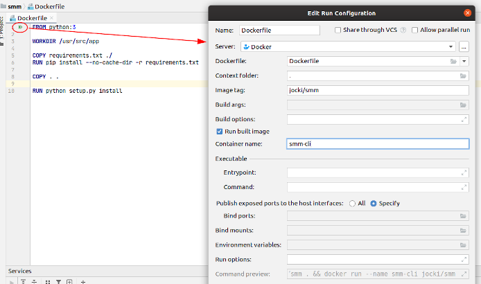
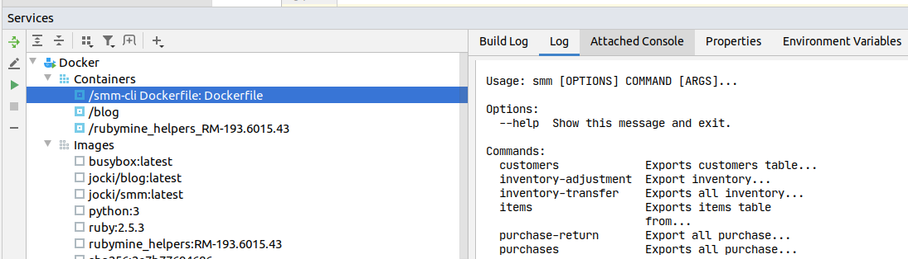
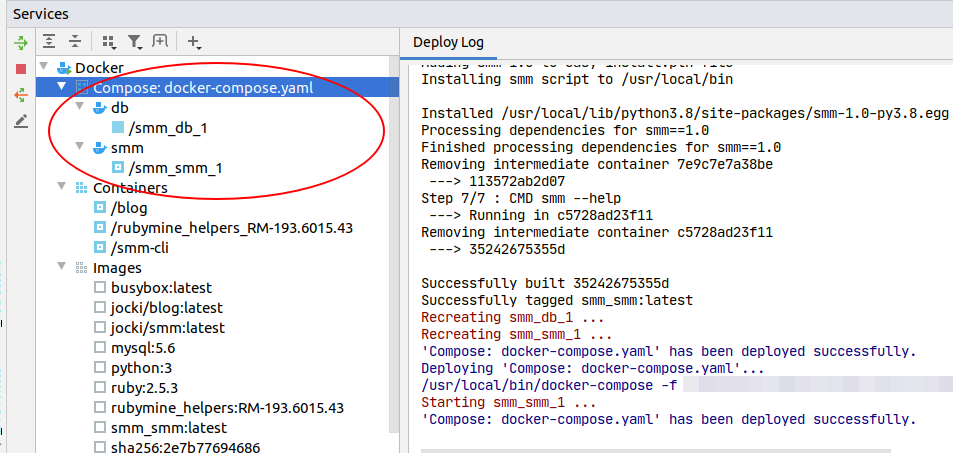
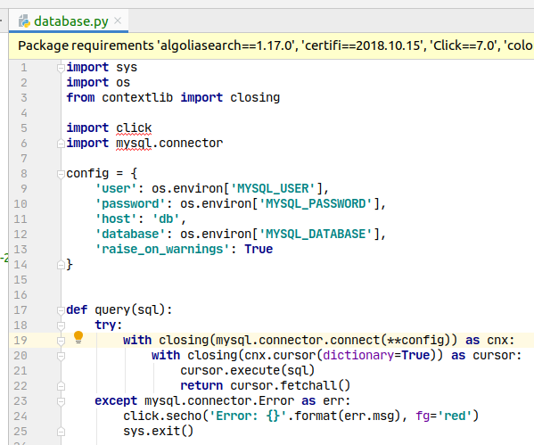
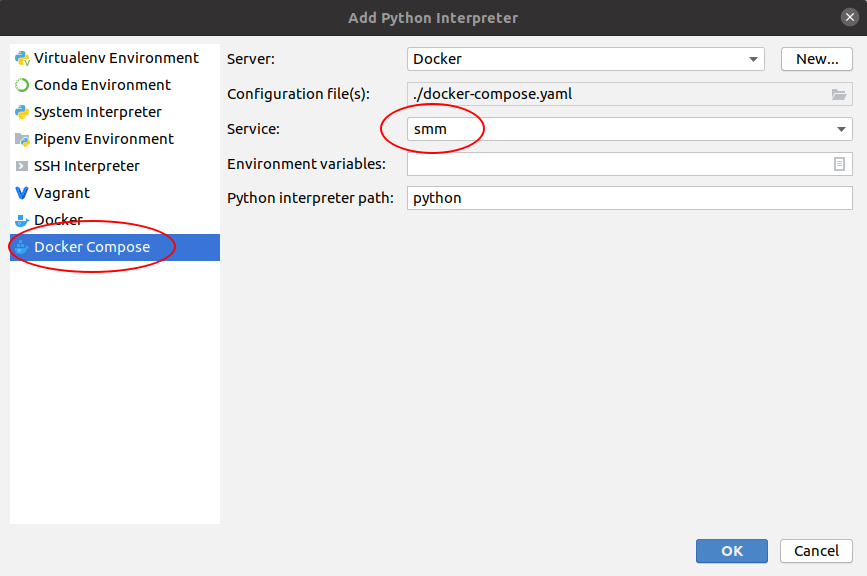
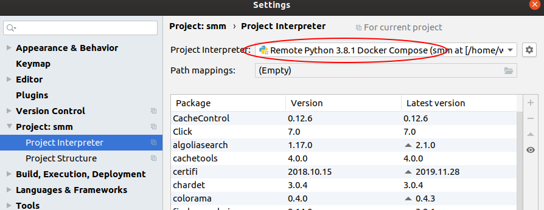
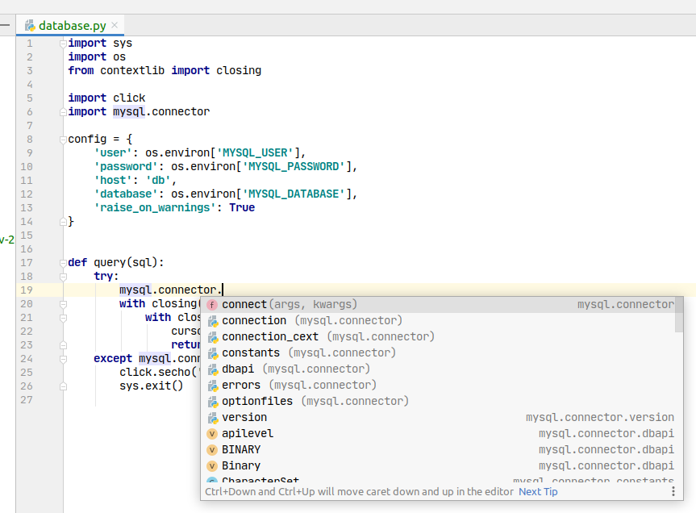
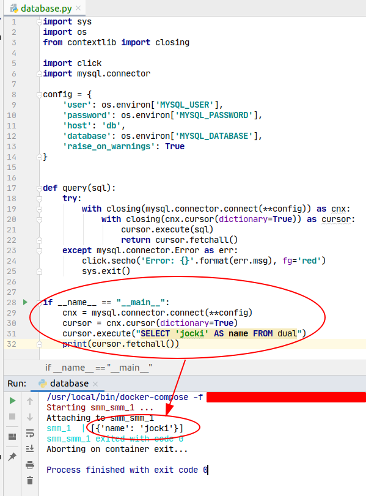

Hari ini saya perlu bekerja kembali dengan tool CLI Python yang sudah lama tidak saya sentuh.  Saya bahkan sudah tidak 
memiliki instalasi Python lagi di sistem operasi yang saya pakai.  Apakah ada cara cepat untuk menjalankan script
tersebut tanpa harus meng-*install* Python dan *dependency*-nya di sistem operasi saya?  Walaupun Python memiliki Virtualenv
untuk membatasi instalasi *dependency* ke proyek yang aktif, akan lebih menyenangkan bila saya menjalankannya di *container*.
Tentu saja, saya membutuhkan IDE yang bisa memakai Python di dalam *container* Docker dan tetap bisa mendeteksi *dependency*
yang ter-*install* di dalam *container* tersebut.  Salah satu IDE dengan fasilitas tersebut adalah PyCharm.

:::note
Teknik ini juga bisa dipakai untuk bahasa pemograman lain seperti Ruby.  Selain itu, juga berguna
bila tidak ingin meng-install aplikasi pembantu seperti database MySQL, cache Redis dan sejenisnya secara langsung
pada sistem operasi.
:::

Langkah pertama yang saya lakukan adalah membuat `Dockerfile` dengan isi seperti berikut ini:

```dockerfile title="Dockerfile"
FROM python:3

WORKDIR /usr/src/app

COPY requirements.txt .
RUN pip install --no-cache-dir -r requirements.txt

COPY . .

RUN python setup.py install

CMD smm --help
```       

Saya bisa menjalankan `Dockerfile` secara langsung dari PyCharm dengan men-klik icon *launcher* di sebelah kiri nomor baris,
seperti yang terlihat pada gambar berikut ini:



Hasil eksekusi-nya dapat dijumpai di window **Services** seperti yang terlihat pada gambar berikut ini:



Selain hasil eksekusi, PyCharm juga menampikan seluruh *container* dan *image* yang sudah pernah dibuat di instance
Docker saya.  Saya juga bisa menghapus *container* atau *image* secara cepat di window **Services**
tersebut dengan men-klik kanan namanya dan memilih **Delete...**.  Untuk *container* yang berjalan, terdapat 
pilihan **Stop Container**, **Attach**, **Exec** dan sebagainya.  Untuk *container* yang tidak aktif, terdapat pilihan
**Start Container**.  Untuk *image*, terdapat pilihan **Create Container** untuk membuat *container* baru dari *image*
tersebut.

Agar aplikasi CLI ini bisa bekerja, saya membutuhkan sebuah database MySQL.  Saat ini tidak ada database MySQL di komputer
saya.  Lagi-lagi Docker bisa membantu.  Saya bisa menggunakan Docker Compose untuk membuat *container* baru dengan *image*
dari `mysql:5.6` sesuai dengan versi MySQL yang dipakai di lingkungan produksi.

:::note
Bila saya menjalankan aplikasi lain yang membutuhkan MySQL dengan versi berbeda, saya cukup membuat
<em>container</em> baru dari <em>image</em> MySQL sesuai dengan versi yang dibutuhkan.  Isi dari database MySQL di setiap
<em>container</em> juga tidak akan bentrok.  Akan sangat sulit, bila bukan tidak mungkin, untuk meng-install beberapa
 versi MySQL yang berbeda sekaligus di sebuah komputer yang sama tanpa menggunakan <em>container</em> atau 
 <em>virtual machine</em>.
:::

Saya segera menambahkan file `docker-compose.yaml` dengan isi seperti berikut ini:

```yaml title="docker-compose.yaml"
version: "3.7"

x-database-environment: &database-environment
  MYSQL_DATABASE: mydb
  MYSQL_USER: jocki
  MYSQL_PASSWORD: mypassword

services:
  db:
    image: mysql:5.6
    environment:
      <<: *database-environment
      MYSQL_ROOT_PASSWORD: supersecretpassword

  smm:
    build:
      context: .
    environment: *database-environment
```

Pada konfigurasi di-atas, service `db` dibuat dari image `mysql:5.6` yang secara otomatis akan menambahkan database 
dengan nama `mydb` dan sebuah user baru dengan nama `jocki` dan password `mypassword` dengan akses ke database `mydb`.
Nilai *environment variable* yang sama juga diberikan ke service `smm` sehingga saya sama sekali tidak men-*hard code* 
nilai user, password, dan nama database di kode program. Sebagai gantinya, saya bisa membaca nilai tersebut dari 
*environment variables* seperti berikut ini:

```python title="main.py"
import os

import click
import mysql.connector

config = {
    'user': os.environ['MYSQL_USER'],
    'password': os.environ['MYSQL_PASSWORD'],
    'host': 'db',
    'database': os.environ['MYSQL_DATABASE'],
    'raise_on_warnings': True
}

cnx = mysql.connector.connect(**config)
```

Pada kode program di atas, nilai `host` adalah `db` yang merujuk pada nama service yang dibuat dari image `mysql:5.6`.
Docker Compose secara otomatis akan membuat `hostname` untuk `db` di service `smm` sehingga saya tidak perlu menggunakan
alamat IP secara langsung.

:::caution
Menyertakan informasi rahasia melalui <em>environment variable</em> bukanlah sesuatu yang 
aman.  Untuk proyek yang lebih serius, gunakan <code>docker secret create</code> di Docker Swarm atau <em>Secret object</em>
di Kubernetes untuk menyimpan password.  Saya menggunakan <em>environment variable</em> karena lebih singkat dan 
mudah dipahami untuk proyek percobaan.
:::

Sekarang, bila saya menjalankan Docker Compose dengan men-klik icon *launch* di sebelah kiri `services`, saya akan 
memperoleh hasil seperti berikut ini di window **Services**:



:::tip
Bila Docker Compose tidak bekerja di <em>launcher</em> PyCharm karena permasalahan TLS, coba 
tambahkan konfigurasi <em>environment variable</em> berupa <code>DOCKER_TLS_VERIFY=;DOCKER_CERT_PATH=</code>.
:::

Sebelum memulai menjalankan CLI, saya akan menambahkan data ke database terlebih dahulu.  Saya bisa melakukannya
dengan memberikan perintah seperti berikut ini:

```bash
docker-compose exec -T db sh -c 'exec mysql -uroot -p"$MYSQL_ROOT_PASSWORD" $MYSQL_DATABASE' < my_sql_data_backup.sql
```

Setelah itu, saya bisa mencoba menjalankan aplikasi Python CLI saya dengan memberikan perintah seperti:

```bash
docker-compose run smm smm customers
```

Bagian `docker-compose run smm` akan membuat sebuah *container* baru untuk service `smm`.  Perintah yang akan dikerjakan
pada *container* tersebut adalah `smm customers`.  Perintah ini dapat diganti sesuai dengan kebutuhan.

Sampai disini, saya sudah bisa menjalankan aplikasi CLI di dalam Docker dengan baik.  PyCharm juga menawarkan
berbagai kemudahan di window **Services** dalam menggunakan Docker.  Akan tetapi, itu baru mencakup *Ops* di *DevOps*. 
Bagaimana dengan *development*?  Saya masih menjumpai banyak pesan kesalahan di IDE seperti:



Mengapa demikian?  Hal ini karena seluruh *dependency* di-install di dalam *container* Docker.  Saya bahkan tidak memiliki
`python` dan `pip` untuk melakukan instalasi *dependency* di komputer *host*.  PyCharm saat ini tidak mengenali 
*dependency* tersebut.  Untuk mengatasi hal ini, saya perlu menambahkan Python interpreter yang berada di dalam Docker
agar dikenali oleh PyCharm.

Saya akan mulai dengan memilih menu **File**, **Settings...**, **Project: nama proyek**, **Project Interpreter**.  Saya 
kemudian men-klik icon *gear* di sebelah kanan *drop down* **Project Interpreter** dan memilih menu **Add**.  Pada dialog
yang muncul, saya memilih **Docker Compose** dan mengisinya seperti yang terlihat pada gambar berikut ini:



Sebelum selesai dengan dialog ini, saya harus memastikan bahwa komputer saya terkoneksi ke internet dengan stabil karena
PyCharm akan men-download `busybox:latest`.  Bila semua berjalan dengan benar, saya akan melihat semua *dependency* yang
tadinya berada dalam *container* Docker seperti pada gambar berikut ini:



Sekarang, saya tidak akan menjumpai pesan kesalahan lagi.  Bahkan, *content assist* juga bekerja dengan baik menampilkan
daftar function yang bisa saya panggil, seperti yang terlihat pada gambar berikut ini:



Bila saya menjalankan file Python atau memilih **Tools**, **Python Console...**, PyCharm akan menggunakan Python yang berada
dalam *container* Docker, seperti yang terlihat pada gambar berikut ini:



Walaupun saya tidak meng-install MySQL di komputer *host*, kode program yang saya tulis berhasil dikerjakan oleh PyCharm
dengan sempurna.  Sebagai contoh, `os.environ` akan mengembalikan nilai *environment variables* di *service* `smm`.  Database
yang diakses oleh `mysql.connector.connect()` adalah *service* `db`.  Saya kini bisa bekerja seolah-olah memiliki Python 
dan MySQL yang ter-install di komputer lokal.