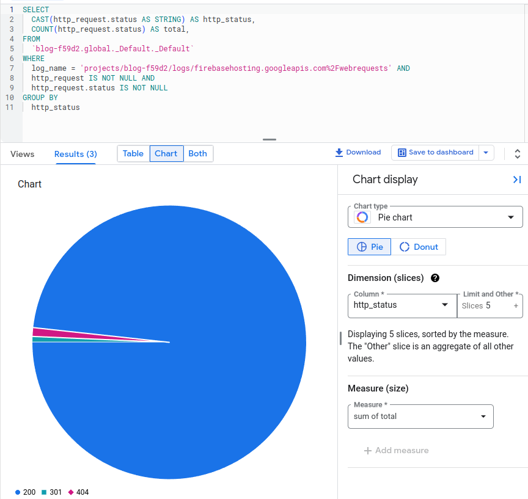
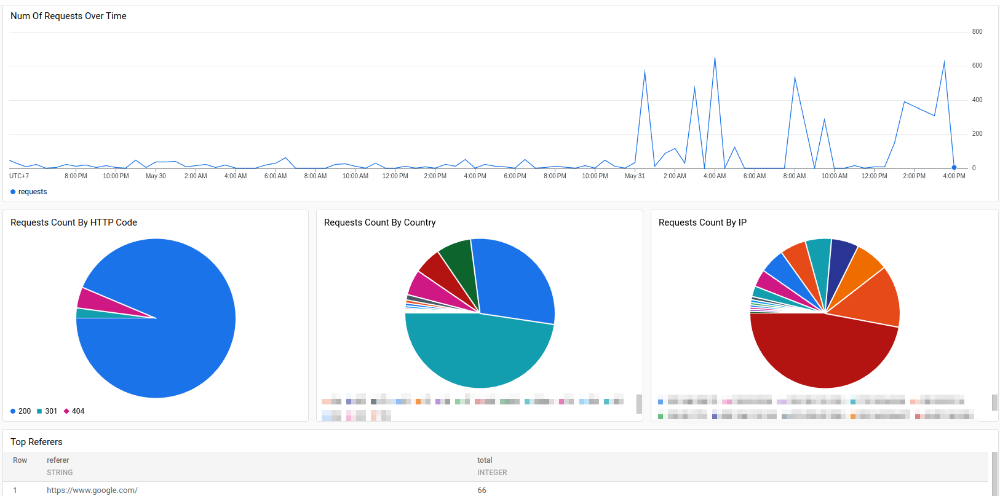

Salah satu fitur menarik di GCP adalah log yang disimpan di Cloud Logging dapat di-*query* melalui SQL BigQuery tanpa biaya tambahan.  Sebagai perbandingan, bila saya memindahkan log ke Elastic stack, Filebeat akan melakukan *parsing* log dan *mapping* sesuai dengan skema yang ditentukan saat log dipindahkan ke Elasticsearch.  Bila terjadi kegagalan di Filebeat, ada kemungkinan log tidak akan tersimpan di Elasticsearch.  Bila ada perubahan di *index mapping* (seperti karena konflik tipe data antara log baru dan log lama), saya mungkin perlu mengulangi proses ini untuk seluruh log lama yang ada.  Dengan men-*query* langsung dari sumber-nya (log), saya bisa mengurangi resiko tersebut.

Firebase Hosting adalah produk Firebase untuk melakukan hosting web statis.  Sebagai contoh, blog ini adalah web statis yang dihasilkan oleh Astro dan di-*host* di Firebase Hosting.  Sayangnya, dashboard Firebase Hosting hanya menyediakan informasi bandwidth *download* (dari pengguna) yang berhubungan dengan billing.  Sebagai gantinya, Firebase Hosting menyediakan integrasi untuk menyimpan *request log* ke Cloud Logging.  Saya bisa mengaktifkannya dengan mengikut panduan di https://firebase.google.com/docs/hosting/web-request-logs-and-metrics.

Sampai disini saya bisa membaca *request log* milik Firebase Hosting di Logs Explorer seperti yang terlihat pada gambar berikut ini:


Tentu saja akan lebih bagus lagi bila log di atas ditampilkan dalam bentuk dashboard sehingga saya bisa secara cepat menemukan informasi umum *request log* seperti berapa banyak request yang gagal, dari negara mana saja, URL apa yang sering diakses, dan sebagainya.

Saya bisa mulai dengan membuka **Logging**, **Log analytics** di GCP console.  Sebagai contoh, untuk mendapatkan informasi HTTP status, saya akan memasukkan query SQL berikut ini:

```sql 
SELECT  
  CAST(http_request.status AS STRING) AS http_status,
  COUNT(http_request.status) AS total,
FROM
  `<gcp_project_id>.global._Default._Default`
WHERE
  log_name = 'projects/<gcp_project_id>/logs/firebasehosting.googleapis.com%2Fwebrequests' AND
  http_request IS NOT NULL AND
  http_request.status IS NOT NULL
GROUP BY
  http_status
```

Saya dapat menjalankan *SQL* di atas dengan men-klik tombol **Run query**.  Pada bagian hasil eksekusi, saya dapat memilih tampilan dalam bentuk tabel, *chart*, atau keduanya.  Sebagai latihan, saya akan memlih menampilkan hasil dalam bentuk *chart*.  Saya kemudian mengubah nilai *Chart type* menjadi *Pie chart*.  Pada kolom *Dimension (slices)*, saya akan menggunakan kolom `http_status`.  Sementara itu, pada kolom *Measure (size)*, saya memilih kolom `total` dengan metode agregasi *Sum*.  Hasilnya terlihat seperti pada gambar berikut ini:



Saya juga dapat menyimpan *chart* di atas ke dalam *dashboard* dengan men-klik tombol **Save to dashboard**.  *Dashboard* adalah sebuah halaman untuk menampilkan beberapa *chart* berbeda dan mempermudah melakukan *filtering* ke seluruh *chart* yang ada.

Log dari Firebase Hosting sudah dilengkapi informasi kota dan negara di `json_payload.remoteIpCity` dan `json_payload.remoteIpCountry`.  Dengan demikian, untuk melihat *request* berdasarkan kode negara, saya dapat menggunakan query seperti berikut ini:

```sql
SELECT  
  STRING(json_payload.remoteIpCountry) AS country,
  COUNT(json_payload.remoteIpCountry) AS total,
FROM
  `<gcp_project_id>._Default._Default`
WHERE
  log_name = 'projects/<gcp_project_id>/logs/firebasehosting.googleapis.com%2Fwebrequests' AND
  json_payload IS NOT NULL AND
  json_payload.remoteIpCountry IS NOT NULL
GROUP BY country
ORDER BY total DESC
```

Pada query di atas, karena tipe data dari `json_payload` adalah `JSON`, saya perlu menggunakan `STRING()` untuk mengubah nilai `remoteIpCountry` menjadi `String` sehingga dapat dipakai di *chart*.

Sebagai contoh lainnya, saya juga dapat menampilkan HTTP referer untuk mencari tahu situs apa saja yang men-*link* ke blog.  Saya dapat melakukannya dengan memberikan query berikut ini:

```sql {10}
SELECT  
  http_request.referer AS referer,
  COUNT(http_request.referer) AS total,
FROM
  `<gcp_project_id>._Default._Default`
WHERE
  log_name = 'projects/<gcp_project_id>/logs/firebasehosting.googleapis.com%2Fwebrequests' AND
  http_request IS NOT NULL AND
  http_request.referer IS NOT NULL AND
  NOT STARTS_WITH(http_request.referer, 'https://jocki.me')    
GROUP BY referer
ORDER BY total DESC
```

Saya menambahkan `NOT STARTS_WITH` karena tidak ingin menyertakan HTTP referer dari dalam situs yang sama.

Sebagai hasil akhirnya, saya dapat memasukkan seluruh *chart* ke *dashboard* untuk memperoleh hasil seperti berikut ini:



Terlihat bahwa fitur *log analytics* sangat berguna untuk mengolah logs secara langsung di GCP tanpa menggunakan aplikasi pihak ketiga seperti Filebeat, Grafana Alloy dan sebagainya.  Selain itu, tidak ada biaya tambahan untuk fitur ini (saya belum mengaktifkan billing pada proyek Firebase+GCP yang dipakai di artikel ini!) sehingga cocok dipakai untuk aplikasi kecil yang tidak membutuhkan retensi lama.
