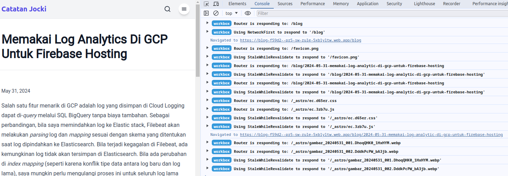

import { FileTree } from '@astrojs/starlight/components';

[Workbox](https://developer.chrome.com/docs/workbox) adalah library dari tim Chrome untuk mempermudah menulis kode program di Service Worker.  Ini bisa membantu mengurangi *bug* dan menerapkan berbagai strategi *caching* dengan mudah.  Sebagai contoh, Workbox secara bawaan sudah dilengkapi dengan strategi seperti `StaleWhileRevalidate`, `CacheFirst`, `NetworkFirst`, `NetworkOnly`, dan `CacheOnly`.  Untuk menggunakan Workbox di Astro juga cukup mudah, saya hanya perlu menambahkan plugin [astrojs-service-worker](https://www.npmjs.com/package/astrojs-service-worker) dan hasil akhirnya sudah menggunakan Service Worker.

Plugin `astrojs-service-worker` menggunakan method `generateSW()` dari modul `workbox-build` untuk menghasilkan file JavaScript yang berisi kode program Service Worker.  Secara default, kode program yang dihasilkan akan selalu memakai strategi `CacheFirst`.  Bagaimana bila saya ingin sesuatu yang lebih fleksibel?  Saya bisa menulis sendiri kode program Service Worker dan menggunakan `injectManifest()` untuk menyisipkan daftar file yang perlu di-*cache* secara otomatis.  Namun berhubung `astrojs-service-worker` belum mendukung `injectManifest()`, saya perlu membuat plugin *integration* lokal baru di proyek Astro saja.

## Membuat integrasi lokal Di Astro

*Integration* adalah konsep sejenis *plugin* di Astro.  Selain dalam bentuk npm package seperti pada umumnya, saya dapat membuat *integration* langsung di proyek yang sama.  Sebagai contoh, saya akan membuat folder baru bernama `integrations/serviceWorker` di folder `src` dengan isi file seperti berikut ini:

<FileTree>
- blog
  - src    
    - integrations
      - serviceWorker
        - index.ts
        - no-op-service-worker.js
        - service-worker.js
</FileTree>

Pada `index.ts`, saya dapat mendeklarasikan *integration* seperti pada contoh kode program berikut ini:

```ts title="index.ts"
const createPlugin = (): AstroIntegration => {
    return {
        name: "service-worker-integration",
        hooks: {
            "astro:config:setup": async({ config, injectScript, injectRoute, command, logger }) => {
                ...
            },
            "astro:build:done": async ({ dir, logger }) => {                
                ...
            }
        },
    };
};

export default createPlugin;
```

Astro menyediakan beberapa *hook* menarik yang dapat saya pakai untuk mengerjakan kode program tertentu saat kondisi tertentu terjadi di Astro.  Saya dapat melihat seluruh daftar *hook* yang tersedia di https://docs.astro.build/en/reference/integrations-reference/#hooks.  Pada kode program di atas, saya hanya akan memakai `astro:config:setup` dan `astro:build:done`.

*Hook* `astro:config:setup` dikerjakan pada fase yang paling awal.  *Hook* ini menyediakan function `injectScript` dan `injectRoute` yang akan saya gunakan seperti pada kode program berikut ini:

```ts title="index.ts"
const SW_NAME = "service-worker.js";
...
"astro:config:setup": async({ config, injectScript, injectRoute, command, logger }) => {
    logger.info('Injecting service worker loader script in every pages');
    const swPath = join(config.base, SW_NAME);
    injectScript("head-inline", `
        if ('serviceWorker' in navigator) {
            navigator.serviceWorker.register('${swPath}');
        }
    `);
    if (command === "dev") {
        injectRoute({
            pattern: swPath,
            entrypoint: "./src/integrations/serviceWorker/no-op-service-worker.js",
        });
    }

},
...
```

Pada kode program di atas, saya menggunakan `injectScript()` untuk menambahkan JavaScript di elemen `<head>` untuk setiap HTML untuk menjalankan kode service worker di `/service-worker.js`.  Karena saya menggunakan `head-inline`, kode JavaScript ini akan ditambahkan begitu saja tanpa diproses oleh Vite bundler yang dipakai oleh Astro.

Berikutnya, saya memeriksa apakah `command` bernilai `dev`, misalnya pada saat dijalankan melalui `astro dev`.  Pada lingkungan `dev` seperti ini, saya perlu mematikan Service Worker agar tidak menganggu proses *live reload*.  Oleh sebab itu, saya mengubah isi `/service-worker.js` menjadi sesuai dengan isi `no-op-service-worker.js` yang terlihat seperti:

```js title="no-op-service-worker.js"
const template = `
self.addEventListener('install', () => {  
  self.skipWaiting();
});
  
self.addEventListener('activate', () => {  
  self.clients.matchAll({
    type: 'window'
  }).then(windowClients => {
    windowClients.forEach((windowClient) => {
      windowClient.navigate(windowClient.url);
    });
  });
});
`

export async function GET() {  
  const headers = new Headers();
  headers.append("content-type", "application/javascript;charset=utf-8");
  return new Response(template, { headers });
}
```

Saya perlu menambahkan kode Service Worker yang tidak melakukan apa-apa karena Service Worker yang telah di-*install* di sisi *client* akan tetap selalu ada walaupun file tersebut sudah dihapus dari sisi *server*.  Bila saya hanya menghilangkan file `service-worker.js` saat dijalankan dengan `astro dev`, browser yang telah menjalankan Service Worker sebelumnya tetap akan menyajikan halaman dari *cache*.

:::note
Pastikan nama file Service Worker tidak pernah berubah di kemudian hari.  Tidak ada cara yang lebih pasti untuk menghapus Service Worker yang sudah di-*install* oleh pengguna selain mengubah kode program Service Worker tersebut dengan kode program yang tidak melakukan apa-apa (*no op*).
:::

## Library Workbox

Workbox bersifat modular; seluruh daftar modul-nya dapat dilihat di https://developer.chrome.com/docs/workbox/modules/workbox-build.  Untuk operasi umum yang biasanya selalu dipakai di Service Worker, saya dapat menggunakan `workbox-core`.  Karena saya menggunakan Astro, saya bisa menambahkan Workbox lewat `npm` dengan perintah seperti berikut ini:

```bash
npm install workbox-core
```
Ini memungkinkan saya membuat kode program seperti:

```js title="service-worker.js"
import { clientsClaim } from "workbox-core";
self.skipWaiting();
clientsClaim();
```
Untuk menambahkan strategi yang akan dipakai, saya perlu menggunakan modul `workbox-strategies`.  Strategi ini tidak bisa jalan begitu saja, mereka perlu didaftarkan di rute dengan menggunakan `registerRoute()` yang disediakan oleh modul `workbox-routing`.  Saya dapat menambahkan kedua modul tersebut dengan menggunakan kode program seperti berikut ini:

```bash
npm install workbox-routing workbox-strategies
```

Ini akan memungkinkan saya untuk membuat kode program seperti:

```js title="service-worker.js"
import { registerRoute } from "workbox-routing";
import { NetworkFirst, StaleWhileRevalidate} from "workbox-strategies";
...
registerRoute(/.*\/blog$/, new NetworkFirst(), 'GET');
registerRoute(() => true, new StaleWhileRevalidate(), 'GET');
```

Bila ada file yang perlu di-*cache* terlebih dahulu (tanpa perlu menunggu di-akses oleh pengguna), saya dapat menggunakan modul `workbox-precaching`:

```bash
npm install workbox-precaching
```

Saya dapat menggunakan `precache()` seperti pada kode program berikut ini:

```js title="service-worker.js"
import { precache, cleanupOutdatedCaches } from "workbox-precaching";
...
precache(self.__WB_MANIFEST);
cleanupOutdatedCaches();
```

Nilai `self.__WB_MANIFEST` pada kode program di atas adalah sesuatu yang unik.  Nilai ini akan dimodifikasi secara otomatis nanti oleh `injectManifest()` yang akan menelusuri seluruh daftar aset yang tersedia.  Lihat bagian [workbox-build](#workbox-build) untuk informasi lebih lanjut mengenai `injectManifest()`.

:::caution
Bila kode program di atas dijalankan tanpa diproses oleh `injectManifest()`, kode program Service Worker akan berisi kesalahan saat dijalankan karena nilai `self.__WB_MANIFEST` tidak didefinisikan.
:::

Sampai disini, kode program Service Worker yang saya pakai akan terlihat seperti berikut ini:

```js title="service-worker.js"
import { clientsClaim } from "workbox-core";
import { precache, cleanupOutdatedCaches } from "workbox-precaching";
import { registerRoute } from "workbox-routing";
import { NetworkFirst, StaleWhileRevalidate} from "workbox-strategies";

self.skipWaiting();
clientsClaim();
registerRoute(/.*\/blog$/, new NetworkFirst(), 'GET');
registerRoute(() => true, new StaleWhileRevalidate(), 'GET');
precache(self.__WB_MANIFEST);
cleanupOutdatedCaches();
```

Pada kode program di atas, saya menggunakan strategi `NetworkFirst` untuk path `/blog` sehingga setiap mengunjungi halaman `/blog`, browser akan melakukan *request* HTTP ke server.  Bila terjadi kesalahan, misalnya Internet sedang *offline* atau lambat, baru halaman dari pre-cache akan ditampilkan.  Tujuannya supaya halaman yang berisi daftar blog selalu paling aktual.

Untuk halaman dengan *path* lainnya, saya menggunakan strategi `StaleWhileRevalidate`.  Informasi lebih lanjut mengenai strategi ini dapat dilihat di https://developer.chrome.com/docs/workbox/modules/workbox-strategies#stale-while-revalidate.  Pada dasar-nya, strategi `StaleWhileRevalidate` akan menampilkan halaman dari *cache* terlebih dahulu sambil melakukan *request* HTTP ke server untuk memperbaharui *cache* bila perlu.


## workbox-build 

Berbeda dari modul lainnya, `workbox-build` adalah modul npm yang berisi method `generateSW()` dan `injectManifest()` untuk dipanggil pada saat proses *building* (bukan eksekusi).  

Bila saya ingin kode program Service Worker dihasilkan secara otomatis, saya perlu memanggil `generateSW()`.  Ini yang dilakukan oleh plugin `astrojs-service-worker`.  Sebagai contoh, kode `generateSW({globDirectory: './dist', globPatterns: '**/*', swDest: './dist/service-worker.js'})` akan menghasilkan file `service-worker.js` di folder `dist` dengan kode program yang status.  Kode program yang dihasilkan akan menggunakan `precacheAndRoute()` untuk melakukan operasi berikut ini ke seluruh aset yang ditemukan:
* Meletakkan aset ke dalam *cache* bila belum ada.
* Membuat *route* baru untuk aset dengan menggunakan strategi `CacheFirst`.  Pada strategi ini, bila sebuah *route* sudah ada di *cache*, nilai dari *cache* akan dipakai.  Sebaliknya, bila belum ada di-*cache*, maka *request* network ke *server* akan dilakukan.

Karena sudah punya file `service-worker.js` sendiri, saya hanya perlu menggunakan `injectManifest()` untuk meng-update `self.__WEB_MANIFEST` di file tersebut agar isinya selalu sama dengan kondisi aset terbaru.   Sebagai contoh, bila saya memiliki baris dengan kode program:

```js title="service-worker.js"
precache(self.__WB_MANIFEST);
```

`injectManifest()` akan mengubahnya sehingga terlihat seperti berikut ini:

```js title="service-worker.js" wrap
precache([{"revision":"1af8d67218dbe185ea4fcdf5c2248bf0","url":"_astro/Blog.iqt4wkWR.css"},{"revision":"b52f7dc08a43ce112df72b8507647ec0","url":"_astro/DOH.astro_astro_type_script_index_0_lang.D9RbuUoF.js"},{"revision":"acc1d7d65285d115720fa6bbedfb01ae","url":"_astro/ec.3zb7u.js"},{"revision":"bbd19486c1a8bdce1e563a5611301dd3","url":"_astro/ec.d65er.css"},{"revision":"4725ac07ce735aac9d4b7de3758e92eb","url":"sitemap-0.xml"},{"revision":"49e79b994e4200a79104df5170ddfede","url":"sitemap-index.xml"},{"revision":"768f003785bae3aa35e43d4421d65551","url":"tools/doh/index.html"},{"revision":"f79a2a3d22ab4dcad9647f24f4fec853","url":"tools/public-ip/index.html"},{"revision":"178424750f0f3d7bded8772243cf9c6b","url":"wordcloud.js"}...]);
```
Walaupun saya dapat menulis lokasi aset dan menghitung *hash*-nya secara manual satu per satu, hal ini sangat tidak disarankan karena rentan terhadap kesalahan.

## Menggunakan Rollup

Perhatikan bahwa kode program `service-worker.js` yang saya buat memiliki perintah `import` ke modul npm.  Ini tentu saja tidak bisa langsung dijalankan oleh browser.  Saya perlu melakukan konfigurasi supaya file ini di-proses oleh *bundler*.  Astro memakai [Vite](https://vitejs.dev/) yang selanjutnya memakai [Rollup](https://rollupjs.org/) sebagai *bundler*.  Karena file `service-worker.js` ini berdiri sendiri (tidak direferensikan di `index.html` lewat `<script>`), saya bisa mem-proses-nya secara terpisah lewat Rollup API.

Untuk itu, saya akan menambahkan kode program berikut ini pada *hook* `astro:build:done`:

```ts title="index.ts"
import { nodeResolve } from '@rollup/plugin-node-resolve';
import { join } from "node:path";
import { fileURLToPath } from "node:url";
import { rollup } from 'rollup';
...

"astro:build:done": async ({ dir, logger }) => {                                    
    const out = fileURLToPath(dir);                                
    const swSrc = join(out, "../src/integrations/serviceWorker/service-worker.js");    
    const bundle = await rollup({
        input: swSrc,                    
        plugins: [
            nodeResolve(),                                                                                   
        ]
    });
    await bundle.write({
        dir: out, 
        format: 'iife',                    
    });                
    await bundle.close();                
}
```

Kode program pada *hook* `astro:build:done` di atas akan dikerjakan saat proses build sudah selesai semuanya.  Mengapa `astro:build:done` di tahap-tahap paling terakhir? Hal ini karena saya perlu mendapatkan daftar aset yang paling aktual.  Bila saya mengerjakannya di `astro:config:setup`, beberapa proses seperti optimalisasi image belum dilakukan.  Daftar aset yang saya jumpai adalah file gambar seperti `*.png` yang belum dioptimalkan menjadi `*.webp` oleh Astro.  Saya juga akan menjumpai banyak file *chunks* yang bukan bagian dari hasil akhir web Astro.

:::note
*Hook* `astro:build:done` hanya akan dikerjakan saat menjalankan `astro build`.  Bila aplikasi dijalankan melalui `astro dev`, *hook* ini tidak akan dipanggil.
:::

Kode program di atas akan membaca file `src/integrations/serviceWorker/service-worker.js` dan menyisipkan kode program Workbox sebagai pegganti `import`.  Perhatikan bahwa saya menggunakan nilai `iife` pada `output.format` agar JavaScript yang dihasilkan dapat dikerjakan oleh browser.  Saya juga perlu menambahkan plugin `nodeResolve()` agar Rollup mencari setiap `import` di file `service-worker.js` di `node-modules` yang telah saya install sebelumnya.


## Plugin `rollup-plugin-workbox`

Sampai disini, saya bisa memanggil `injectManifest()` secara manual.  Namun, karena Rollup sudah menyediakan plugin `rollup-plugin-workbox`, saya hanya perlu menambahkan definisi plugin seperti berikut ini:

```ts title="index.ts" {12-17}
import { injectManifest } from 'rollup-plugin-workbox';
...

"astro:build:done": async ({ dir, logger }) => {                
    ...
    const swDest = join(out, "service-worker.js");
    ...
    const bundle = await rollup({
    input: swSrc,                    
    plugins: [
        nodeResolve(),                                                                       
        injectManifest({
            swSrc, 
            swDest,                                                        
            globDirectory: out,
            globPatterns: ["**/*"],                            
        }),                        
    ]
    });
    ...
}
```

Pada konfigurasi di atas, `injectManifest()` akan mencari file template Service Worker di `swSrc` dan menuliskan hasil yang sudah di-*inject* di `swDest`.  Sampai disini, bila saya menjalankan perintah `astro build` dan `astro preview`, saya akan menemukan bahwa Service Worker sudah bekerja dengan baik.

Workbox menyediakan fasilitas *logging* ke *console* yang sangat berguna untuk troubleshooting.  Namun, pada konfigurasi di atas, fitur *logging* tidak akan aktif.  Bila saya ingin mengaktifkannya, saya dapat mengubah konfigurasi di atas menjadi seperti:

```ts title="index.ts" {17-21}
import { injectManifest } from 'rollup-plugin-workbox';
...

"astro:build:done": async ({ dir, logger }) => {                
    ...
    const swDest = join(out, "service-worker.js");
    ...
    const bundle = await rollup({
    input: swSrc,                    
    plugins: [
        nodeResolve(),                                                                       
        injectManifest({
            swSrc, 
            swDest,                                                        
            globDirectory: out,
            globPatterns: ["**/*"],                            
        },{                            
            esbuild: {
                minify: false,
            }
        }),                        
    ]
    });
    ...
}
```

Fitur ini akan mempermudah menelusuri *bug* di *staging*; laporan bug tanpa hasil logging seperti ini kadang akan sangat sulit direproduksi.


