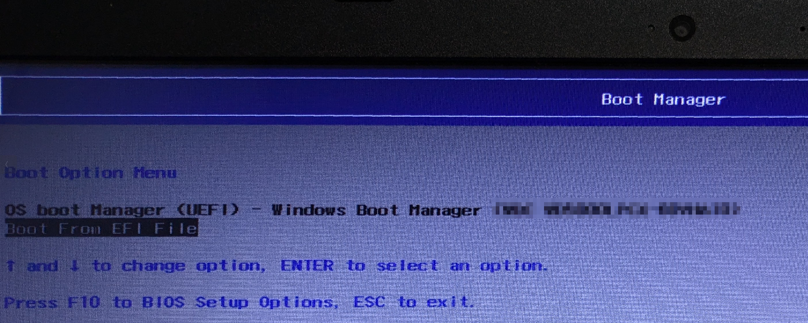
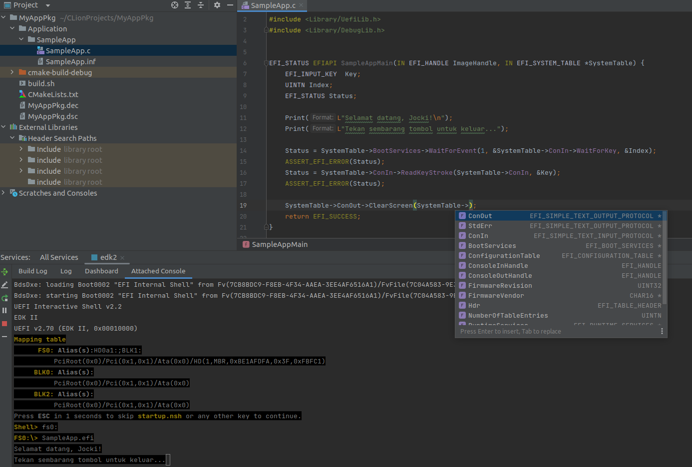

import { FileTree } from '@astrojs/starlight/components';

*Bootstrap loader* adalah komponen sistem operasi yang dikerjakan paling awal pada saat komputer dinyalakan.  Pada era BIOS, *bootstrap loader* dapat menggunakan *BIOS interrupt call* seperti `10h` untuk mencetak tulisan di layar dan `13h` untuk membaca disk.  Karena layanan yang tersedia pada kondisi ini masih sangat terbatas, *bootstrap loader* biasanya akan mempersiapkan perangkat input/output dan dukungan *file system* (seperti FAT32, ext4, NTFS dan sebagainya) untuk membaca file kernel sistem operasi yang tersimpan di disk.  Ini adalah permasalahan *"telur dan ayam"* karena kode program *bootstrap loader* yang lumayan kompleks tersebut tidak akan dipakai lagi setelah kernel sistem operasi dijalankan.  Unified Extensible Firmware Interface (UEFI) berusaha menyelesaikan permasalahan ini dengan melakukan standarisasi layanan (dalam bentuk *boot services* dan *runtime services*) serta dukungan *file system* FAT32 secara bawaan.  Hampir semua perangkat PC baru saat ini sudah menggunakan UEFI dan sistem operasi populer untuk PC seperti Windows & Linux juga sudah mendukung UEFI.

Bila kode program *bootstrap loader* era BIOS biasanya di-simpan di sektor pertama yang disebut Master Boot Record (MBR), kode program *bootstrap loader* di UEFI disimpan dalam bentuk file EFI di sebuah partisi FAT32 dengan nama seperti `BOOTX64.EFI`.  File EFI ini menggunakan format Portable Executable (PE) sama seperti yang dipakai oleh file EXE di sistem operasi Windows.  Selain itu, kebanyakan motherboard PC juga dilengkapi dengan UEFI Shell yang memungkinkan pengguna untuk menjalankan file EFI secara interaktif saat komputer dinyalakan (sebelum sistem operasi dikerjakan).  Pada tulisan ini, saya akan mencoba membuat aplikasi UEFI sederhana yang dapat dijalankan dari UEFI Shell.

## EFI Development Kit (EDK) II

Walaupun UEFI terdengar lebih mudah di-program, proses awal untuk menulis sebuah aplikasi UEFI membutuhkan usaha yang cukup banyak bila dibandingkan menulis kode Assembly untuk MBR yang hasilnya dapat langsung disalin lewat `dd`.  Untuk membuat aplikasi UEFI, saya akan menggunakan Tianocore EDK II yang merupakan platform referensi resmi untuk UEFI dari Intel.  Saya akan mulai dengan men-*clone* kode program EDK II dari GitHub dengan menggunakan perintah berikut ini:

```shell
$ cd /home/developer
$ git clone https://github.com/tianocore/edk2.git
$ cd edk2
$ git checkout edk2-stable202405
$ git submodule update --init
```

Sampai disini, saya akan memperoleh folder `/home/developer/edk2` dengan struktur folder yang terlihat seperti berikut ini:

<FileTree>
- home/developer/edk2  
  - OvmfPkg
    - ...
  - MdeModulePkg
    - ...
  - MdePkg
    - ...
  - edksetup.sh
  - ...    
</FileTree>

Untuk menghindari kesalahan versi dan *tools* yang tidak ter-install, saya akan menjalankan proses *building* dari dalam container Docker.  Tianocore memiliki beberapa *image* siap pakai yang dapat dilihat https://github.com/tianocore/containers.  Sebagai latihan, saya akan menggunakan *image* `ghcr.io/tianocore/containers/ubuntu-22-test:latest`.  Container ini sudah dilengkapi dengan QEMU yang dapat saya pakai untuk menjalankan file EFI pada saat *development*.  Karena file EFI hanya bisa dijalankan oleh UEFI, bukan oleh sistem operasi seperti aplikasi biasanya, saya tentu saja tidak ingin me-*restart* PC setiap kali ingin melihat hasil perubahan kode program.

Untuk menjalankan container secara interaktif, saya dapat memberikan perintah seperti berikut ini:

```shell
$ docker run -it -v $HOME/edk2:/edk2 --workdir /edk2 --env PACKAGES_PATH=/edk2 ghcr.io/tianocore/containers/ubuntu-22-test:latest /bin/bash
root@8acd5d:/edk2# . edksetup.sh
## OUTPUT:
## Loading previous configuration from /edk2/Conf/BuildEnv.sh
## Using EDK2 in-source Basetools
## WORKSPACE: /edk2
## EDK_TOOLS_PATH: /edk2/BaseTools
## CONF_PATH: /edk2/Conf
root@8acd5d:/edk2# exit
```

Pada perintah di atas, saya menjalankan `edksetup.sh` untuk melakukan inisialisasi proyek EDK2.


## Open Virtual Machine Firmware (OVMF)

OVMF adalah implementasi EDK2 untuk QEMU.  Dengan OVMF, mesin virtual QEMU akan memiliki dukungan UEFI.  Langkah pertama yang perlu saya lakukan untuk memakai OVMF adalah men-*build* proyek tersebut.  Saya akan mulai dengan mengubah beberapa nilai di `Conf/target.txt` dengan isi seperti berikut ini:

```text title=/home/developer/edk2/Conf/target.txt
ACTIVE_PLATFORM         = OvmfPkg/OvmfPkgX64.dsc
TARGET_ARCH             = X64
TOOL_CHAIN_TAG          = GCC5
```

Berikutnya, saya akan memulai proses *building* dengan perintah seperti berikut ini:

```shell
$ docker run -it -v $HOME/edk2:/edk2 --workdir /edk2 --env PACKAGES_PATH=/edk2 ghcr.io/tianocore/containers/ubuntu-22-test:latest /bin/bash
root@c9338:/edk2# . edksetup.sh

root@c9338:/edk2# make -C /edk2/BaseTools/Source/C
## OUTPUT:
## ...
## make[1]: Leaving directory '/edk2/BaseTools/Source/C/DevicePath'
## Finished building BaseTools C Tools with HOST_ARCH=X64
## make: Leaving directory '/edk2/BaseTools/Source/C'

root@c9338:/edk2# build
## OUTPUT:
## ...
## - Done -
## Build end time: 15:57:09, Aug.03 2024
## Build total time: 00:00:59
```

Pada perintah di atas, setelah proses *building* selesai, saya akan memperoleh file `Build/OvmfX64/DEBUG_GCC5/FV/OVMF.fd` yang merupakan hasil akhir yang dapat dipakai oleh QEMU.  Karena akan sering dipakai dan jarang berubah, saya akan men-*copy* file ini sebagai `bios.bin` dengan perintah seperti:

```shell
root@c9338:/edk2# cp Build/OvmfX64/DEBUG_GCC5/FV/OVMF.fd bios.bin
```

Sekarang, saya dapat menggunakan file `bios.bin` tersebut di QEMU dengan perintah seperti berikut ini:

```shell
root@c9338:/edk2# qemu-system-x86_64 -bios bios.bin -nographic -net none
### OUTPUT:
### UEFI Interactive Shell v2.2
### EDK II
### UEFI v2.70 (EDK II, 0x00010000)
### Mapping table
###     BLK0: Alias(s):
###          PciRoot(0x0)/Pci(0x1,0x1)/Ata(0x0)
### Press ESC in 1 seconds to skip startup.nsh or any other key to continue.
Shell> exit
```

Untuk keluar dari QEMU di modus teks, tekan tombol `Ctrl+A` diikuti dengan `X`.

:::caution
Pada saat tulisan ini dibuat, terdapat bug https://bugzilla.tianocore.org/show_bug.cgi?id=4250 yang menyebabkan QEMU crash saat menjalankan OVMF.  Untuk menghindari bug ini, gunakan QEMU dengan versi 8 ke atas.   Sayangnya, container EDK2 versi terbaru yang saya pakai pada saat tulisan ini dibuat masih menggunakan QEMU 7.1.0.  Untuk menggunakan QEMU 8, lakukan perubahan pada `Dockerfile` di https://github.com/tianocore/containers dan buat ulang *image* berdasarkan `Dockerfile` tersebut.

Bila hal di atas tidak memungkinkan, tambahkan argumen `-fw_cfg name=opt/org.tianocore/X-Cpuhp-Bugcheck-Override,string=yes` pada saat menjalankan QEMU seperti yang terlihat pada perintah berikut ini:

```shell
root@c9338:/edk2# qemu-system-x86_64 -bios bios.bin -nographic -net none -fw_cfg name=opt/org.tianocore/X-Cpuhp-Bugcheck-Override,string=yes
```

Flag di atas akan mengabaikan bug dari QEMU tetapi bisa saja menyebabkan hal tidak terduga akibat bug yang dibiarkan tersebut.
:::

## Menulis Aplikasi UEFI

Sekarang saatnya untuk menulis kode program aplikasi UEFI.  Proyek EDK2 dikelompokkan ke dalam satuan yang disebut sebagai *package*.  Sebagai contoh, pada saat men-*build* OVMF, saya bekerja dengan *package* `OvmfPkg`.  Untuk aplikasi UEFI latihan ini, saya akan membuat sebuah *package* baru di folder tersendiri yang berada di luar folder EDK2.  Folder *package* yang saya buat memiliki struktur seperti berikut ini:

<FileTree>
- /home/developer/MyAppPkg
  - Application
    - SampleApp
      - SampleApp.c
      - SampleApp.inf  
  - MyAppPkg.dec
  - MyAppPkg.dsc
</FileTree>

File `MyAppPkg.dec` merupakan file yang selalu ada di *package* EDK2 yang berisi informasi tentang *package* tersebut.  Sebagai contoh, saya akan menambahkan isi berikut ini pada file `MyAppPkg.dec`:

```text title=/home/developer/MyAppPkg/MyAppPkg.dec
[Defines]
  DEC_SPECIFICATION              = 0x00010005
  PACKAGE_NAME                   = MyAppPkg  
  PACKAGE_GUID                   = e27ea641-4c6c-4b4d-83f1-5bc846dd165a
  PACKAGE_VERSION                = 0.1
```

Pada definisi di atas, saya memberikan nama *package* di `PACKAGE_NAME`, versi *package* di `PACKAGE_VERSION` dan juga sebuah GUID unik sebagai identitas *package* di `PACKAGE_GUID`.  Selain file DEC, sebuah *package* di EDK2 juga memiliki file DSC.  Sebagai contoh, saya menambahkan isi berikut ini pada file `MyAppPkg.dsc`:

```text title=/home/developer/MyAppPkg/MyAppPkg.dsc
[Defines]
  PLATFORM_NAME                  = MyAppPkg
  PLATFORM_GUID                  = 3513f791-046c-4490-8543-e9cfdf7d0920
  PLATFORM_VERSION               = 0.1
  DSC_SPECIFICATION              = 0x00010005
  SUPPORTED_ARCHITECTURES        = X64
  OUTPUT_DIRECTORY               = Build/MyAppPkg
  BUILD_TARGETS                  = RELEASE

[BuildOptions]

!include MdePkg/MdeLibs.dsc.inc

[LibraryClasses]
  UefiApplicationEntryPoint|MdePkg/Library/UefiApplicationEntryPoint/UefiApplicationEntryPoint.inf
  UefiLib|MdePkg/Library/UefiLib/UefiLib.inf
  PrintLib|MdePkg/Library/BasePrintLib/BasePrintLib.inf
  PcdLib|MdePkg/Library/BasePcdLibNull/BasePcdLibNull.inf
  MemoryAllocationLib|MdePkg/Library/UefiMemoryAllocationLib/UefiMemoryAllocationLib.inf
  DebugLib|MdePkg/Library/BaseDebugLibNull/BaseDebugLibNull.inf
  BaseMemoryLib|MdePkg/Library/BaseMemoryLib/BaseMemoryLib.inf
  BaseLib|MdePkg/Library/BaseLib/BaseLib.inf
  UefiBootServicesTableLib|MdePkg/Library/UefiBootServicesTableLib/UefiBootServicesTableLib.inf
  DevicePathLib|MdePkg/Library/UefiDevicePathLib/UefiDevicePathLib.inf
  UefiRuntimeServicesTableLib|MdePkg/Library/UefiRuntimeServicesTableLib/UefiRuntimeServicesTableLib.inf

[Components]
  Application/SampleApp/SampleApp.inf
```

Sama seperti di file DEC, pada file DSC, setiap *package* memiliki nilai `PLATFORM_NAME`, `PLATFORM_GUID` dan `OUTPUT_DIRECTORY` yang unik.  Saya dapat mengatur target arsitektur di `SUPPORTED_ARCHITECTURES`.  Karena hanya akan dipakai di PC pribadi, saya menggunakan nilai `X64` untuk `SUPPORTED_ARCHITECTURES`.

File DSC dapat menyertakan file DSC lain dengan menggunakan `!include`.  Sebagai contoh, pada deklarasi di atas, saya menggunakan `!include MdePkg/MdeLibs.dsc.inc` untuk menambahkan deklarasi `[LibraryClasses]` yang umum dipakai.  Nilai pada `[LibraryClasses]` menggunakan format seperti `NamaLibrary|LokasiLibrary`.  File INF di *package* ini nantinya dapat merujuk ke library dengan menggunakan `NamaLibrary`.  Sebagai contoh, karena akan membuat aplikasi UEFI, saya menambahkan `UefiApplicationEntryPoint|MdePkg/Library/UefiApplicationEntryPoint/UefiApplicationEntryPoint.inf`.  Di file INF untuk aplikasi nanti, saya cukup menggunakan `UefiApplicationEntryPoint` sebagai nilai di `[LibraryClasses]`.

Sebuah *package* mengandung satu atau lebih komponen.  Pada EDK2, komponen berupa aplikasi UEFI biasanya diletakkan di folder `Application`, komponen library di folder `Library`, dan sebagainya.  Definisi komponen untuk sebuah *package* perlu ditambahkan di bagian `[Components]` di file DSC.  Sebagai contoh, karena saya hanya akan membuat sebuah aplikasi tunggal, isi `[Components]` di file DSC saya hanya berupa `Application/SampleApp/SampleApp.inf`.

Masing-masing komponen memiliki file INF-nya sendiri.  Sebagai latihan, saya akan menggunakan isi berikut ini untuk file `SampleApp.inf`:

```text title=/home/developer/MyAppPkg/Application/SampleApp/SampleApp.inf
[Defines]
  INF_VERSION                = 0x00010005
  BASE_NAME                  = SampleApp
  FILE_GUID                  = a03e1432-7a41-42a7-8a6c-15f8bd31f88a
  MODULE_TYPE                = UEFI_APPLICATION
  VERSION_STRING             = 0.1
  ENTRY_POINT                = SampleAppMain

[Sources]
  SampleApp.c

[Packages]  
  MdePkg/MdePkg.dec

[LibraryClasses]
  UefiApplicationEntryPoint
  UefiLib
```

Pada deklarasi di atas, saya menambahkan nama komponen di `BASE_NAME`, versi komponen di `VERSION_STRING` dan sebuah GUID unik untuk komponen di `FILE_GUID`.  Saya menggunakan nilai `UEFI_APPLICATION` di `MODULE_TYPE` karena ini adalah aplikasi UEFI.  Beberapa nilai lain yang mungkin untuk `MODULE_TYPE` adalah `UEFI_DRIVER` bila ini adalah driver UEFI, `USER_DEFINED` untuk logo, `BASE` untuk dipakai dimana saja, dan sebagainya.

Khusus untuk aplikasi UEFI, saya perlu mengisi nilai `ENTRY_POINT` dengan nama *function* yang akan dikerjakan saat aplikasi dijalankan.  Pada deklarasi di atas, karena nilai `ENTRY_POINT` adalah `SampleAppMain`, maka saya perlu membuat sebuah function dengan nama `SampleAppMain`.  Saya perlu mendaftarkan seluruh file kode program yang dipakai di bagian `[Sources]`.

Bila kode program bergantung pada *package* lain, saya perlu menyertakan file DEC *package* tersebut di bagian `[Packages]`.  `MdePkg` dibutuhkan oleh *build system* EDK2 sehingga saya perlu menyertakan *package* tersebut.  Nilai `[LibraryClasses]` adalah nama library yang dibutuhkan oleh komponen sesuai dengan yang dideklarasikan di file DSC.

Sekarang saatnya menulis kode program.  Sebagai contoh, saya akan membuat sebuah kode program yang men-cetak tulisan ke layar, menunggu hingga sebuah tombol di keyboard ditekan dan menghapus layar sebelum keluar:

```c title=/home/developer/MyAppPkg/Application/SampleApp/SampleApp.c
#include <Uefi.h>
#include <Library/UefiLib.h>
#include <Library/DebugLib.h>


EFI_STATUS EFIAPI SampleAppMain(IN EFI_HANDLE ImageHandle, IN EFI_SYSTEM_TABLE *SystemTable) {
    EFI_INPUT_KEY  Key;
    UINTN Index;
    EFI_STATUS Status;

    Print(L"Selamat datang, Jocki!\n");
    Print(L"Tekan sembarang tombol untuk keluar...");

    Status = SystemTable->BootServices->WaitForEvent(1, &SystemTable->ConIn->WaitForKey, &Index);
    ASSERT_EFI_ERROR(Status);
    Status = SystemTable->ConIn->ReadKeyStroke(SystemTable->ConIn, &Key);
    ASSERT_EFI_ERROR(Status);

    SystemTable->ConOut->ClearScreen(SystemTable->ConOut);
    return EFI_SUCCESS;
}
```

Dengan hanya 10 baris, kode program di atas terlihat jauh lebih sederhana bila dibandingkan dengan kode program MBR yang memanggil *BIOS interrupt call*.  EDK2 memiliki *styling* kode program yang agak berbeda dari kode program C pada umumnya.  Sebagai contoh, pada EDK2, variabel global diawali huruf kecil sementara untuk variabel lokal menggunakan *camel case* yang diawali huruf kapital.  Kode program EDK2 juga tidak menggunakan tipe data C melainkan *macro* yang disediakan seperti `UINTN`.  Kode program di atas sendiri sebenarnya tidak sepenuhnya mengikuti *code style* EDK2 seperti selalu menambahkan spasi sebelum tanda kurung buka (termasuk pada pemanggilan function).

## Menjalankan Aplikasi UEFI

Untuk men-*build* *package* yang telah saya buat sebelumnya, saya perlu men-*mount* dua folder berbeda di *container*: satu untuk folder *package* dan satu lagi untuk folder yang berisi EDK2.  Saya kemudian menggunakan variabel `PACKAGES_PATH` yang berisi lokasi kedua folder tersebut (di dalam *container*) sehingga EDK2 tahu bahwa kedua folder akan dipakai bersamaaan.  Untuk itu, saya bisa memberikan perintah seperti berikut ini:

```shell
$ docker run -it -v $HOME/edk2:/edk2 -v $HOME/MyAppPkg:/MyAppPkg --workdir /edk2 --env PACKAGES_PATH=/edk2:/MyAppPkg ghcr.io/tianocore/containers/ubuntu-22-test:latest /bin/bash
root@37dee:/edk2# . edksetup.sh
```

Saya kemudian memanggil tool `build` dari EDK2 untuk men-*build* package aplikasi saya dengan menyertakan nama file DSC seperti berikut ini:

```shell
root@37dee:/edk2# build -a X64 -b RELEASE -t GCC5 -p MyAppPkg.dsc 
```

Hasil akhir dari perintah di atas adalah file `Build/MyAppPkg/RELEASE_GCC5/X64/SampleApp.efi`.  Saya dapat menjalankan file ini di QEMU dengan menggunakan perintah seperti berikut ini:

```shell
root@37dee:/edk2# qemu-system-x86_64 --bios bios.bin -drive file=fat:rw:/edk2/Build/MyAppPkg/RELEASE_GCC5/X64 -nographic -net none
## OUTPUT:
## UEFI Interactive Shell v2.2
## EDK II
## UEFI v2.70 (EDK II, 0x00010000)
## Mapping table
##      FS0: Alias(s):HD0a1:;BLK1:
##          PciRoot(0x0)/Pci(0x1,0x1)/Ata(0x0)/HD(1,MBR,0xBE1AFDFA,0x3F,0xFBFC1)
##     BLK0: Alias(s):
##          PciRoot(0x0)/Pci(0x1,0x1)/Ata(0x0)
##     BLK2: Alias(s):
##          PciRoot(0x0)/Pci(0x1,0x1)/Ata(0x0)
## Press ESC in 1 seconds to skip startup.nsh or any other key to continue.
##

Shell> fs0:
FS0:\> SampleApp.efi
## OUTPUT:
## Selamat datang, Jocki!
## Tekan sembarang tombol untuk keluar...
```

QEMU dapat mensimulasikan sebuah folder menjadi sebuah disk FAT32 dengan menggunakan `-drive file=fat:rw:lokasi_folder`.  Dengan fitur ini, QEMU akan membuat sebuah disk yang berisi folder output dimana `SampleApp.efi` berada.  Setelah masuk ke dalam UEFI Shell, saya memberikan perintah `fs0:` untuk beralih ke disk virtual tersebut.  Untuk menjalankan aplikasi UEFI, saya cukup mengetikkan nama file-nya seperti `SampleApp.efi`.  Pada hasil di atas, terlihat bahwa aplikasi UEFI bekerja sesuai dengan yang diharapkan.

Untuk menjalankan file EFI pada perangkat nyata, saya perlu menyiapkan sebuah USB flash drive dengan partisi FAT32 (atau NTFS bila UEFI pada PC mendukung NTFS) dan menyalin file `SampleApp.efi` ke partisi tersebut.  Pada saat komputer dinyalakan, saya dapat menekan tombol DEL (tombol ini bisa berbeda tergantung pada motherboard yang dipakai) untuk masuk ke halaman pengaturan BIOS/UEFI, lalu saya perlu memilih menu seperti *Boot to UEFI Shell*.  Tidak lama kemudian saya akan menjumpai UEFI Shell sama seperti di QEMU dimana saya bisa memberikan perintah yang sama untuk menjalankan aplikasi UEFI.

:::note
Sebelum menjalankan file EFI pada perangkat nyata, saya perlu mematikan terlebih dahulu fasilitas Secure Boot.  Ini adalah fasilitas UEFI untuk memastikan setiap aplikasi dan driver sudah di-verifikasi.  Proses *signing* memerlukan pendaftaran aplikasi di Windows Hardware Dev dengan persyaratan seperti EV certificate dan akun Azure Active Directory.  Bila Secure Boot aktif dan file EFI yang hendak dijalankan belum di-*sign*, UEFI akan menolak menjalankan file tersebut.  Fitur Secure Boot dapat dimatikan melalui halaman pengaturan BIOS/UEFI.

Proses ini sempat memicu kekhawatiran monopoli dari Microsoft karena pembuat *bootstrap loader* untuk sistem operasi seperti Linux perlu mendaftarkan file EFI untuk di-*sign* oleh Microsoft yang notabene punya sistem operasi sendiri: Windows.  Untuk mengakali ini, komunitas Linux mendaftarkan sebuah *bootstrap loader* shim yang tidak melakukan apa2 selain mengerjakan file lain.  Karena shim sudah di-*sign* oleh Microsoft, ia bisa dijalankan dalam modus UEFI Secure Boot dan selanjutnya bisa menjalankan file lain yang tidak perlu didaftarkan ke Microsoft secara bebas.  Ini mirip seperti karyawan yang mengakali security policy yang terlalu ketat di laptop mereka :)
:::

Tidak semua UEFI pada perangkat PC dilengkapi dengan UEFI Shell.  Bila UEFI pada perangkat keras tidak dilengkapi dengan UEFI Shell, saya dapat menjalankan aplikasi UEFI sama seperti *bootloader* sistem operasi pada umumnya.  Sebagai contoh, *notebook* yang saya pakai tidak memiliki UEFI Shell, tetapi tetap mendeteksi file EFI di USB flash drive seperti yang terlihat pada gambar berikut ini:



Setelah memilih file EFI yang saya buat, ia tetap bekerja seperti yang diharapkan:


## Konfigurasi IDE CLion

IDE CLion yang saya pakai tidak mendukung EDK2 sehingga proses pembuatan kode program terasa sangat sulit tanpa *content assist*, *syntax highlightning* dan sebagainya.  Untuk mengakali ini, saya bisa membuat sebuah file `CMakeLists.txt` dengan isi seperti berikut ini:

```txt title=CMakeLists.txt
cmake_minimum_required(VERSION 3.24)
project(MyAppPkg C)

set(CMAKE_C_STANDARD 11)

add_executable(MyAppPkg Application/SampleApp/SampleApp.c)

target_include_directories(MyAppPkg PUBLIC "$ENV{HOME}/edk2/MdePkg/Include")

target_compile_options(MyAppPkg PUBLIC -Wno-incompatible-pointer-types)

add_definitions(-include X64/ProcessorBind.h)
```

File ini murni dipakai oleh IDE saja dan sama sekali tidak dipakai pada proses *build* (CMake) karena EDK2 memiliki *build tool*-nya tersendiri.  Saya mungkin perlu mengubah `CMakeLists.txt` setiap kali file DSC dan INF berubah, namun ini pantas diperjuangkan demi fitur IDE yang layak seperti yang terlihat pada gambar berikut ini:

