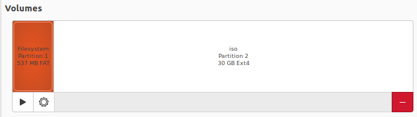
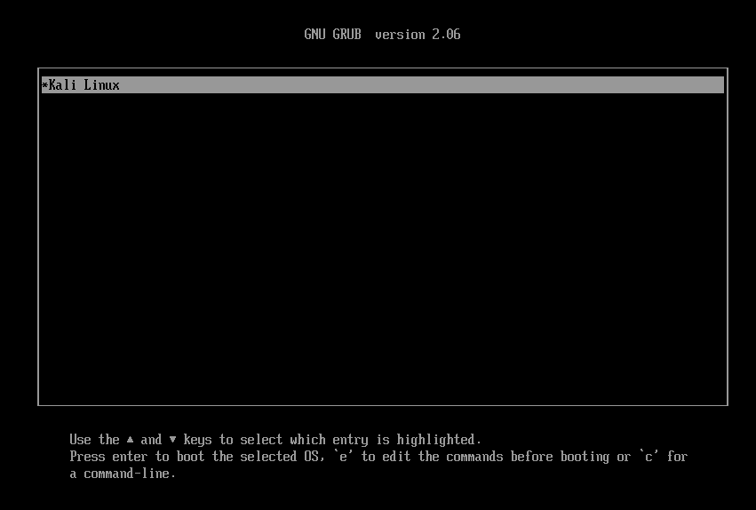
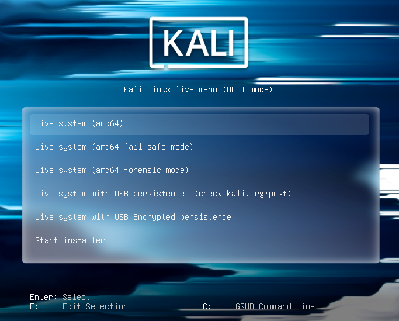
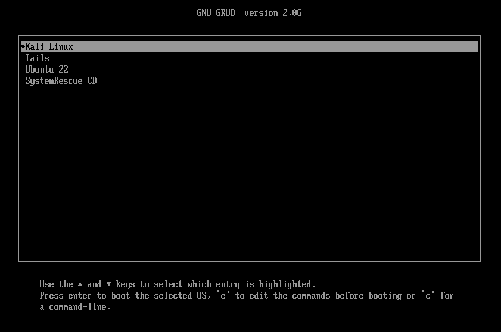
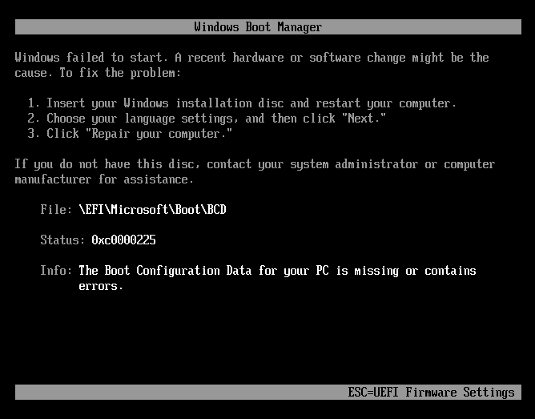

import { FileTree } from '@astrojs/starlight/components';

Distro Linux biasanya mendukung fasilitas *live* boot dari USB Flash Drive.  Namun, bila menggunakan *installer* bawaan, sebuah USB Flash Drive hanya bisa untuk satu distro saja.  Penggunaan media penyimpanan akan lebih efisien bila saya dapat meletakkan beberapa file ISO untuk distro Linux yang berbeda ke USB Flash Drive yang sama. Bagaimana caranya supaya saya dapat meletakkan beberapa file ISO di USB Flash Drive tersebut dan memilih file ISO untuk dijalankan saat komputer dinyalakan?  Pada tulisan ini, saya akan mencoba menerapkan solusi dengan menggunakan GRUB.  Karena GRUB adalah *bootstrap loader* yang sudah dipakai di Ubuntu, saya tidak perlu meng-*install* aplikasi pihak ketiga lagi.

## Instalasi GRUB

Karena menggunakan UEFI, saya akan mulai dengan men-*format* USB Flash Drive dengan menggunakan GUID Partition Table (GPT).  Setelah itu, saya akan membuat dua partisi yang isinya seperti berikut ini:
1. Partisi FAT32 dengan tipe *EFI File System* (ESP) dengan ukuran 512 MB.  Ini adalah partisi yang wajib ada supaya USB Flash Drive ini dapat dikenali oleh UEFI. Saya akan men-install GRUB di partisi ini.  Partisi ini akan dirujuk sebagai `/dev/sdb1` pada tulisan ini.
1. Partisi Ext4 untuk sisa ruang yang ada. Saya akan meletakkan seluruh file ISO di partisi ini. Partisi ini akan dirujuk sebagai `/dev/sdb2` pada tulisan ini.

Sebagai contoh, pada USB Flash Drive 32 GB yang saya pakai, layout partisi-nya akan terlihat seperti pada gambar berikut ini:



Sebelum memulai instalasi GRUB, saya perlu men-*mount* partisi `/dev/sdb1` dengan menggunakan perintah seperti berikut ini:

```shell
$ mkdir esp
$ mount /dev/sdb1 esp
```

:::caution
Nama device seperti `/dev/sdb1` dan `/dev/sdb2` bisa berbeda di komputer lain sesuai dengan jumlah disk yang ada (bisa jadi `/dev/sda1`, `/dev/sdc1` dan sebagainya).  Menulis pada partisi yang salah dapat menyebabkan kerusakan sistem operasi dan kehilangan data! 
:::

Setelah itu, saya bisa melakukan instalasi GRUB dengan memberikan perintah berikut ini:

```shell
$ grub-install --target=x86_64-efi --efi-directory=esp --removable
```

Perintah di atas akan membuat file baru di partisi `/dev/sdb1` dengan struktur seperti berikut ini:

<FileTree>
- EFI
  - BOOT
    - BOOTX64.CSV
    - BOOTX64.EFI
    - grub.cfg
    - grubx64.efi
    - mmx64.efi
</FileTree>

Sampai disini, saya dapat memakai USB Flash Drive tersebut dengan memilih *boot device* berupa USB Flash Drive di menu BIOS.  Ini akan menjalankan shell GRUB seperti yang terlihat pada gambar berikut ini:


Karena belum ada sistem operasi di USB Flash Drive, saat ini tidak ada yang bisa dilakukan oleh GRUB.

## Live ISO Linux

Sebagai latihan, saya menambahkan beberapa file ISO di `/dev/sdb2` sehingga terlihat seperti berikut ini:

<FileTree>
- kali-linux-2024.2-live-amd64.iso
- tails-amd64-6.6.iso
- ubuntu-22.04.3-desktop-amd64.iso
- systemrescue-11.01-amd64.iso
</FileTree>

Salah satu alasan mengapa saya membuat partisi baru `/dev/sdb2` adalah keterbatasan ukuran file maksimal di *file system* FAT32 yang dipakai di `/dev/sdb1`.  Pada FAT32, ukuran sebuah file tidak bisa lebih besar dari 4 GB.  Sementara itu, ukuran file ISO ada yang lebih dari 4 GB (misalnya Kali Linux dengan ukuran 4,6 GB dan Ubuntu Desktop installer dengan ukuran 5 GB).

Setelah ini, saya perlu menambahkan konfigurasi GRUB dengan mengubah file `/EFI/BOOT/grub.cfg` di `/dev/sdb1`.  Sebagai contoh, untuk menampilkan menu untuk memilih ISO Kali Linux, saya akan menambahkan baris konfigurasi seperti berikut ini:

```bash title="grub.cfg" "1234-5678-9012-1234"
function load_iso {
  search.fs_uuid 1234-5678-9012-1234 root  
  loopback loop ${1}
  set root=(loop)
  set iso_path=${1}
  export iso_path
}

menuentry "Kali Linux" {
  load_iso "/kali-linux-2024.2-live-amd64.iso"
  configfile /boot/grub/grub.cfg
}
```

Pada konfigurasi di atas, saya mendeklarasikan sebuah *function* baru dengan nama `load_iso`.  *Function* ini akan menggunakan `search.fs_uuid` untuk mencari partisi yang berisi file ISO (yang seharusnya adalah `/dev/sdb2`) berdasarkan GUID.   Karena nilai GUID selalu unik, saya perlu mengganti nilai ini sesuai dengan nilai GUID untuk partisi `/dev/sdb2`.   Setelah itu, saya menggunakan `loopback` untuk membuat sebuah *device* baru berdasarkan file ISO yang diberikan.  Karena nama file ISO adalah argumen dari *function* ini, saya menggunakan `${1}` sebagai lokasi file *image*.  Saya juga mengganti nilai variabel `root` menjadi `(loop)` sehingga setiap operasi file secara default akan dilakukan pada *device* dari file *image* ini.  Terakhir, saya membuat sebuah variabel `iso_path` yang umum dipakai untuk memberi tahu lokasi file ISO kepada kernel sistem operasi.

Untuk membuat menu baru di GRUB, saya perlu menggunakan `menuentry`.  Sebagai contoh, pada konfigurasi di atas, saya akan memperoleh sebuah baris menu dengan tulisan *Kali Linux* seperti yang terlihat pada gambar berikut ini:



Bila saya men-*mount* file ISO `kali-linux-2024.2-live-amd64.iso`, saya akan menemukan file konfigurasi GRUB yang dipakai oleh distro tersebut di `/boot/grub/grub.cfg`.  Pada file ini, saya akan menemukan pemanggilan kernel Linux dengan *boot parameter* seperti `findiso=${iso_path}`.  Hal ini berarti konfigurasi tersebut sudah mendukung *boot* dari file ISO asalkan saya mendefinisikan nama file ISO di variabel `iso_path`.  Dengan demikian, saya bisa menggunakan `configfile` untuk memanggil GRUB bawaan Kali Linux.

Hasilnya adalah bila menu *Kali Linux* dipilih, saya akan menemukan menu GRUB bawaan distro tersebut seperti yang terlihat pada gambar berikut ini:



Berikutnya, saya akan mendefinisikan `menuentry` untuk distro Tails.  Bila saya men-*mount* file ISO `tails-amd64-6.6.iso`, saya akan menemukan file konfigurasi GRUB di `/EFI/debian/grub.cfg`.  Pada distro ini, saya tidak menemukan *boot parameter* `findiso` di file konfigurasi GRUB-nya.  Oleh sebab itu, saya akan  menyalin definisi `menuentry` bawaan distro di `/EFI/debian/grub.cfg` dan menambahkan `findiso` secara manual seperti yang terlihat pada konfigurasi berikut ini:

```bash title="grub.cfg"
menuentry "Tails" {
  set isofile="/tails-amd64-6.6.iso"
  load_iso "${isofile}"
  echo "Loading the Linux kernel..."
  linux /live/vmlinuz initrd=/live/initrd.img boot=live config live-media=removable nopersistence noprompt timezone=Etc/UTC splash noautologin module=Tails slab_nomerge slub_debug=FZ mce=0 vsyscall=none init_on_free=1 mds=full,nosmt page_alloc.shuffle=1 randomize_kstack_offset=on spec_store_bypass_disable=on findiso=${isofile} quiet
  echo "Loading the initramfs..."
  initrd /live/initrd.img
  echo "Booting..."
  boot
}
```

Untuk distro Ubuntu 22, bila saya men-*mount* file ISO-nya, saya akan menemukan dua file konfigurasi GRUB dengan nama `/boot/grub/grub.cfg` dan `/boot/grub/loopback.cfg`.  Distro tersebut sudah menyediakan file konfigurasi `/boot/grub/loopback.cfg` khusus untuk *boot* lewat file ISO.  Dengan demikian, saya hanya perlu mendeklarasikan `menuentry` baru seperti berikut ini:

```bash title="grub.cfg"
menuentry "Ubuntu 22" {  
  load_iso "/ubuntu-22.04.3-desktop-amd64.iso"
  configfile /boot/grub/loopback.cfg
}
```

Saya juga menemukan hal serupa di distro SystemRescue CD.  Distro ini menyertakan file `/boot/grub/loopback.cfg` di file ISO-nya.  Namun, saya menemukan masalah saat menjalankan file konfigurasi-nya.  Hal ini karena konfigurasi GRUB yang dipakai oleh SystemRescue CD menggunakan perintah `eval` yang tidak didukung oleh instalasi GRUB secara default (di sistem operasi Ubuntu yang saya pakai).  Perintah `eval` ini disediakan oleh sebuah *module* GRUB.  Untuk memakai *module* tersebut, saya akan menyalin file `eval.mod` ke lokasi `/EFI/BOOT` di partisi `/dev/sdb1` (misalnya dari `/boot/grub/x86_64-efi/eval.mod`) sehingga sekarang struktur file-nya akan terlihat seperti berikut ini:

<FileTree>
- EFI
  - BOOT
    - BOOTX64.CSV
    - BOOTX64.EFI
    - grub.cfg
    - grubx64.efi
    - mmx64.efi
    - eval.mod
</FileTree>

Setelah itu, saya akan menambahkan baris berikut ini pada file konfigurasi GRUB:

```bash title="grub.cfg"
menuentry "SystemRescue CD" {
  insmod /EFI/BOOT/eval.mod  
  load_iso "/systemrescue-11.01-amd64.iso"
  configfile /boot/grub/loopback.cfg
}
```

Pada konfigurasi di atas, saya menggunakan `insmod` untuk mengaktifkan modul `eval` sehingga konfigurasi GRUB milik SystemRescue CD bisa dikerjakan dengan baik.

Sebagai hasil akhirnya, saya kini memiliki menu untuk mengerjakan masing-masing distro Linux (dalam bentuk file ISO) seperti yang terlihat pada gambar berikut ini:



## Windows Installer

Sistem operasi Windows juga menyediakan installer dalam bentuk file ISO.  Cara yang direkomendasikan oleh Microsoft adalah menyalin ISO ini ke USB Flash Drive dengan menggunakan *media creation tool*.  Namun, tanpa menggunakan *tool* tersebut, sebenarnya saya juga bisa men-*extract* file ISO ke sebuah partisi NTFS dan menjalankan installer langsung dari UEFI.

:::note
Isi file ISO installer Windows tidak dapat di-salin ke partisi FAT32 karena file `sources/install.wim` berukuran lebih dari 4 GB sementara ukuran maksimum sebuah file di FAT32 adalah 4 GB.
:::

Selain itu, GRUB juga bisa mengerjakan EFI-nya Windows *installer*.  Ini lebih baik daripada menjalankannya langsung dari UEFI karena tidak seluruh perangkat keras dilengkapi dukungan NTFS.  Sementara itu, GRUB yang saya *install* sudah pasti dapat membaca *file system* NTFS.

Walaupun GRUB sebagai *bootstrap loader* dapat membaca isi file ISO, setelah kernel sistem operasi dijalankan, GRUB akan *"lenyap"* dan merupakan tanggung jawab sistem operasi untuk mencari file yang dibutuhkannya.  Beberapa kernel Linux mendukung file ISO melalui *boot parameter* seperti `findiso` (Debian) dan `imgloop` (Arch Linux).  Untuk sistem operasi Windows sendiri, tidak ada dukungan membaca file ISO sehingga walaupun saya bisa menjalankan file EFI dari dalam ISO, saya akan menemukan pesan kesalahan seperti pada gambar berikut ini:



Sebagai solusinya, saya akan membuat sebuah partisi NTFS baru dan menyalin seluruh isi file ISO ke dalam partisi tersebut.  

Setelah itu, saya akan menambahkan baris berikut ini pada file konfigurasi GRUB:

```bash title="grub.cfg" "123456789"
menuentry "Windows Installer" {
  search.fs_uuid 123456789 root
  chainloader "/efi/boot/bootx64.efi"
  boot
}
```

Pada konfigurasi di atas, saya perlu menggunakan GUID di `search.fs_uuid` dengan GUID partisi NTFS yang saya buat sebelumnya.  Perintah `chainloader` akan mengerjakan file EFI milik installer Windows di partisi tersebut.  Dengan konfigurasi GRUB di atas, perangkat keras dengan UEFI tanpa dukungan *file system* NTFS kini tetap bisa menjalankan installer Windows.