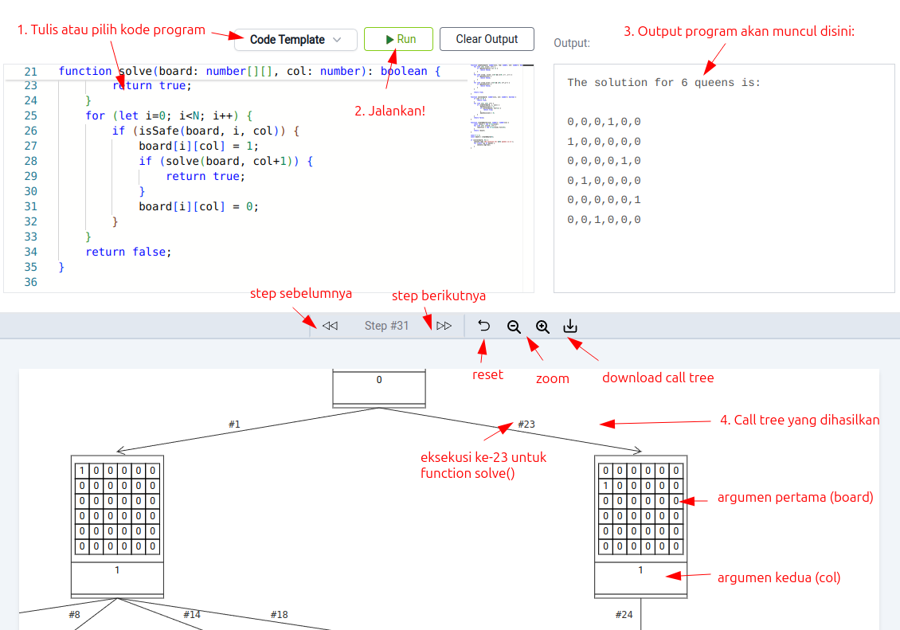
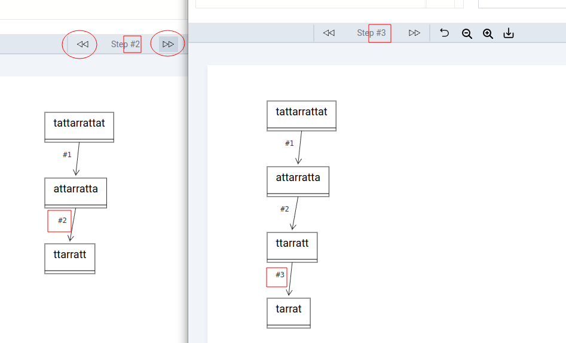
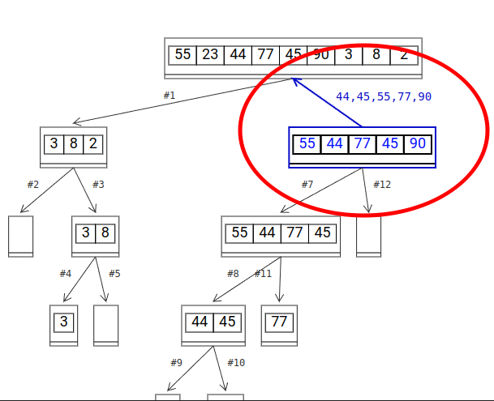
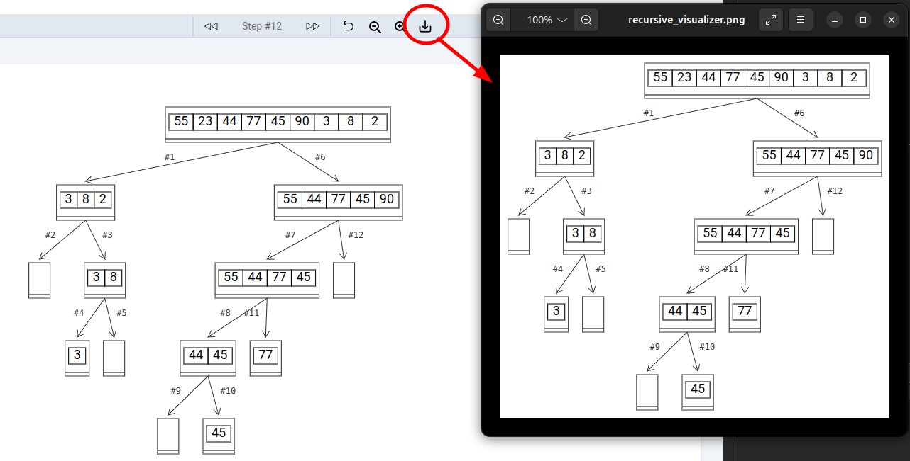
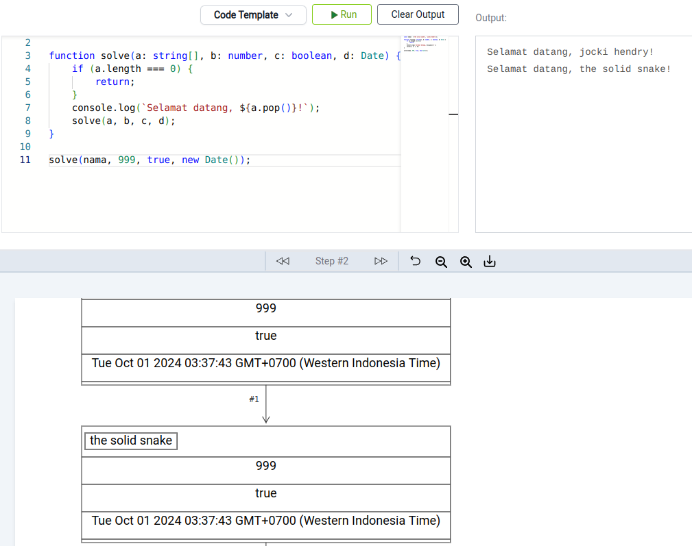
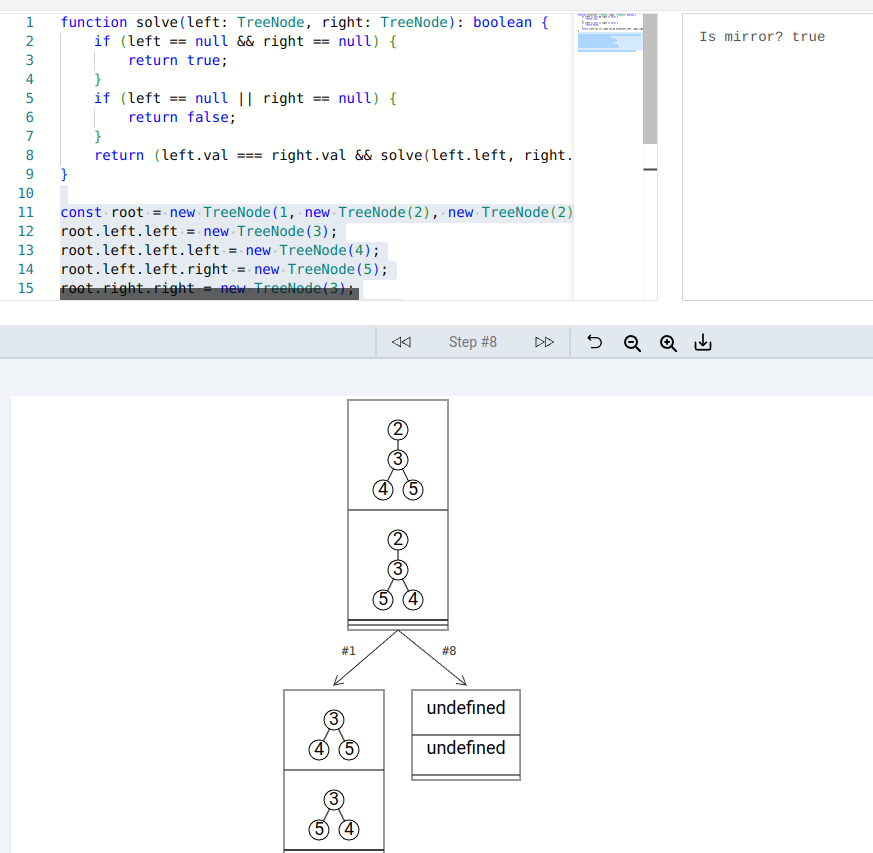
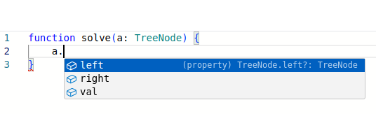
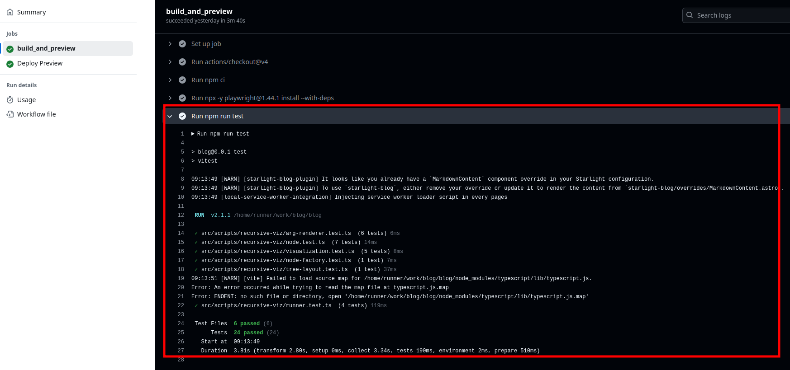

[Visual Recursion](https://jocki.me/tools/visual-recursion) adalah sebuah tool berbasis web untuk melakukan visualisasi *recursion call tree*.  Tool ini sepenuhnya berjalan di browser tanpa interaksi dengan *backend*.  Bahasa pemograman yang didukung adalah TypeScript dan JavaScript.

## Panduan Penggunaan



1. Ketik kode program pada editor yang tersedia.  Program harus mengandung sebuah function *recursive* dengan nama `solve()`.  Function ini boleh memiliki lebih dari satu parameter.
2. Klik tombol **Run** untuk menjalankan kode program.
3. Output dari kode program (dari perintah `console.log()`) akan muncul di bagian *Output*.  Isi dari *Output* juga dapat dihapus dengan men-klik tombol **Clear Output**.
4. *Call tree* untuk `solve()` akan ditampilkan pada sebuah *canvas* berukuran 3000 x 2000 pixels di bagian bawah.  Drag *canvas* ini untuk melihat bagian *call tree* yang tidak terlihat.

Klik tombol panah untuk melihat *call tree* mulai dari awal hingga akhir:



Gerakkan posisi *mouse* pada sebuah *node* untuk melihat hasil kembalian dari function.  Warna *node* akan menjadi biru dan tanda panah akan berbalik ke *parent node* dan mengandung teks berupa nilai yang dikembalikan:



Klik tombol **Zoom in** dan **Zoom out** untuk mengubah ukuran huruf.  Untuk mengembalikan ukuran huruf serta posisi ke semula, klik tombol *reset*.

Klik tombol **Download** untuk menyimpan *call tree* sebagai file gambar PNG:



*Call tree* hanya dihasilkan bila kode program mengandung sebuah function dengan nama `solve()`.  Tidak ada batasan bagaimana cara pemanggilan `solve()`, jumlah argumen dan tipe data argumen-nya.  Sebagai contoh, kode program berikut ini mendefinisikan `solve()` dengan 4 parameter: `a` dengan tipe *array* string, `b` dengan tipe numerik, `c` dengan tipe `boolean` dan `d` dengan tipe object `Date`:



Visual Recursion dilengkapi dengan class `TreeNode` untuk mewakili *binary tree* dengan definisi seperti berikut ini:

```typescript
class TreeNode {
    constructor(public val: any, public left?: TreeNode, public right?: TreeNode) {}
}
```

Class `TreeNode` tidak perlu di-*import* dan dapat langsung dipakai di kode program.  Bila argumen `solve()` adalah `TreeNode`, ia akan ditampilkan dalam bentuk *tree* seperti yang terlihat pada gambar berikut ini:



## Development

Kode program Visual Recursion saat ini menjadi dengan blog ini dalam bentuk komponen Astro dengan nama [VisualRecursion.astro](https://github.com/JockiHendry/blog/blob/b8bcf5f2d26afb83b9c293c40cdb12fcde9273f3/src/components/VisualRecursion.astro).  Bila `VisualRecursion.astro` lebih banya berisi kode HTML, saya meletakkan kode program TypeScript di folder [src/scripts/recursive-viz](https://github.com/JockiHendry/blog/tree/b8bcf5f2d26afb83b9c293c40cdb12fcde9273f3/src/scripts/recursive-viz).

File [ui.js](https://github.com/JockiHendry/blog/blob/b8bcf5f2d26afb83b9c293c40cdb12fcde9273f3/src/scripts/recursive-viz/ui.ts) berisi kode program untuk melakukan binding antara JavaScript dan UI HTML.  Untuk mengurangi jumlah *dependency*, saya memilih untuk melakukan *binding* secara manual dengan `addEventListener()` dan sebagainya.  Bila ini adalah sebuah proyek baru yang berdiri sendiri, saya pasti akan menggunakan framework seperti React atau Angular sehingga kode programnya akan lebih rapi dan singkat.

Untuk editor kode program, saya menggunakan [Monaco Editor](https://github.com/microsoft/monaco-editor) yang berbasiskan VS Code.  Saya menyertakan library tersebut sebagai file statis di folder [public/vs](https://github.com/JockiHendry/blog/tree/b8bcf5f2d26afb83b9c293c40cdb12fcde9273f3/public/vs).  Agar IntelliSense tetap mengenali *class* yang tidak terlihat seperti `TreeNode`, saya menggunakan `addExtralib` seperti pada kode program berikut ini:

```ts title="src/scripts/recursive-viz/ui.ts"
...
typescriptDefaults.addExtraLib(`
    class TreeNode {
        constructor(public val: any, public left?: TreeNode, public right?: TreeNode) {}
    }
`);
...
```



Saya bisa saja menyimpan template kode program yang siap pakai dalam bentuk variabel string, namun Vite memiliki dukungan [raw import](https://vitejs.dev/guide/assets#importing-asset-as-string) sehingga saya bisa meletakkan template dalam bentuk file di folder `template` dan menggunakan `import` seperti berikut ini untuk memakainya:

```ts title="src/scripts/recursive-viz/ui.ts"
import fibonacciCodeTemplate from './template/fibonacci?raw';
import nQueenCodeTemplate from './template/n-queen?raw';
import palindromeCodeTemplate from './template/palindrome?raw';
import quicksortCodeTemplate from './template/quicksort?raw';
import mirrorBinaryTreeTemplate from './template/binary-tree-mirror?raw';
```

Karena *requirement* untuk visualisasi lumayan fleksibel dan saya tidak menemukan *library* yang mendukung *output* sesuai dengan yang diinginkan, saya membuat implementasi visualisasi *call tree* langsung dari fitur `Canvas` bawaan HTML5.  Kode program yang memanipulasi `Canvas` ini sebagian besar dapat dijumpai di [visualization.ts](https://github.com/JockiHendry/blog/blob/b8bcf5f2d26afb83b9c293c40cdb12fcde9273f3/src/scripts/recursive-viz/visualization.ts).  Sebagai contoh, untuk men-*download* `Canvas` menjadi file gambar, saya membuat method `save()` seperti berikut ini:

```ts title="src/scripts/recursive-viz/visualization.ts"
...
save() {
    if (this.rawSource.length === 0) {
        return;
    }
    const imageData = this.ctx.getImageData(0, 0, this.width, this.height);
    let minY = 0, maxY = 0;
    let minX = this.width, maxX = 0;

    // ...
    // mencari minX, minY, maxX dan maxY berdasarkan pixel...
    // ...


    // ...
    // membuat tmpCanvas yang hanya berisi salinan gambar tanpa ruang kosong yang luas
    //

    const tmpCanvas = document.createElement('canvas');
    tmpCanvas.width = contentWidth + 20;
    tmpCanvas.height = contentHeight + 20;

    // ...
    // membuat element <a href> virtual dan men-klik elemen tersebut secara virtual untuk
    // mensimulasikan proses download file
    const a = document.createElement('a');
    a.setAttribute('href', tmpCanvas.toDataURL());
    a.setAttribute('download', 'recursive_visualizer.png');
    document.body.appendChild(a);
    a.click();
    document.body.removeChild(a);
}
...
```

Karena ukuran `Canvas` adalah 3000 x 2000 pixels, bila saya menyimpannya ke file begitu saja, ada kemungkinan besar file gambar yang dihasilkan akan terlihat kecil dan berisi banyak bagian kosong.  Oleh sebab itu, pada kode program di atas, saya menggunakan `getImageData()` dari `Canvas` untuk mendapatkan isi gambar dalam bentuk *array* yang berisi informasi pixel.  Setiap pixel di `Canvas` akan diwakili oleh 4 elemen *array*, masing-masing untuk warna merah, hijau, biru dan *alpha* (transparansi).  Karena saya mengisi `Canvas` dengan latar belakang warna putih, bila saya menjumpai titik yang bukan berwarna putih, maka saya akan menyimpan posisi tersebut sebagai lokasi awal gambar.

:::note
Sepertinya kode program untuk mendeteksi pixel dapat dijadikan soal kompetisi struktur data dan algoritma (DS&A) 😎  Saat ini kode yang saya pakai sangat sederhana dan tidak terlihat elegan.  Saya hanya membuat empat `for` *loop* untuk mendeteksi ujung pixel di posisi kiri atas, kanan atas, kiri bawah dan kanan bawah seperti yang terlihat pada kode dibawah ini:

```typescript
const imageData = this.ctx.getImageData(0, 0, this.width, this.height);
let minY = 0, maxY = 0;
let minX = this.width, maxX = 0;
for (let i=0; i<imageData.data.length; i++) {
    if (imageData.data[i] !== 255) {
        minY = Math.floor(i/(4*imageData.width));
        break;
    }
}
for (let i=imageData.data.length-1; i>=0; i--) {
    if (imageData.data[i] !== 255) {
        maxY = Math.floor(i/(4*imageData.width));
        break;
    }
}
for (let y=0; y<imageData.height; y++) {
    for (let x=0; x<imageData.width; x++) {
        const i = 4*x + 4*imageData.width*y;
        if (imageData.data[i] !== 255 || imageData.data[i+1] !== 255 ||
            imageData.data[i+2] !== 255 || imageData.data[i+3] !== 255) {
                if (x < minX) {
                    minX = x;
                }
                break;
        }
    }
    for (let x=imageData.width-1; x>=0; x--) {
        const i = 4*x + 4*imageData.width*y;
        if (imageData.data[i] !== 255 || imageData.data[i+1] !== 255 ||
            imageData.data[i+2] !== 255 || imageData.data[i+3] !== 255) {
            if (x > maxX) {
                maxX = x;
            }
            break;
        }
    }
}
```

Apa yang dapat dilakukan untuk membuat kode program di atas lebih singkat dan lebih cepat?
:::

Untuk menjalankan kode program yang diketik oleh pengguna, saya akan menggunakan fasilitas `eval()` bawaan JavaScript.  Namun sebelumnya, saya melakukan proses transformasi kode program dengan menyisipkan kode program yang diketik oleh pengguna ke dalam [template/intercepted_code.ts](https://github.com/JockiHendry/blog/blob/b8bcf5f2d26afb83b9c293c40cdb12fcde9273f3/src/scripts/recursive-viz/template/intercepted_code.ts) dan menggunakan library Typescript untuk melakukan transpilasi kode program TypeScript menjadi JavaScript.  Kode program yang melakukan proses ini ada di file [runner.ts](https://github.com/JockiHendry/blog/blob/b8bcf5f2d26afb83b9c293c40cdb12fcde9273f3/src/scripts/recursive-viz/runner.ts):

```ts title="src/scripts/recursive-viz/runner.ts"
execute(): RawRecord[] {
    this.log('Running...');
    const transpiledCode = ts.transpile(this.completeCode);
    const [result, consoleOutput] = eval(transpiledCode);
    this.log(consoleOutput.join(''));
    return result;
}
```

:::danger
Fitur `eval()` di JavaScript sangat berbahaya karena bisa dipakai untuk menjalankan kode program yang bukan dibuat oleh pembuat website tersebut.  Ini adalah salah satu sumber penyebab terjadinya XSS.  Jangan mengerjakan kode program yang tidak dimengerti atau tidak dipercaya melalui `eval()`.  Namun, karena saya membuat aplikasi web yang memang harus menjalankan kode program secara dinamis, tidak ada pilihan yang lebih mudah selain menggunakan `eval()`.
:::

Karena TypeScript adalah superset dari JavaScript, `ts.transpile()` dapat menerima kode program dalam bentuk TypeScript ataupun JavaScript biasa.

Saya menggunakan fitur [Proxy](https://developer.mozilla.org/en-US/docs/Web/JavaScript/Reference/Global_Objects/Proxy) dari JavaScript untuk  menyadap pemanggilan `solve()` sehingga saya bisa melihat argumen yang dilewatkan serta nilai yang dikembalikan setiap kali `solve()` dipanggil.  Selain itu, saya juga menerapkan [proxy pattern](https://en.wikipedia.org/wiki/Proxy_pattern) untuk function `log` dari `Console` sehingga saya bisa merekam output dari `Console.log()` untuk ditampilkan di halaman web.

Setelah mendapatkan rekaman eksekusi, agar lebih mudah ditampilkan, saya akan mengubahnya ke dalam bentuk *tree*.   *Tree* adalah struktur data yang terdiri atas satu atau lebih *node* dimana setiap *node* memiliki maksimal 1 *parent* (berbeda dengan *graph* dimana *node* bisa memiliki lebih dari satu *parent* sehingga tidak akan ada *loop* di *tree*).  Untuk mewakili *node* di *tree*, saya membuat class [Node](https://github.com/JockiHendry/blog/blob/b8bcf5f2d26afb83b9c293c40cdb12fcde9273f3/src/scripts/recursive-viz/node.ts).  Kode program yang melakukan proses transformasi untuk membuat *tree* dapat dijumpai di [NodeFactory](https://github.com/JockiHendry/blog/blob/b8bcf5f2d26afb83b9c293c40cdb12fcde9273f3/src/scripts/recursive-viz/node-factory.ts).

Walaupun terdengar mudah, menggambar *tree* secara indah ternyata bukanlah hal yang sederhana.  Namun, saya tidak perlu memulai dari nol karena banyak *computer scientist* lain yang telah menemukan solusinya.  Salah satu algoritma yang paling sering dipakai untuk menggambar *tree* adalah algoritma Walker (Buccheim adalah variasi algoritma Walker yang lebih cepat).  Oleh sebab itu, saya segera membaca *paper* dengan judul *A Node-Positioning Algorithm for General Trees (Walker, 1989)* yang dapat dilihat di https://www.cs.unc.edu/techreports/89-034.pdf.  Saya kemudian membuat implementasi algoritma tersebut di class [WalkerTreeLayout](https://github.com/JockiHendry/blog/blob/b8bcf5f2d26afb83b9c293c40cdb12fcde9273f3/src/scripts/recursive-viz/tree-layout.tsx).

Algoritma Walker dimulai dari `firstWalk()` yang menghitung posisi koordinat X sementara yang disebut `prelimX` dan `modifier`.  Proses ini dilakukan pada seluruh *node* yang ada secara *post order*.  Untuk setiap *node* yang bukan paling kiri, function `apportion()` akan dipanggil untuk menggeser *node* bila perlu demi mengurangi ruang kosong.  Setelah `firstWalk()`, algoritma Walker akan memanggil `secondWalk()` yang pada dasarnya mengubah posisi sementara di `firstWalk()` menjadi nilai X dan Y yang siap untuk dipakai.

Class [Node](https://github.com/JockiHendry/blog/blob/b8bcf5f2d26afb83b9c293c40cdb12fcde9273f3/src/scripts/recursive-viz/node.ts) berisi informasi yang akan ditampilkan di `Canvas` (seperti argumen dan nilai kembalian) dan juga operasi yang dibutuhkan oleh algoritma Walker (seperti `getLeftSibling()`, `getLeftNeighbor()`, `getLeftMost()` dan sebagainya).

`Node` juga berisi method `render()` yang akan dipanggil oleh `Visualization` untuk menggambar *node* tersebut di `Canvas`.  Method `render()` pada dasarnya akan menggambar kotak yang mewakili *node* dan visualisasi argumen-nya.  Bila *node* tersebut memiliki *parent*, saya juga menggambar konektor panah ke *parent* tersebut.  Walaupun terlihat sangat biasa, untuk menggambar sebuah arah panah, saya perlu menggunakan  matematika yang melibatkan `atan2()`, `sin()` dan `cos()` seperti yang terlihat pada kode program berikut ini:

```typescript title="src/scripts/recursive-viz/node.ts"
const angle = Math.atan2(targetY - sourceY, targetX - sourceX);
ctx.moveTo(sourceX, sourceY);
ctx.lineTo(targetX, targetY);
ctx.lineTo(targetX - 10 * Math.cos(angle - Math.PI / 6), targetY - 10 * Math.sin(angle - Math.PI / 6));
ctx.moveTo(targetX, targetY);
ctx.lineTo(targetX - 10 * Math.cos(angle + Math.PI / 6), targetY - 10 * Math.sin(angle + Math.PI / 6));
ctx.stroke();
```

Untuk setiap argumen yang perlu di-gambar di *node*, saya perlu melakukan visualisasi yang berbeda untuk tipe data tertentu.  Ini adalah contoh kasus yang tepat untuk menerapkan [adapter pattern](https://en.wikipedia.org/wiki/Adapter_pattern).  Saya membuat sebuah *adapter interface* dengan nama `ArgRenderer`.  Saya juga membuat implementasinya yang berupa:
* `BasicValueArgRenderer` untuk menampilkan nilai yang telah dikonversikan ke string.
* `ArrayRowArgRenderer` untuk menampilkan array satu dimensi dalam bentuk satu baris per kolom untuk setiap nilai.
* `MatrixArgRenderer` untuk menampilkan array dua dimensi dalam bentuk tabel.
* `TreeArgRenderer` untuk menampilkan `TreeNode` dalam bentuk *tree*.

Semua kode program untuk class di atas dapat dijumpai di file [arg-renderer.ts](https://github.com/JockiHendry/blog/blob/b8bcf5f2d26afb83b9c293c40cdb12fcde9273f3/src/scripts/recursive-viz/arg-renderer.ts).  Bila suatu hari nanti perlu membuat visualisasi baru untuk tipe data tertentu, saya dapat menambahkan class baru disini.  


`TreeArgRenderer` cukup unik karena ia menampilkan `TreeNode` di kode program dalam visualiasi *tree*.  Saya pada dasarnya perlu menggambar *tree* di dalam *tree*.  `TreeNode` adalah *node* yang dipakai untuk membentuk *binary tree*.  Berbeda dengan *call tree* dimana sebuah *node* bisa memiliki banyak *children*, pada *binary tree*, sebuah *node* hanya memiliki maksimum 2 *children*: `left` dan `right`.  Saya tetap menggunakan `WalkerTreeLayout` yang sama untuk menampilkan *binary tree* tersebut.


## Testing

Saya percaya bahwa kode program (yang *serius*) yang dibuat oleh programmer harus memiliki *unit testing*.  Bukan hanya memastikan tidak ada kesalahan, *unit test* juga membuat programmer merasakan bagaimana memakai *method* dan *class* yang sedang dibuatnya.  Pada saat melakukan *assertion*, programmer memastikan kembali tujuan kode program yang sedang dibuat olehnya dan memikirkan hal-hal tidak terduga yang mungkin terjadi (*input* yang kosong, melebihi nilai maksimum, dan sebagainya).

:::info
Bila programmer kesulitan membuat *unit test*, ini bisa jadi indikator arsitektur software yang buruk.  Sebagai contoh, bila saya meletakkan seluruh kode program saya ke dalam sebuah class tunggal di sebuah file tunggal, boleh dibilang proses penulisan *unit test* akan sangat tidak menyenangkan.   Bila menulis *unit test* saja sudah sulit, maka kemungkinan besar *code base* tersebut akan sulit dipahami dan sulit dimodifikasi (resiko timbulnya *bug* lebih besar).

Sebagai contoh, saya memisahkan antara kode program yang menggambar ke `Canvas` di class `Visualization` dan apa yang digambar di class `Node`.  Class `Visualization` akan memakai informasi posisi yang ada di class `Node` dalam proses penggambaran.  Dengan demikian, saya bisa membuat *unit test* untuk `Node` untuk memastikan posisi-nya di *call tree* sudah benar tanpa perlu memiliki objek `Canvas` atau `CanvasRenderingContext2D` yang ada di class `Visualization`.
:::

Untuk melakukan *unit testing*, saya akan menggunakan [Vitest](https://vitest.dev/).  Saya menambahkan baris berikut ini pada `package.json`:

```json title="package.json"
...
  "scripts": {
    ...
    "test": "vitest"
  },
...  
```

Untuk menjalankan *unit test*, saya bisa memberikan perintah `npm run test`.  Saya juga menambahkan perintah ini ke pipeline Github Actions sehingga *unit test* akan dijalankan pada *pull request* seperti yang terlihat pada gambar berikut ini:



Saya menulis *unit test* di file yang diakhiri dengan `*.test.ts`.  Sebagai contoh, *unit test* untuk file `node.ts` ada di `node.test.ts`.  Untuk melakukan *assertion*, saya menggunakan kode seperti `expect().toEqual()`, `expect().toBeNull()`, dan sebagainya.

Khusus untuk [tree-layout.test.ts](https://github.com/JockiHendry/blog/blob/b8bcf5f2d26afb83b9c293c40cdb12fcde9273f3/src/scripts/recursive-viz/tree-layout.test.ts), isinya agak berbeda karena saya menggunakan fasilitas [snapshot test](https://vitest.dev/guide/snapshot) dari Vitest.  Angka posisi X dan Y akan di-isi secara otomatis oleh Vitest pada saat pertama kali dijalankan.  Sebagai contoh, pada awalnya saya hanya menulis `toMatchInlineSnapshot()` dan Vitest kemudian akan mengubahnya menjadi seperti `toMatchInlineSnapshot('500')`.  Bila saya menjalankan test ini di kemudian hari dan nilai yang dihasilkan berbeda, maka test akan gagal.  Bila nilai berubah dan saya tidak berniat mengubah layout, maka kemungkinan telah terjadi kesalahan yang tidak diduga.

Sampai dimana *unit test* harus dilakukan?  Saya secara pribadi merasa minimal logika kode program harus dicakup (seperti perhitungan posisi, transformasi objek, dan sebagainya).  Terlihat bahwa saya tidak menulis *unit test* untuk `ui.ts`.  Hal ini karena kode program di file tersebut berhubungan dengan DOM dan objek HTML5 seperti Canvas yang hanya tersedia di *browser*.  Bila ada waktu lebih atau ada sumber daya *test engineer* yang bisa dipakai, saya bisa menggunakan `jsdom` untuk mensimulasikan DOM & Canvas.   Atau, boleh juga langsung ke pengujian UI secara otomatis masuk ke kategori *integration testing* yang bisa dilakukan dengan bantuan tool seperti Plywright.  

:::note
Menulis UI testing bisa sangat melelahkan bila tidak dilakukan oleh *test engineer* karena ini sudah merupakan konteks yang berbeda (berhubungan dengan *browser* secara keseluruhan bukan lagi ke `class` yang barusan dibuat).  *Context switching* seperti ini bisa menurunkan produktifitas programmer.  Bila tidak terdapat *test engineer*, *product manager* adalah kandidat yang tepat untuk melakukan UI testing karena mereka yang paling tahu bagaimana seharusnya fitur baru bekerja.

Yang lebih ribet lagi, UI testing harus di-*maintain* karena tampilan aplikasi biasanya selalu berubah dari waktu ke waktu.  Baru saja UI test selesai ditulis, tidak lama kemudian sudah harus dimodifikasi.
:::

Bahkan setelah membuat *unit test*, tidak ada jaminan aplikasi bebas dari bug sehingga pengujian di *staging* tetap merupakan ide bagus.  Sebagai contoh, pada awalnya saya menyertakan Monaco Editor sebagai *dependency* di `package.json`.  Karena Monaco Editor menggunakan *web worker* dan Vite mendukung [web worker lewat import](https://vitejs.dev/guide/assets.html#importing-script-as-a-worker), saya bisa memakainya dengan kode program seperti berikut ini:

```typescript
import {editor} from 'monaco-editor';
import EditorWorker from 'monaco-editor/esm/vs/editor/editor.worker?worker';
import JSONWorker from 'monaco-editor/esm/vs/language/json/json.worker?worker';
import CSSWorker from 'monaco-editor/esm/vs/language/css/css.worker?worker';
import HTMLWorker from 'monaco-editor/esm/vs/language/html/html.worker?worker';
import TSWorker from 'monaco-editor/esm/vs/language/typescript/ts.worker?worker';
...
editor.create(editorContainerElement, {
    language: 'typescript',
    automaticLayout: true,
});
```

Halaman terlihat baik dan bisa bekerja dengan lancar di *browser* bila aplikasi dijalankan di *dev* dengan perintah `npm run dev`.  Namun, siapa sangka setelah di-build ke *production* dengan `npm run build && npm run preview`, tampilan Monaco Editor jadi berantakan.  Ini mungkin adalah bug di Vite, namun ini adalah contoh dimana hal-hal tidak terduga selalu bisa terjadi di *software engineering*.