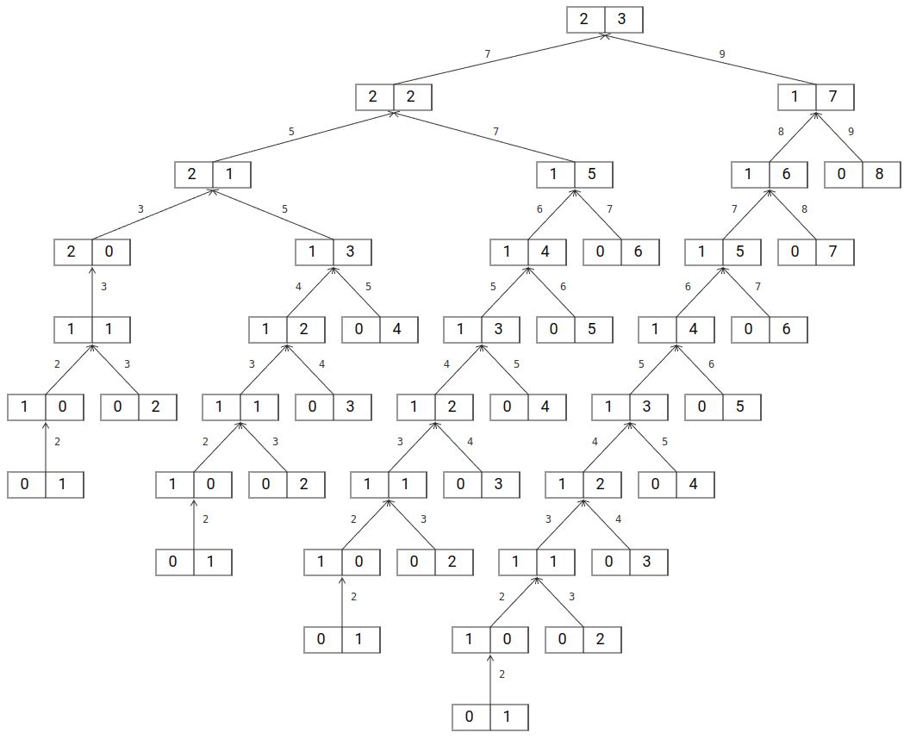
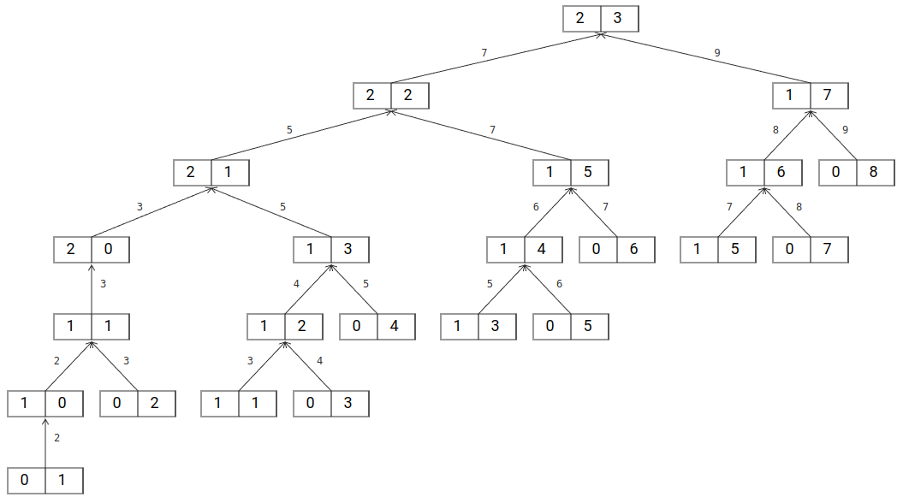
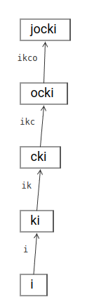
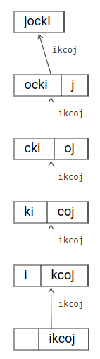
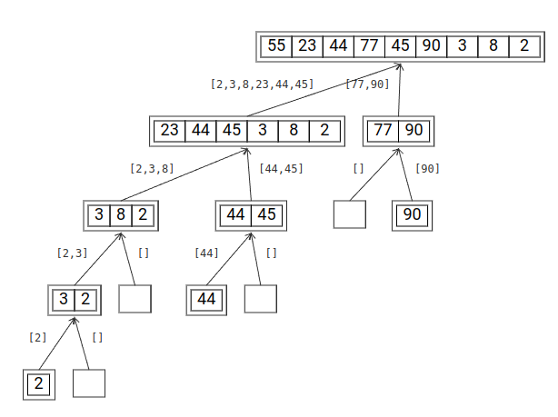
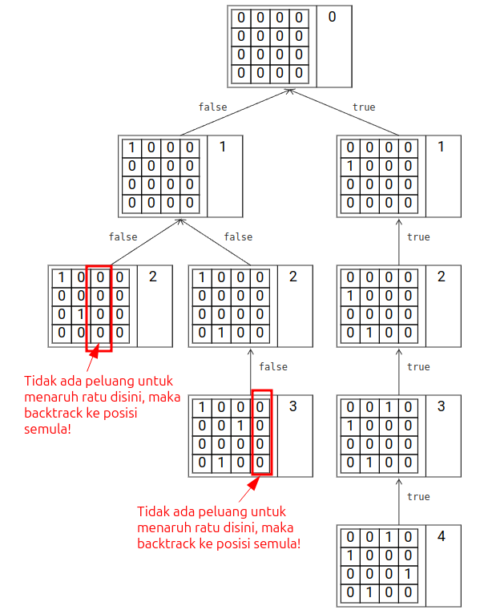

import 'katex/dist/katex.css';

Rekursi (*recursion*) adalah sebuah teknik pemograman dimana sebuah *function* memanggil dirinya sendiri.  Walaupun jarang dipakai di pemograman tingkat tinggi seperti aplikasi web, rekursi merupakan fondasi yang penting dan sering dijumpai di persoalan struktur data & algoritma (DS&A).  Sebagai contoh, *dynamic programming* merupakan salah satu bentuk penerapan rekursi dan struktur data *tree* adalah struktur data yang sering ditelusuri secara rekursif.

:::note
Beberapa istilah DS&A terdengar mirip seperti istilah *software engineering* lainnya tetapi sebenarnya tidak saling berhubungan.  Sebagai contoh, *dynamic programming* pada bahasa pemograman adalah sebuah klasifikasi bahasa pemograman yang tidak memiliki tipe data statis (misalnya Python & JavaScript versus C/C++ & Java).  *Dynamic programming* pada DS&A adalah sebuah teknik dalam menyelesaikan persoalan dimana persoalan dibagi menjadi persoalan yang lebih kecil untuk diproses lewat rekursi.  Istilah *dynamic* disini dipilih karena cara membuatnya yang tidak seperti algoritma konvensional dimana programmer menyelesaikan permasalahan berurutan langkah demi langkah.

Contoh lainnya adalah *heap*.  Pada DS&A, *heap* adalah struktur data *tree* dimana nilai dari sebuah *node* selalu lebih besar (untuk *max heap*) atau lebih kecil (untuk *min heap*) dari nilai *children*-nya.  Pada *software engineering*, *heap* adalah lokasi memori bebas yang tersedia untuk dipakai oleh kode program (misalnya melalui `malloc` di C).  *Heap* untuk `malloc` ini sama sekali tidak berhubungan dengan struktur data *tree* dan murni hanya kebetulan saja mereka memakai nama yang sama (*heap* secara literal berarti timbunan atau onggokan).
:::

Salah satu kendala yang saya jumpai saat mempelajari teknik rekursif adalah sulitnya melakukan visualiasi pemanggilan.  Untuk itu, saya membuat [Visual Recursion](https://jocki.me/tools/visual-recursion) dengan harapan supaya saya bisa lebih memahami teknik rekursif.

## Rekursi

Pada matematika, contoh klasik rekursi adalah deretan Fibonacci yang didefinisikan sebagai berikut ini:

```math
\begin{align}
F_0 &= 0,\\
F_1 &= 1,\\
F_n &= F_{n-1} + F_{n-2}
\end{align}
```

Walaupun demikian, implementasi-nya di kode program tidak selalu harus lewat rekursi karena *function* di pemograman memiliki lebih banyak fitur dibandingkan dengan *function* matematika.  Sebagai contoh, ini adalah contoh implementasi *function* yang mencari angka Fibonacci pada posisi tertentu melalui *loop* (secara iteratif):

```typescript
function solve(n: number): number {
    let a = 0;
    if (n === 1) {
        return a;
    }
    let b = 1;
    if (n === 2) {
        return b;
    }
    for (let i=3; i<=n; i++) {
        let sum = a + b;
        a = b;
        b = sum;
    }
    return b;
}

console.log(solve(10)); 

// OUTPUT:
// 34
```

Secara umum, kode program versi iteratif memiliki *performance* yang lebih baik dibandingkan dengan versi rekursif.  Walaupun demikian, biasanya versi rekursif lebih mudah dipahami dibandingkan dengan versi iteratif. Contohnya adalah [Ackermann function](https://en.wikipedia.org/wiki/Ackermann_function) yang didefinisikan seperti berikut ini:

```math
A(m,n) = \begin{cases}
 n + 1 &\text{if }m = 0\\
 A(m-1,1) &\text{if }m > 0&\text{ and } n = 0\\
 A(m-1, A(m,n-1)) &\text{if }m > 0&\text{ and } n > 0
\end{cases}
```

*Function* tersebut akan mudah dipahami bisa ditulis melalui pemanggilan rekursif seperti pada contoh kode program berikut ini:

```typescript
function solve(m: number, n: number): number {
    if (m === 0) {
        return n + 1;
    }
    return solve(m - 1, n === 0 ? 1 : solve(m, n - 1));
}

console.log(solve(2,3));

// OUTPUT:
// 9
```



## Memoization

Salah satu cara untuk meningkatkan kinerja rekursi adalah dengan menggunakan *memoization*.  Implementasinya lumayan sederhana, cukup simpan hasil kembalian *function* untuk argumen tertentu sehingga bila nanti ada pemanggilan dengan argumen yang sama, tidak perlu dihitung lagi.  Sama seperti bentuk *caching* lainnya, walaupun kecepatan eksekusi meningkat, *memoization* akan menambah penggunaan memori.

Sebagai contoh, ini adalah versi kode program yang menghitung Ackermann function yang sudah menggunakan *memoization*:

```typescript
const cache = new Map<string, number>();

function solve(m: number, n: number): number {    
    const h = `${m};${n}`;
    if (cache.has(h)) {
        return cache.get(h);
    }
    if (m === 0) {
        return n + 1;
    }
    const result = solve(m - 1, n === 0 ? 1 : solve(m, n - 1));
    cache.set(h, result);
    return result;
}

console.log(solve(2,3));

// OUTPUT:
// 9
```



Bila dilihat dari *call tree* yang dihasilkan, sekarang terlihat jauh lebih singkat dari versi sebelumnya.  Versi tanpa *memoization* melibatkan 43 kali pemanggilan *function*.  Bandingkan dengan versi *memoization* yang hanya melibatkan 22 kali pemanggilan *function*.

Karena `Map` hanya mendukung sebuah *key* tunggal, saya menggabungkan `m` dan `n` dalam bentuk string.  Bila ingin kinerja yang lebih baik lagi, *key* sebaiknya dalam bentuk sebuah angka.  Saya bisa menghasilkan sebuah angka unik dari dua angka yang berbeda dengan menggunakan [Cantor pairing function](https://en.wikipedia.org/wiki/Pairing_function) yang didefinisikan seperti berikut ini:

```math
\pi(k_1,k_2) = \cfrac{1}{2}(k_1+k_2)(k_1+k_2+1)+k_2
```

dimana $$k_1,k_2\in\lbrace0,1,2,3,...\rbrace$$.

Versi kode programnya terlihat seperti berikut ini:

```typescript
const cache = new Map<number, number>();

function pair(m: number, n: number): number {
    return ((m+n)*(m+n+1))/2 + n;
}

function solve(m: number, n: number): number {
    const p = pair(m, n);
    if (cache.has(p)) {
        return cache.get(p);
    }
    if (m === 0) {
        return n + 1;
    }
    const result = solve(m - 1, n === 0 ? 1 : solve(m, n - 1));
    cache.set(p, result);
    return result;
}

console.log(solve(2,3));

// OUTPUT:
// 9
```

## Tail Recursion

Pada saat sebuah *function* dipanggil, sistem operasi akan menyimpan informasi seperti posisi kembali di sebuah memori sementara yang disebut *stack*.  Bila *function* tersebut memanggil *function* lain lagi, informasi posisi saat ini akan ditambahkan ke *stack*, dan begitu seterusnya.  Memori *stack* ini biasanya terbatas, misalnya area *stack* secara bawaan adalah 8 MB di Linux dan 1 MB di Windows.

Bila sebuah *function* memanggil *function* yang kemudian memanggil *function* lain dan kemudian memanggil *function* lain yang kemudian memanggil *function* lain dan seterusnya hingga area *stack* menjadi penuh, program akan mengalami kesalahan.  Jenis kesalahan seperti ini disebut sebagai *stack overflow*.  Rekursi sangat rentan terhadap kesalahan *stack overflow* karena banyaknya pemanggil *function* yang terjadi.

Bila *function* rekursif yang dipanggil merupakan kode program paling terakhir yang dikerjakan di sebuah *function*, ia disebut sebagai *tail recursion*.   Salah satu kondisi unik pada *tail recursion* adalah sebenarnya tidak perlu menggunakan *stack* untuk mengingat posisi kembali terakhir karena ia bisa langsung kembali ke *function* sebelum-sebelumnya.  Dengan demikian, *tail recursion* dapat dioptimalisasikan menjadi seperti iterasi tidak akan terjadi *stack overflow* lagi.  Namun, tidak semua *compiler* atau *interpreter* mendukung fitur ini.  Berdasarkan informasi di [artikel Wikipedia](https://en.wikipedia.org/wiki/Tail_call), tidak semua browser JavaScript mendukung *tail call optimization* (terbatas di Safari/WebKit).

Sebagai contoh, berikut ini adalah kode program yang membalikkan string secara rekursif:

```typescript
function solve(s: string): string {
    if (s.length < 2) return s;
    return solve(s.slice(1)) + s[0];
}

console.log(solve('jocki'));

// OUTPUT:
// ikcoj
```



Sementara itu, berikut ini adalah versi yang menggunakan *tail recursion*:

```typescript
function solve(s: string, acc?: string): string {
    if (s.length < 2) return acc;
    return solve(s.slice(1), s[0] + (acc ?? ''));
}

console.log(solve('jocki'));

// OUTPUT:
// ikcoj
```



Biarpun sama berakhir dengan `return solve()` di baris terakhir, kode program pertama tidak menerapkan *tail recursion*.  Hal ini karena `return solve(...) + s[0]` dimana hasil kembalian pemanggilan rekursif `solve(...)` perlu ditambahkan lagi dengan `s[0]`.  Ini menunjukkan masih ada yang perlu dilakukan setelah pemanggilan rekursif selesai!  Sementara itu, pada program versi kedua, baris terakhir murni `return solve(...)` tanpa tambahan apa2 sehingga ini adalah *tail recursion*.

## Algoritma Divide and Conquer

*Divice and conquer* adalah jenis algoritma rekursi yang memecahkan permasalahan menjadi permasalahan kecil untuk diselesaikan, kemudian hasil-nya digabungkan kembali untuk mendapatkan solusi permasalahan tersebut.  Salah satu contoh algoritma *divide and conquer* yang populer adalah *quick sort*.  Berikut ini adalah contoh kode program *quick sort*:

```typescript
function solve(arr: number[]): number[] {
    if (arr.length < 2) {
        return arr;
    }
    const pivot = arr[Math.floor(Math.random() * arr.length)];
    const left = [];
    const right = [];
    for (const a of arr) {
        if (a < pivot) {
            left.push(a);
        } else if (a > pivot) {
            right.push(a);
        }
    }
    return [...solve(left), pivot, ...solve(right)];
}

const data = [55,23,44,77,45,90,3,8,2];
console.log(`Unsorted array is `, data);
const sorted = solve(data);
console.log(`Sorted array is `, sorted);

// OUTPUT:
// Unsorted array is 	55,23,44,77,45,90,3,8,2
// Sorted array is      2,3,8,23,44,45,55,77,90
```



Pada *quick sort*, terlihat bahwa *array* yang akan diurutkan dipecah berdasarkan *pivot* di posisi yang acak.  Setelah mencapai ukuran paling kecil, *array*-*array* yang kecil ini digabungkan menjadi satu per satu hingga menjadi kembali seperti *array* awal tetapi kini dengan posisi yang sudah berurut.

## Backtracking

*Backtracking* adalah variasi dari algoritma rekursi yang memungkinkan kode program untuk berhenti dari proses rekursi di saat kondisi sudah tidak valid lagi.  Ini adalah bentuk optimalisasi dari pendekatan mencoba *brute force* semua kombinasi yang ada.  Salah satu persoalan yang paling sering dijumpai untuk *backtracking* adalah *N-queen puzzle*.  Bagaimana cara-nya meletakkan $$N$$ ratu di papan catur dengan ukuran $$NxN$$ dimana mereka tidak saling menyerang satu sama lain?

```typescript
function isSafe(board: number[][], row: number, col: number): boolean {
    for (let i=0; i<col; i++) {
        if (board[row][i] === 1) {
            return false;
        }
    }
    for (let i=row, j=col; i>=0 && j>=0; i--, j--) {
        if (board[i][j]) {
            return false;
        }
    }
    for (let i=row,j=col; j>=0 && i<N; i++,j--) {
        if (board[i][j]) {
            return false;
        }
    }

    return true;
}

function solve(board: number[][], col: number): boolean {
    if (col >= N) {
        return true;
    }
    for (let i=0; i<N; i++) {
        if (isSafe(board, i, col)) {
            board[i][col] = 1;
            if (solve(board, col+1)) {
                return true;
            }
            board[i][col] = 0;
        }
    }
    return false;
}

function createBoard(size: number): number[][] {
    const result = new Array(size);
    for (let i=0; i<size; i++) {
        result[i] = new Array(size).fill(0);
    }
    return result;
}

const N = 4;
const board = createBoard(N);

if (solve(board, 0)) {
    console.log(`The solution for ${N} queens is:\n`);
    for (const row of board) {
        console.log(row);
    }
}
```



Pada kode program di atas, begitu `isSafe()` mengembalikan `false` (posisi tidak valid), maka posisi ratu saat ini akan dihapus dan proses rekursi untuk cabang ini tidak akan diteruskan.

## Dynamic Programming

*Dynamic programming* hampir sama seperti *divide and conquer* yang memecahkan sebuah permasalahan menjadi masalah-masalah kecil.  Perbedaannya, pada *dynamic programming*, permasalahan kecil ini saling berhubungan satu dengan yang lainnya, sementara pada *divide and conquer*, setiap permasalahan kecil masing-masing berdiri sendiri.

Salah satu contoh *dynamic programming* adalah [longest common subsequence (LCS)](https://en.wikipedia.org/wiki/Longest_common_subsequence).  LCS dipakai untuk mencari bagian dari *string* yang sama tetapi tidak perlu berurut.  Penerapannya adalah untuk menampilkan `diff`, revisi seperti di `git`, dan sebagainya.  Definisi LCS secara matematika adalah:

```math
LCS(X_i,Y_j)=\begin{cases}
\in &\text{if }i = 0\text{ or }j = 0\\
LCS(X_{i-1},Y_{j-1})^\land{x_i} &\text{if }i,j > 0\text{ and }x_i = y_j\\
max\lbrace{LCS(X_i,Y_{j-1}),LCS(X_{i-1},Y_j)}\rbrace &\text{if }i,j > 0\text{ and }x_i\ne{y_j}
\end{cases}
```

dimana *string* yang akan dibandingkan adalah $$X = \lparen{x_1},{x_2},\ldots,{x_m}\rparen$$ dan $$Y = \lparen{y_1},{y_2},\ldots,{y_n}\rparen$$.  Nilai $$X_0,X_1,X_2,\ldots,X_m$$ adalah 0, 1, 2 karakter pertama dari $$X$$ dan seterusnya.  Nilai $$Y_0,Y_1,Y_2,\ldots,Y_n$$ adalah 0, 1, 2 karakter pertama dari $$Y$$ dan seterusnya.  Nilai $$\in$$ mewakili string kosong.  Operator $$^\land$$ dipakai untuk menggabungkan *string*.

*Dynamic programming* bisa dilakukan secara *top down* (rekursif) ataupun *bottom up* (iteratif).  Teknik *bottom up* biasanya memakai tabel atau *array* yang perlu di-isi (disebut juga *tabulation*).  Sebagai contoh, saya bisa membuat tabel untuk rumus matematika di atas dengan kode program seperti berikut ini:

```typescript
function LCS(X: string, Y: string): number[][] {
    const m = X.length;
    const n = Y.length;
    const C = new Array(m+1);
    for (let i=0; i<m+1; i++) {
        C[i] = new Array(n+1).fill(0);
    }
    for (let i=1; i<=m; i++) {
        for (let j=1; j<=n; j++) {
            if (X[i-1] === Y[j-1]) {
                C[i][j] = C[i-1][j-1]+1;
            } else {
                C[i][j] = Math.max(C[i][j-1], C[i-1][j]);
            }
        }
    }
    return C;
}

const X = "jocki";
const Y = "jokowi";
const C = LCS(X, Y);
```

Tabel yang dihasilkan untuk `"jocki"` dan `"jokowi"` akan terlihat seperti berikut ini:

```math
\begin{array}{l|r:r:r:r:r:r:r}
 & \in & \text{j} & \text{o} & \text{k} & \text{o} & \text{w} & \text{i} \\
\hline
\in & 0 & 0 & 0 & 0 & 0 & 0 & 0 \\
\text{j} & 0 & 1 & 1 & 1 & 1 & 1 & 1 \\
\text{o} & 0 & 1 & 2 & 2 & 2 & 2 & 2 \\
\text{c} & 0 & 2 & 2 & 2 & 2 & 2 & 2 \\
\text{k} & 0 & 2 & 3 & 3 & 3 & 3 & 3 \\
\text{i} & 0 & 1 & 2 & 3 & 3 & 3 & 4 \\
\end{array}
```

Tabel di atas memperlihatkan LCS untuk setiap *prefix* mulai dari 0 hingga keseluruhan.  Sebagai contoh, jumlah LCS `joc` dan `jok` adalah `2`, jumlah LCS `jock` dan `joko` adalah `3`.  Dan begitu seterusnya. Untuk keseluruhan kata, jumlah LCS `jocki` dan `jokowi` yang berada di pojok kanan bawah adalah `4`.

Untuk menelusuri setiap perbedaan yang ada di *matrix* LCS di atas, saya dapat menggunakan teknik rekursi seperti pada kode program berikut ini:

```typescript
function printDiff(C: number[][], X: string, Y: string, i: number, j: number) {
    if (i >= 0 && j >= 0 && X[i] === Y[j]) {
        printDiff(C, X, Y, i-1, j-1);
    } else if (j > 0 && (i === 0 || C[i][j-1] >= C[i-1][j])) {
        printDiff(C, X, Y, i, j-1);
        console.log("+ " + Y[j]);
    } else if (i > 0 && (j === 0 || C[i][j-1] <= C[i-1][j])) {
        printDiff(C, X, Y, i-1, j);
        console.log("- " + X[i]);
    }
}

const X = "jocki";
const Y = "jokowi";
const C = LCS(X, Y);
printDiff(C, X, Y, X.length, Y.length);

// OUTPUT:
// - c
// + o
// + w
```

Output di atas memperlihatkan bahwa `"jocki"` bisa berubah menjadi `"jokowi"` bila huruf `c` dihapus dan `ow` ditambahkan.