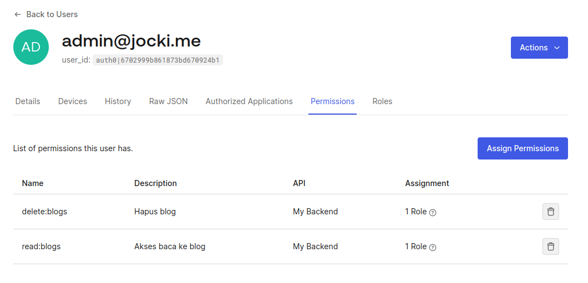

import Login from '../../../components/blog-oauth/Login.astro';
import Logout from '../../../components/blog-oauth/Logout.astro';
import AuthorizationCode from '../../../components/blog-oauth/AuthorizationCode.astro';
import JWTDecode from '../../../components/blog-oauth/JWTDecode.astro';
import JWTVerify from '../../../components/blog-oauth/JWTVerify.astro';
import Profile from '../../../components/blog-oauth/Profile.astro';
import { Steps } from '@astrojs/starlight/components';


Pada suatu hari, saya menghabiskan waktu berjam-jam untuk membahas *stateless authentication* dengan seorang security senior.  Senior tersebut mempertanyakan keamanan proses verifikasi JWT setelah diterima oleh *service* di *back end*.  Ia membandingkan OAuth2 dengan *ticket* di Kerberos dimana *ticket* yang diterima perlu diverifikasi oleh *service* lain melalui melalui komunikasi jaringan.  Saya berusaha menyakinkan padanya bahwa setelah JWT diterima oleh *service*, masing-masing *service* dapat melakukan verifikasi sendiri secara lokal tanpa perlu memanggil *service* lain (seperti *user service*, *auth service*, dsb).  Bukan saja *trust boundary* menjadi lebih singkat (sehingga lebih aman karena proses verifikasi di lokal), verifikasi ini tidak akan memberatkan server lain karena akan terdistribusi di masing-masing *micro services*.  Untuk menghindari diskusi seperti ini di kemudian hari, saya akan membuat sebuah artikel interaktif pada halaman ini untuk men-simulasi-kan cara kerja OAuth2 dan JWT.

## Authentication

OAuth2 lebih berfokus pada *authorization*.  Ia memiliki konsep *access token* yang didalamnya mengandung *scope* yang berisi indikator API mana saja yang boleh dipanggil melalui *access token* tersebut.  Namun, OAuth2 tidak mensyaratkan bagaimana user harus login.  OpenID Connect (OIDC) adalah ekstensi dari OAuth2 yang menambahkan bagian *authentication*.  Dengan OIDC, pengguna bisa login dengan akun sosial seperti Google & Meta.

Saya tidak akan berfokus pada *authentication* pada tulisan ini.  Sebagai latihan, saya sudah membuat user berikut ini:

* Email `user1@jocki.me` dengan password `Password123` dengan role `user`.
* Email `admin@jocki.me` dengan password `Password123` dengan role `admin`.

## Mendapatkan Token

Sebelum memperoleh token seperti JWT, langkah pertama dalam OAuth2 adalah mendapatkan *authorization grant* terlebih dahulu.  Spesifikasi OAuth2 memberikan 4 pilihan untuk *authorization grant*:
* *Authorization Code*
* *Implicit*
* *Resource Owner Password Credential*
* *Client Credential*

Metode yang paling umum dipakai untuk aplikasi web & mobile adalah *authorization code* dimana Resource Owner akan mengembalikan sebuah kode sementara yang harus segera ditukar dengan *access token*.  Dengan demikian, username & password dari Resource Owner (misalnya password akun Google yang dipakai untuk login) tidak akan pernah dikirim ke Authorization Server.

Sebagai contoh implementasi, tombol berikut ini akan men-*redirect* ke halaman milik Authorization Server (yang kemudian akan mengarahkan ke akun sosial untuk login bila perlu):

<Login />

<Steps>
1. Klik tombol di atas dan perhatikan URL saat halaman login muncul.  Apakah domain-nya sama?
    <details>
      <summary>Jawaban:</summary>
      Tidak sama! Pada OAuth2, halaman tersebut milik entitas yang disebut sebagai **Authorization Server** dan halaman blog ini disebut sebagai **Client**.  Pada contoh yang lebih realistis, **Authorization Server** bisa saja memakai domain yang sama namun dengan subdomain yang berbeda.
    </details>
2. Setelah login berhasil, pengguna akan kembali ke halaman ini.  Tapi ada yang berbeda, apa itu?
    <details>
      <summary>Jawaban:</summary>
      Pada URL setelah login berhasil, terdapat *request parameter* seperti `code` dan `state`.  Sebelumnya, parameter ini tidak ada.
    </details>
3. Coba login dengan menggunakan akun Google.  Bila sudah berhasil login dengan email & password, gunakan tombol **Paksa Login Kembali**.
</Steps>

Bila proses *login* berhasil, saya akan kembali ke halaman ini dan mendapatkan parameter `code` dalam bentuk parameter URL.  *Authorization code* hanya bisa dipakai sekali saja.  Setelah menukar *authorization code* dengan *access token*, *authorization code* yang sama tidak bisa digunakan lagi sehingga tombol login di atas harus kembali ditekan untuk mendapatkan *authorization code* baru.

<AuthorizationCode />

<Steps>
1. Pastikan bahwa *Authorization Code* di atas sudah terisi.  Bila belum, *refresh* halaman dan/atau login kembali.  Kemudian, klik tombol **Tukar Authorization Code Dengan Token**.  Authorization Server akan mengembalikan *access token* dan *ID    
2. Setelah berhasil mendapatkan token, klik kembali tombol **Tukar Authorization Code Dengan Token**.  Apakah proses penukaran berhasil?
    <details>
      <summary>Jawaban:</summary>
      Tidak!  *Authorization code* hanya bisa dipakai sekali saja untuk mencegah *replay attack*.
    </details>
3. Apa fungsi *State*?
    <details>
      <summary>Jawaban:</summary>
      State bisa dipakai untuk mencegah CSRF.  Bila *hacker* membuat website berbahaya yang memanggil Authorization Server yang saya gunakan untuk mendapatkan *access token* pengguna (dengan memancing pengguna login di website tersebut).   Tanpa nilai *state*, website saya tidak akan bisa mengenali apakah *request* seperti ini dari website yang seharusnya atau bukan.
    </details>
</Steps>

Bila proses penukaran berhasil, saya akan memperoleh *access token* dan *ID token*.

*ID token* adalah bawaan dari spesifikasi dari OIDC dimana aplikasi bisa mendapatkan informasi seperti foto profil, email, nama lengkap, dan sebagainya dari akun sosial yang dipakai oleh pengguna (bila login melalui akun sosial seperti Google, Meta, dan sebagainya).  Sementara itu, *access token* adalah *token* yang perlu dilewatkan ke *back end* saat memakai API.

Konsumen dari *ID token* adalah aplikasi web.  Biasanya informasi yang ada di *ID token* dipakai untuk menampilkan foto pengguna di halaman user, nama lengkap, email dan sebagainya.  Informasi ini tidak ada di database *back end* bila pengguna baru pertama kali login dengan akun sosial.  *ID token* tidak perlu dilewatkan ke API *back end*.

Sebagai contoh, berikut ini contoh tampilan profil berdasarkan *ID token* yang diterima:

<Profile />

<Steps>
1. Coba login kembali dengan menggunakan akun Google dan ulangi langkah penukaran *authorization code* di atas.  Foto profil, email dan nama akun Google akan muncul tampilan profil di atas.  Dimanakah data tersebut disimpan?
   <details>
      <summary>Jawaban:</summary>
      Informasi yang diperoleh dari akun Google akan disimpan di *ID token*.  Apa yang di-izinkan oleh pengguna, seperti melihat data pribadi dan foto profil, tertuang di *ID token*.  Programmer tidak bisa menggunakan cara lain (misalnya memanggil API di server Google secara langsung untuk mendapatkan lebih banyak informasi) selain dengan mengarahkan pengguna untuk kembali login dan meminta izin pengguna. 
    </details>
</Steps>

Konsumen dari *access token* adalah API yang ada di *back end*.   Berkebalikan dengan *ID token*, *acess token* cukup disimpan oleh aplikasi web untuk kemudian dikirim melalui header `Authorization` setiap kali memanggil API.

Selain itu, pada saat meminta *authorization code*, bila saya menambahkan `scope` dengan nama `offline_access`, saya akan mendapatkan satu jenis token lagi yang disebut sebagai *refresh token*.  Penggunaan *refresh token* tidak direkomendasikan untuk aplikasi web.  Ia lebih sering dipakai di aplikasi mobile dimana token bisa disimpan secara aman dalam jangka waktu panjang.

:::caution
Sebelum *Authorization Code*, *flow* yang disarankan untuk *web* adalah *Implicit*. *Flow* ini lebih singkat karena hanya perlu satu langkah saja dimana aplikasi web memanggil `/authorize` untuk mendapatkan *access token*.  Setelah *authentication* selesai, halaman *web* akan dipanggil kembali dengan menerima *access token* dalam bentuk *fragment* seperti `https://jocki.me/blog/2024-10-07-cara-kerja-stateless-oauth-jwt?access_token=eyB...78&token_type=Bearer&expires_in=3600`.

Walaupun lebih sederhana dan mudah dimengerti, *Implicit flow* tidak disarankan lagi karena mengirim *access token* langsung lewat URL lebih tidak aman dibandingkan dengan meminta *access token* lewat POST request.
:::

## Menyimpan Token

Pada aplikasi lama sebelum era OAUth2, server perlu menyimpan *authentication* dalam bentuk session.  Misalnya di PHP, saya perlu menggunakan `session_start()` untuk mengawali session.  Variabel sebagai penanda bahwa pengguna sudah login akan disimpan di sisi server sebagai bagian dari session.  PHP juga akan menambahkan *cookie* pada halaman sehingga halaman tersebut dianggap sebagai bagian dari session yang sama.

Pada OAuth2, prosesnya sangat berbeda!  *Access token* adalah *authentication*-nya itu sendiri.  *Back end* tidak perlu menyimpan *session* sama sekali.  Setiap kali *back end* memproses API, bila ada *access token* **yang valid**, maka API boleh dipanggil.  Dengan demikian, dari sisi *back end* akan lebih sederhana karena *access token* yang dihasilkan tidak perlu dikelola oleh *server*.  Ini yang disebut juga sebagai *stateless authentication*.

Pada halaman ini, *access token* hanya disimpan di memori tanpa disimpan ke *local storage* atau *cookie*.  Ini cara yang paling aman karena *access token* yang berada di *local storage* dan *cookie* (selain Http-Cookie) bisa dicuri bila terdapat celah keamanan XSS.  Namun, cara ini tidak selalu ideal karena setiap kali halaman di-*refresh*, proses mendapatkan *access token* harus kembali diulangi dari awal.

<Steps>
1. Untuk membuktikan bahwa *access token* tidak disimpan di *cookie*, coba buka developer tools (F12) dan cari apakah ada *cookie*, *local storage*, atau *session storage* yang mengandung *access token*.  Apakah ketemu?
   <details>
      <summary>Jawaban:</summary>
      Tidak!  Saya menyimpan *access token* dan *id token* dalam bentuk variabel global di JavaScript.  Nilai variabel ini akan hilang begitu halaman di-*refresh*.  Oleh sebab itu, saya perlu mengulangi seluruh langkah di atas setiap kali halaman di-muat ulang.  Karena Auth0 menyimpan *session* pengguna, tidak perlu ada halaman login bila pengguna sudah pernah login sebelumnya sehingga proses meminta ulang *access token* ini bisa terjadi secara transparan tanpa campur tangan pengguna.
    </details>
2. Apakah dengan tidak menyimpan *access token* di *cookie* maka aplikasi 100% aman dari XSS?
   <details>
      <summary>Jawaban:</summary>
      Tidak ada yang 100% aman di security!  *Cookie* sering menjadi target karena mudah di-*list*.  Kode program JavaScript yang di-*inject* oleh *adversary* tetap dapat melakukan apa saja sama seperti kode program JavaScript resmi milik *web*, termasuk mengakses variabel *access token* bila tahu namanya.
   </details>
</Steps>

## Verifikasi JWT

JSON Web Token (JWT) pada dasarnya adalah sebuah JSON yang isi-nya di-*encode* dengan *base64*.  JWT terdiri atas 3 bagian yang dipisahkan oleh tanda titik.  JWT pada umumnya tidak di-enkripsi (kecuali pada *token* khusus seperti JWE yang diluar topik pembahasan).  Nilai hasil *base64 encoded* yang terlihat acak sebenarnya bisa dilihat oleh siapa saja.  Sebagai contoh, berikut ini adalah hasil *access token* yang sudah di-*decode*:

<JWTDecode />

Saya juga dapat melihat hasil yang lebih indah dengan menggunakan website https://jwt.io/.

Bagian pertama dari JWT disebut sebagai *JOSE (JSON Object Signing and Encryption) header*.  Ini adalah sebuah objek JSON yang memiliki property seperti:

* `typ` yang menunjukkan jenis token seperti `at+jwt` untuk *access token* atau hanya `JWT` saja.
* `alg` yang menunjukkan algoritma yang dipakai untuk *signing* (untuk JWS) dan *encryption* (untuk JWE).  Nilai-nya bisa berupa `none` untuk JWT yang tidak di-enkripsi (JWE) dan juga tidak di-*sign* (JWS).


Bagian kedua adalah isi dari JWT yang disebut sebagai JWT *claims*.  Beberapa nama JWT *claim* yang terdaftar adalah:

* `iss` (Issuer) yang menunjukkan penerbit JWT (Authorization Server). 
* `sub` (Subject) yang mengidentifikasi pengguna yang login (bisa berupa *user id* dan sejenisnya).
* `aud` (Audience) menunjukkan target API yang boleh dipakai untuk token ini.  *Back end* harus menolak *token* bila nilai *audience*-nya tidak tepat (bukan untuk *back end* tersebut).
* `exp` (Expiration Time) menunjukkan waktu kadaluarsa.  *Back end* harus menolak JWT yang sudah kadaluarsa.
* `iat` (Issued At) menunjukkan waktu saat JWT dibuat.  *Back end* harus menolak JWT bila nilai ini di masa depan.
* `jti` (JWT ID) adalah pengenal unik khusus untuk JWT ini.

Selain *claim* di atas, Authorization Server boleh saja menambahkan *custom claim* di JWT.  Sebagai contoh, pada contoh di atas, terdapat tambahkan *claim* non-standard dengan nama `permissions` yang isinya seperti berikut ini:

```javascript
...
permissions: [
  "read:blogs",
  "delete:blogs",
]
...
```

Saya dapat mengatur *permission* yang dicantumkan di JWT berdasarkan *user* dan *role* di *dashboard* Auth0 seperti yang terlihat pada gambar berikut ini:



Bagian terakhir dari JWT adalah *digital signature*.  Ini bukan dalam bentuk JSON melainkan nilai *binary* yang dikalkulasi dengan cara seperti berikut ini:

```
SIGNATURE = ALGORITMA(BAGIAN PERTAMA + '.' + BAGIAN KEDUA, PRIVATE KEY)
```

<Steps>
1. Pada saat melakukan enkripsi, apakah jenis key yang dipakai untuk men-*encrypt* data?
   <details>
      <summary>Jawaban:</summary>
      Public key!  Pada enkripsi, data di-*encrypt* dengan menggunakan *public key*.  Hanya pemilik *private key*-nya saja yang bisa men-*decrypt* data tersebut nanti.
    </details>
2. Pada saat membuat *digital signature*, apakah jenis key yang dipakai untuk men-*sign* data?
   <details>
      <summary>Jawaban:</summary>
      Private key!  Pada *digital signature*, data di-*sign* dengan menggunakan *private key* yang hanya dipegang oleh pembuat data.  *Public key*-nya dibagikan ke publik sehingga siapa saja bisa melakukan verifikasi bahwa data ini memang benar dibuat oleh dirinya.
   </details> 
3. Pada JWT secara umum, apakah proses yang dilakukan: enkripsi atau *digital signature*?
   <details>
      <summary>Jawaban:</summary>
      *Digital signature*!  JWT memastikan bahwa dirinya tidak bisa di-modifikasi atau di-tiru, tapi isi datanya bisa dilihat siapa saja.
   </details>        
</Steps>

:::danger
Karena JWT tidak di-enkripsi, jangan menyertakan data sensitif di JWT.
:::

Sebagai latihan, saya akan mensimulasikan *back end* yang melakukan verifikasi JWT dengan algoritma `RS256` (RSA dengan SHA-256).  Karena men-*deploy* sebuah *server* membutuhkan biaya, saya akan melakukan proses verifikasi ini dari JavaScript dengan bantuan Web Crypto API.Yup, browser modern sekarang sudah dilengkapi API untuk operasi *cryptography*!

Proses verifikasi bisa saya lakukan secara *offline* tanpa harus menghubungi Authentication Server.  Namun sebelumnya, saya terlebih dahulu harus mendapatkan *public key* yang menjadi pasangan *private key* yang dipakai untuk men-*sign* JWT.  Karena *public key* jarang berubah (selain karena kadaluarsa atau dirotasi secara paksa), ini **bukan** sesuatu yang harus dilakukan setiap API dipanggil!

Standar JSON Web Key (JWK) dan JSON Web Key Set (JWKS) umum dipakai untuk mempublikasikan *key* dalam bentuk JSON sehingga lebih mudah dikonsumsi oleh *back end* (lewat kode program).  Sebagai contoh, pada Authorization Server yang saya pakai, JWKS dapat diperoleh dengan membuka https://dev-0nhqm15bupw57vxv.us.auth0.com/.well-known/jwks.json.

<Steps>
1. Apa perbedaan antara JWKS dan JWK?
   <details>
      <summary>Jawaban:</summary>
      JWKS terdiri atas satu atau lebih JWK dalam bentuk property `keys` yang merupakan sebuah *array*. JWKS dipakai karena pada kasus tertentu, misalnya peralihan saat rotasi sertifikat, *key* lama (untuk JWT lama yang belum *expired* setelah rotasi) dan *key* baru (untuk JWT baru setelah rotasi) dipakai secara bersamaan.
    </details>
2. Apakah yang didukung oleh Web Crypto API di browser? JWKS atau JWK?
   <details>
      <summary>Jawaban:</summary>
      JWK! `importKey()` mendukung objek JSON dalam format JWK.  Namun, melakukan konversi JWKS ke JWK sangat mudah, misalnya dapat dilakukan dengan kode program seperti `jwks.keys[0]`.
   </details>
3. Kenapa Authorization Server disarankan untuk mempublikasikan JWKS lewat URL `.well-known`?
   <details>
      <summary>Jawaban:</summary>
      Supaya library yang melakukan verifikasi JWT bisa mencari public key yang dibutuhkan secara otomatis.  Rotasi public key juga bisa berlangsung secara otomatis tanpa harus ada perubahan di masing-masing *back end* karena mereka sudah tahu dimana public key yang baru.
   </details>
</Steps>

Sekarang, saya siap untuk mensimulasikan verifikasi JWT.  Salin isi JWT yang diperoleh dari pertukaran dengan *authorization code* pada input dibawah ini dan klik tombol **Execute** untuk memeriksa apakah verifikasinya sukses atau gagal:

<JWTVerify />

Untuk melakukan verifikasi *digital signature* JWT di JavaScript lewat Web Crypto API, saya menggunakan kode program seperti berikut ini:

```javascript
const parts = jwtInput.split('.');
if (parts.length !== 3) {
   addError('Format JWT salah!');
   return;
}
const header = JSON.parse(decoder.decode(decode(parts[0])));
if (header.alg !== 'RS256') {
   addError(`Backend hanya mendukung RS256 namun ketemu ${header.alg}`);
   return;
}
const payload = JSON.parse(decoder.decode(decode(parts[1])));
const signature = decode(parts[2]);
const dataToVerify = encoder.encode(parts[0] + '.' + parts[1]);    
const publicKey = await crypto.subtle.importKey('jwk', jwks.keys[0], {
   name: 'RSASSA-PKCS1-v1_5',
   hash: { name: 'SHA-256' }
}, false, ['verify']);
const verified = await crypto.subtle.verify(
   {name: 'RSASSA-PKCS1-v1_5'},
   publicKey,
   signature,
   dataToVerify,
);    
```

Nilai `verified` akan bernilai `true` bila *public key* dan *private key*-nya cocok dan `false` bila tidak sesuai.  Nilai `false` menunjukkan ada yang tidak beres dengan JWT ini (misalnya JWT palsu) sehingga isi JWT tidak boleh diteruskan untuk dipakai.

:::caution
Kode program di atas hanya untuk demonstrasi saja.  Pada proyek nyata, gunakan library JWT yang resmi untuk melakukan verifikasi.  Daftar library JWT di berbagai bahasa pemograman populer dapat dijumpai di https://jwt.io/libraries.
:::

<Steps>
1. Coba login dengan menggunakan user `user1@jocki.me` dan jalankan request `DELETE /blogs/1`.  Apakah request bisa dikerjakan?
   <details>
      <summary>Jawaban:</summary>
      Request akan ditolak oleh *back end* karena nilai `permissions` di JWT tersebut tidak mengandung `delete:blogs` yang dibutuhkan oleh API.
    </details>
2. Coba copy paste JWT dari Authorization Server lain (aplikasi lain yang memakai OAuth2).  Apakah request bisa dikerjakan?
   <details>
      <summary>Jawaban:</summary>
      Request akan ditolak karena JWT tersebut tidak di-*sign* oleh Authorization Server yang saya pakai.  Function `verify()` akan mengembalikan nilai `false` bila public key tidak cocok dengan private key.
   </details>
3. Apakah proses verifikasi ini perlu menghubungi Authentication Server atau server lain tertentu?
   <details>
      <summary>Jawaban:</summary>
      Tidak!  Proses verifikasi dilakukan secara offline karena berdasarkan algoritma *cryptography*, bukan dengan memeriksa database dan sebagainya.
   </details>
</Steps>

Untuk menghapus *session* yang sedang aktif, saya dapat memanggil endpoint `/oidc/logout` dengan menyertakan ID token seperti yang dilakukan pada aksi berikut ini:

<Logout />

Walaupun *session* dihapus, *access token* sebenarnya masih aktif dan tetap dapat dipakai untuk memanggil API selama nilai `exp`-nya masih belum tiba.  Oleh sebab itu, *access token* sebaiknya memiliki masa waktu yang singkat dan diperbaharui secara periodik.

## Arsitektur

OAuth2 dan JWT akan terasa bermanfaat saat dipakai pada arsitektur *microservices*.  Keuntungan melewatkan JWT ke masing-masing service yang dipanggil adalah:

* Masing-masing service melakukan validasi JWT sendiri tanpa perlu memanggil sebuah service sentral seperti user service. Hal ini mengurangi single point of failure (SPOF) yang dapat terjadi bila user service rusak. 
* Membuat pola komunikasi menjadi lebih sederhana karena service tidak perlu memanggil REST API ke user service untuk mendapatkan informasi user pemanggil.  Informasi yang dibutuhkan sudah ada di JWT.  Saat service A akan memanggil service B, dengan melewatkan JWT dari service A ke service B, maka service B secara tidak langsung akan memperoleh informasi user.
* Berpeluang meningkatkan kinerja.  Saya sering menggambarkan ini sebagai seluruh browser pengguna sebagai *cache* JWT yang terdistribusi versus beberapa instance Redis di *user service* yang tersentralisasi.

Terdapat beberapa framework yang bisa mempermudah implementasi pola ini,  misalnya bila menggunakan Kubernetes, saya dapat menggunakan [Istio untuk melakukan verifikasi JWT setiap kali service dipanggil](https://istio.io/latest/docs/tasks/security/authorization/authz-jwt).  Untuk validasi JWT di Ingress Controller, saya dapat menerapkan teknik seperti di halaman [Melakukan Validasi JWT Melalui Kong Ingress Controller](/blog/2022-01-22-melakukan-validasi-jwt-di-ingress-controller).

<Steps>
1. Apa perbedaan validasi JWT yang dilakukan oleh Service Mesh seperti Istio dan Ingress Controller seperti Kong?
   <details>
      <summary>Jawaban:</summary>
      <div>
      Istio menyisipkan Envoy proxy sebagai *sidecar* di setiap *pod*-nya Service.  Dengan demikian, tidak ada cara lain untuk mengakses *pod* tanpa lewat Envoy proxy ini.  Setiap *request* langsung ke *pod* tanpa JWT akan ditolak.
      </div>
      <div>
      Ingress Controller berperan sebagai semacam *gateway* seperti API gateway sehingga pod tetap bisa diakses tanpa JWT secara langsung secara internal (atau dipanggil tanpa melalui *gateway*).
      </div>     
    </details>
2. Apakah boleh JWT hanya di validasi di API gateway saja?
   <details>
      <summary>Jawaban:</summary>
      <div>
      Walaupun tidak salah, arsitektur ini akan membuat peran JWT sangat terbatas dan tidak begitu berguna.  Salah satu kelebihan JWT adalah ia bisa melewatkan data seperti email, nama, permissions, dan sebagainya dari browser ke API gateway ke service yang satu dan service lainnya.
      </div>
      <div>
      Selain itu, arsitektur ini tidak sejalan dengan prinsip *zero-trust* karena service harus percaya pada API gateway (*trust boundary*-nya lebih luas).  Ibarat kompleks apartemen, pada saat memasuki apartemen, penghuni akan melalui pemeriksaan umum di pintu gerbang (seperti menunjukkan kartu akses).  Setelah sampai di pintu kamar, penghuni tetap perlu membuka pintu kamar dengan kunci.  Bila tidak, penghuni yang satu bisa memasuki kamar penghuni lainnya.
      </div>
   </details>
</Steps>

Salah satu kritik yang sering dijumpai pada JWT adalah ukurannya yang besar.  Sebagai alternatifnya, saya dapat menggunakan *opaque token* yang singkat di sisi *front end*.  Begitu ingin memanggil API, *front end* akan menambahkan *opaque token* ini di HTTP Request.  API gateway yang menerima *opaque token* akan memanggil Authorization Server untuk mengubahnya menjadi *access token* dalam bentuk JWT yang sudah berisi data lengkap (berukuran besar) untuk diteruskan ke *service* tujuan.

Pada arsitektur monolith dimana semua anggota tim mengerjakan satu *back end* yang sama, saya merasa penggunaan JWT tidak memberikan banyak keuntungan.  Metode tradisional dengan *session cookie* akan lebih tepat.  Menghasilkan angka acak sebagai pengenal *session* pengguna jauh lebih cepat bila dibandingkan menggunakan *public-private key* dalam menghasilkan JWT.