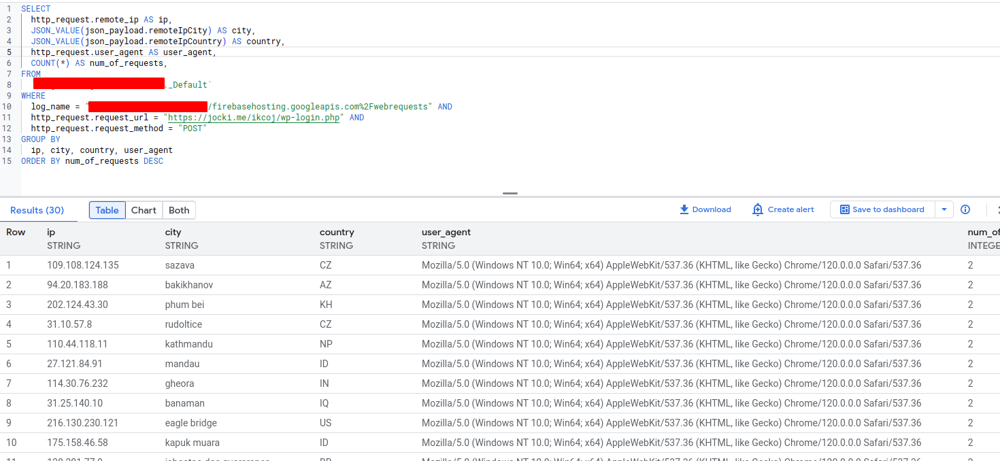
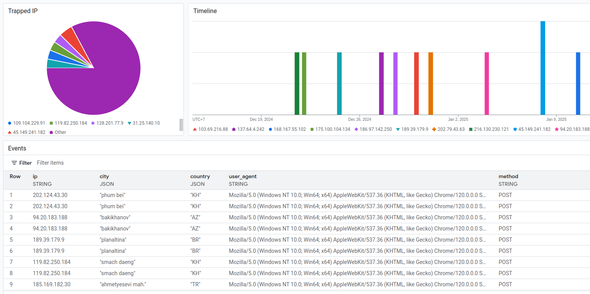

Salah satu teknik untuk mendeteksi *bot* (seperti *scrapper*) adalah menggunakan *trap* berupa HTML tersembunyi yang tidak bisa dilihat oleh pengguna namun akan dibaca oleh *bot*.  HTML honeypot seperti ini adalah salah satu teknik yang dipakai oleh layanan anti-spam seperti Cloudflare dan DataDome.  Pada tulisan ini, saya akan membuat *trap* berupa form HTML untuk login pada blog ini.  Form login ini tidak akan terlihat oleh pengguna sehingga tidak akan ada *request* dari pengguna.  Bila ada yang memanggilnya, kemungkinan besar ini adalah IP *bot* atau *scrapper* yang membaca HTML.  Saya kemudian bisa menambahkan daftar IP yang terdekteksi ke platform *threat intelligence* untuk diawasi lebih lanjut atau di-blokir.  Ini adalah salah satu bentuk pertahanan di fase *Reconnaissance*.

:::note
Berdasarkan [Cyber Kill Chain](https://en.wikipedia.org/wiki/Cyber_kill_chain), *reconnaissance* adalah tahap pertama dari serangan cyber.  Semakin awal deteksi dan pencegahan dilakukan, semakin sedikit dampak yang ditimbulkan oleh serangan cyber tersebut.  Namun, ini sering kali salah dimengerti menjadi seolah-olah tim security hanya berfokus pada *reconnaissance* dan tahap awal lainnya (membangun perimeter).  Karena berbagai faktor seperti kompleksitas sistem informasi, kesalahan manusia dan keterbatasan sumber daya, tidak mungkin sebuah tahap di CKC dapat dideteksi dan dicegah sepenuhnya.  Tujuan tim security adalah **mengurangi** celah yang ada di **seluruh** tahap CKC sehingga menjadi **seminimal** mungkin.

Selain itu, tidak semua serangan selalu diawali oleh tahap *reconnaissance* sementara CKC memetakan serangan sebagai sesuatu yang terjadi secara berurutan.  Contohnya adalah pada kasus seperti berikut ini:
* *Service account* atau akun cloud yang diberikan kepada *vendor* secara tidak sengaja bocor ke publik dan kemudian dipakai oleh penyerang untuk menambahkan VM baru yang berisi *backdoor*.
* Pegawai melakukan *interview* pekerjaan palsu yang dipersiapkan oleh *threat actor*.  Ia diminta untuk menjalankan sebuah proyek dari GitHub di laptop kerjanya sebagai bagian dari *interview*.  Proyek GitHub ini saat dijalankan akan men-*download* *backdoor* yang kemudian dipakai oleh penyerang untuk masuk ke jaringan internal perusahaan.
* Programmer tidak sengaja menyertakan *dependency* yang berbahaya (misalnya lewat *typosquatting*) sehingga aplikasi yang jalan memiliki *backdoor* di URL tertentu.  Pembuat *dependency* berbahaya akan langsung memanggil URL tersembunyi ini untuk mengerjakan perintah jarak jauh.

[Unified Kill Chain](https://www.unifiedkillchain.com/assets/The-Unified-Kill-Chain.pdf) adalah sebuah model yang dibuat untuk menghindari kesalahpahaman di CKC.  Salah satu perubahan penting di UKC adalah setiap tahap di *kill chain* tidak harus dilakukan berurutan.  Pada UKC, taktik dikelompokkan berdasarkan tujuannya: **In**, **Through**, dan **Out**.  Bila target serangan berada di jaringan yang sama, **In** bisa langsung ke **Out** (bila tidak, **In** harus ke **Through** terlebih dahulu).  Proses yang ada di **In** dapat dilihat sebagai *loop*, jika penyerang gagal di **In** dengan sebuah taktik, penyerang akan mengulangi lagi dengan taktik yang berbeda dan seterusnya hingga berhasil.
:::

## HTML Trap

Sebagai latihan, saya akan menambahkan sebuah *trap* statis pada halaman https://jocki.me dalam bentuk HTML pada seperti berikut:

```html
<trap style="position: fixed; top: 0; left: 0; right: 0; bottom: 0; z-index: -2">
    <form method="POST" action="/ikcoj/wp-login.php" id="loginForm">
        <label for="username">User name:</label>
        <input type="text" name="username" id="username" autocomplete />
        <label for="password">Password:</label>
        <input type="password" name="password" id="password" />
        <input type="submit" value="Login" />
    </form>
</trap>
<trap style="position: fixed; top: 0; left: 0; right: 0; bottom: 0; z-index: -1; background-color: white">
</trap>
```

Pada HTML di atas, saya mendefinisikan HTML Form yang berisi `username` dan `password` serta sebuah tombol Login.  Bila tombol Login tersebut ditekan, data akan dikirim ke `hxxps[://]jocki[.]me/ikcoj/wp-login[.]php`.  Walaupun HTML Form tersebut bisa dipakai, pengguna tidak akan pernah menjumpai HTML Form ini karena saya menggunakan `position: fixed` di CSS dengan `z-index: -2` sehingga ia akan ditimpa oleh `<div>` di depannya.  Biar lebih pasti lagi, saya menambahkan sebuah `<div>` berwarna putih (`backgrond-color: white`) dengan `z-index: -1` sehingga warna putih polos ini akan menimpa HTML Form dibelakangnya.

Karena HTML Form di atas tidak akan pernah terlihat, saya akan mengasumsikan siapa saja yang berinteraksi dengan `hxxps[://]jocki[.]me/ikcoj/wp-login[.]php` adalah *bot*.

:::note
HTML *trap* pada artikel ini hanya untuk demonstrasi saja.  Pembuat *bot* bisa dengan mudah mengubah kode program *bot*-nya untuk menghindari memanggil *trap* statis yang ada.  Untuk hasil yang lebih efektif, link yang dihasilkan harus bersifat dinamis dan jenis-nya lebih bervariasi (bukan hanya HTML Form tetapi juga `<a>`, `<button>`, dan sebagainya).
:::

## Analisa

Untuk melihat hasil dari *trap*, saya dapat menggunakan *query* berikut ini di Log Explorer untuk mencari HTTP request yang memenuhi kriteria:

```
"https://jocki.me/ikcoj/wp-login.php"
httpRequest.requestMethod="POST"
```

Bila saya mengaktifkan Log Analitycs, saya juga dapat menggunakan BigQuery SQL untuk membaca log seperti yang terlihat pada gambar berikut ini:



Bila ingin lebih indah lagi, saya juga dapat mengubah log menjadi *metrics* dan membuat visualiasi-nya dalam bentuk *dashboard* seperti pada gambar berikut ini:



Pada hasil di atas, terlihat bahwa terdapat IP  dari berbagai negara berbeda yang mengerjakan POST *request* pada *trap* yang saya buat.  Top IP berasal dari Kamboja, India, Brazil, Indonesia, dan Nepal.  Bila dilihat dari *user agent*-nya, seluruh *request* menggunakan *user agent* `Mozilla/5.0 (Windows NT 10.0; Win64; x64) AppleWebKit/537.36 (KHTML, like Gecko) Chrome/120.0.0.0 Safari/537.36`.  Ini seharusnya adalah Chrome 120 pada Windows 10.  Namun, pengguna biasa seharusnya sudah men-*upgrade* browser mereka menjadi yang terbaru.

Setelah melakukan pencarian, *user agent* ini adalah *user agent* yang dipakai oleh *malware* seperti SSLoad.  Ada kemungkinan IP yang dipakai untuk memanggil *trap* adalah IP yang terinfeksi *malware* dan kini menjadi *zombie* yang dipakai untuk menyerang situs lain, termasuk blog ini.

Sebagai langkah berikutnya, bila ini adalah sistem yang kritis, saya dapat mem-blokir seluruh IP yang memanggil *trap* dengan menambahkannya pada *firewall*.  Tingkat *false positive* disini sangat rendah karena IP tersebut sudah dengan sengaja mengirim POST request (berbeda dengan GET request yang bisa saja datang dari *service worker* dan *search engine crawler* sehingga boleh diabaikan).