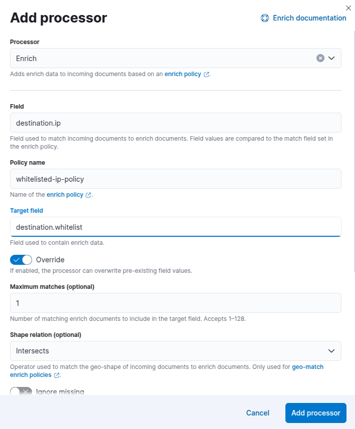
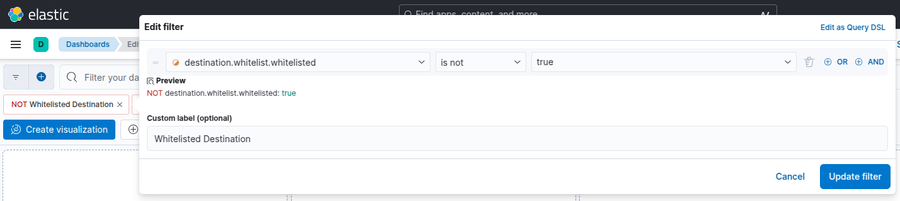
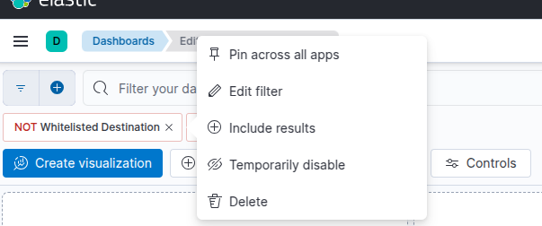

Pada suatu hari, saya mengirim data dari Zeek ke Elasticsearch dengan menggunakan Filebeat.  Visualisasi bekerja dengan baik di Kibana dimana saya bisa melihat informasi koneksi jaringan (dari `conn.log`), aktifitas mencurigakan (dari `weird.log` dan `notice.log`) dan sebagainya.  Namun seiring waktu berlalu, saya selalu menemukan log yang sama terus menerus berulang kali yang sesungguhnya bukan hal berbahaya (misalnya karena aplikasi lokal yang menggunakan protokol langka) sehingga membuat saya sulit langsung mengidentifikasi ancaman saat melihat visualisasi.  Apa yang bisa saya lakukan untuk meningkatkan kualitas monitoring jaringan ini?

Salah satu solusi yang umum diterapkan adalah menggunakan fitur *threat intelligence*.  Bila ingin menggunakan fitur ini, saya perlu mengambil data dari *threat intelligence platform* seperti AbuseCH, AlienVault OTX, MISP dan sebagainya.  *Threat intelligence platform* tersebut berisi *Indicators of Compromise* (IoC) (seperti IP yang dihubungi *malware*) yang diperbaharui secara berkala.  Dengan adanya IoC tersebut, visualiasi saya nantinya benar-benar hanya berisi ancaman (misalnya koneksi ke IP berbahaya sesuai IoC yang terdaftar).  Teknik seperti ini disebut juga sebagai *black-list based detection*.  Walaupun paling umum dipakai, salah satu kekurangannya adalah untuk mendapatkan IoC terbaru dengan kualitas tinggi, saya umumnya perlu melakukan registrasi atau membayar biaya langganan.

Pada skala yang lebih kecil dengan perilaku jaringan yang lebih statis, salah satu solusi yang lebih hemat adalah melakukan penyaringan berdasarkan *whitelist*.  Bila saya tahu sebuah aplikasi biasanya melakukan koneksi ke IP tertentu, saya bisa membuat *whitelist* untuk IP tersebut sehingga visualiasi hanya akan menampilkan IP yang tidak biasanya.  Pendekatan ini lebih mirip ke arah *anomaly-based detection* .  Pendekatan *anomaly-based detection* tidak selalu lebih lemah dibandingkan *black-list based detection* karena *anomaly-based detection* bisa membantu mendeteksi ancaman yang IoC-nya tidak (belum) dipublikasikan (tentu saja solusi terbaik adalah menggabungkan kedua jenis deteksi ini).

Pada tulisan ini, saya akan mencoba menerapkan *whitelist* untuk IP yang dikirim Zeek ke Elasticsearch melalui Filebeat.  Saya akan menggunakan fitur *data enrichment* di Elasticsearch untuk menambahkan *property* `whitelisted` dengan nilai `true`.

## Menambahkan Daftar IP Whitelist

Langkah paling awal yang perlu saya lakukan adalah menambahkan dokumen berisi daftar IP yang di-*whitelist* ke sebuah index.  Untuk membuat sebuah index baru, saya bisa membuka menu **Management**, **Dev Tools** di Kibana dan mengetikkan *request* seperti berikut ini:

```http
PUT /whitelisted-ip
{
  "mappings": {
    "properties": {
      "ip": {"type": "ip_range"},
      "whitelisted": {"type": "boolean"},
      "asn": {"type": "keyword"},
      "hostname": {"type": "keyword"}
    }
  }
}
```

*Request* di atas akan membuat sebuah index baru dengan nama `whitelisted-ip` yang berisi *property* `ip`, `whitelisted`, `asn`, dan `hostname`.  Perhatikan bahwa saya menggunakan tipe data `ip_range` pada `ip` sehingga saya bisa menggunakan CIDR seperti `10.100.0.0/16` yang akan berlaku untuk seluruh IP mulai dari `10.100.0.0` hingga `10.100.255.255`.

Setelah index dibuat, saya dapat menambahkan dokumen baru dengan *request* seperti berikut ini:

```http
POST /whitelisted-ip/_doc
{
  "ip": "1.1.1.1/32",
  "whitelisted": true,
  "asn": "cloudflarenet",
  "hostname": "one.one.one.one"
}
```

```http
POST /whitelisted-ip/_doc
{
  "ip": "8.8.8.8/32",
  "whitelisted": true,
  "asn": "google",
  "hostname": "dns.google"
}
```

:::note
Pada kasus yang lebih realistis, saya dapat menggunakan file CSV yang berisi daftar *whitelist* yang kemudian ditambahkan ke Elasticsearch secara otomatis dengan menggunakan Filebeat.  Dengan demikian, bila ingin menambahkan IP baru, saya hanya perlu mengubah file CSV tanpa harus mengetikkan *request* secara manual di Elasticsearch.
:::

## Membuat Enrich Policy

Untuk membuat *enrich policy* baru, saya dapat memilih menu **Stack Management**, **Index Management**, **Enrich Policies** di Kibana dan men-klik tombol **Add an enrich policy**.  Sebagai alternatif, saya juga menggunakan API seperti berikut ini:

```http
PUT /_enrich/policy/whitelisted-ip-policy
{
    "range": {
        "indices": "whitelisted-ip",
        "match_field": "ip",
        "enrich_fields": ["whitelisted", "asn", "hostname"]
    }
}
```

*Enrich policy* di atas akan menggunakan property `ip` di index `whitelisted_ip` sebagai acuan perbandingan.  Bila nilainya sesuai, property `whitelisted`, `asn` dan `hostname` akan ditambahkan pada *document* yang sedang diproses.  *Enrich policy* mendukung perbandingan dengan menggunakan `geo_match`, `match` dan `range`.  Pada contoh di atas, saya menggunakan `range` karena saya akan membandingkan nilai IP tunggal di dokumen dengan *range* IP di setiap dokumen yang tersimpan di index `whitelisted-ip`.

Setelah *enrich policy* dibuat, saya perlu menjalankannya dengan memanggil API seperti berikut ini:

```http
PUT /_enrich/policy/whitelisted-ip-policy/_execute
```

*Request* di atas akan membuat sebuah index baru dengan nama `.enrich-whitelisted-ip-policy-*` yang nilainya hampir sama dengan index `whitelisted-ip`.  Karena index yang akan digunakan oleh *enrich policy* adalah index `.enrich-whitelisted-ip-policy-*`, setiap kali saya menambahkan dokumen baru ke `whitelisted-ip`, saya perlu menjalankan kembali *request* di atas agar isi index `.enrich-whitelisted-policy-*` diperbaharui.

## Menggunakan Processor di Ingest Pipeline

Pada saat saya mengaktifkan Zeek di Filebeat, ia akan membuat *ingest pipeline* dengan nama seperti `filebeat-8.17.4-zeek-connection-pipeline`.  Saya dapat melihat isinya dengan memilih menu **Management**, **Stack Management**, **Ingest Pipelines**.  Setelah men-klik *ingest pipeline* bersangkutan, saya dapat men-klik menu **Manage**, **Edit** untuk melakukan perubahan pada *ingest pipeline* tersebut.  Sebagai contoh, agar *enrich policy* yang saya buat dilangkah sebelumnya dipakai, saya perlu menambahkan sebuah *processor* baru dengan nama `enrich` dengan men-klik **Add a processor** dan mengisinya seperti berikut ini:




Setelah men-klik tombol **Add processor** dan **Save pipeline**, *enrich policy* `whitelisted-ip-policy` akan dipakai oleh Filebeat dengan mencocokkan nilai `destination.ip` dengan IP yang ada di index `whitelisted-ip`.  Bila ada IP yang cocok, maka nilai *enrich_fields* dari index tersebut akan ditambahkan ke dokumen dalam bentuk *object* dengan nama `destination.whitelist` seperti:

```json {5-9}
{
  "destination": {
    "address": "8.8.8.8",
    "whitelist": {
       "whitelisted": true,
       "asn": "google",
       "hostname": "dns.google"
    }
  }
}
```

## Melihat Hasil Di Kibana

Sampai disini, setiap log baru dari `conn.log` milik Zeek akan memiliki `destination.whitelist` bila IP yang dipakai sesuai dengan IP yang terdaftar di index `whitelisted-ip`.  Informasi ini bisa saya pakai untuk membuat *filter* seperti yang terlihat pada gambar berikut ini:



Pada *filter* di atas, visualisasi dashboard tidak akan menyertakan seluruh dokumen yang nilai `destination.whitelist.whitelisted` berupa `true`.  Dengan demikian, IP yang sudah di-*whitelist* tidak akan muncul lagi di chart Kibana dan saya pun bisa berfokus pada IP baru yang belum dikenali.

Namun, saya juga tetap bisa melihat koneksi ke IP yang sudah di-*whitelist* dengan men-klik *filter* dan memilih **Include results**.  Bila ingin melihat seluruh IP yang ada, saya bisa memilih **Temporary disable** untuk mematikan *filter* (tanpa menghapus *filter* tersebut) seperti yang terlihat pada gambar berikut ini:



## Memperbaharui Index Acuan

Setelah semuanya bekerja dengan baik sesuai harapan, langkah selanjutnya adalah mengelola daftar IP yang ada di index `whitelisted-ip`.  Namun, ternyata langkah ini tidak sesederhana yang saya bayangkan.  Menambahkan IP baru ke index `whitelisted-ip` saja tidak cukup! *Enrich policy* tidak dapat dimodifikasi setelah dibuat.  Oleh sebab itu, saya perlu membuat *enrich policy* baru dengan nama yang berbeda, menjalankannya dan mengubah processor di *ingest pipeline* untuk memakai *enrich policy* baru ini.  Dengan kata lain, saya perlu mengulangi seluruh langkah di atas setiap kali menambahkan IP baru di index `whitelisted-ip`!

Karena proses ini cukup merepotkan, saya akan membuat sebuah *script* Python sederhana dengan isi seperti berikut ini:

```python title="update_enrich_policy.py"
#!/usr/bin/env python3
import datetime
import sys
import requests


ES_HOST = 'http://localhost:9200'


def create_new_enrich_policy(policy_name):
    print(f"Creating new enrich policy {policy_name}...")
    r = requests.put(f"{ES_HOST}/_enrich/policy/{policy_name}",json={
        'range': {
            'indices': 'whitelisted-ip',
            'match_field': 'ip',
            'enrich_fields': ['whitelisted', 'asn', 'hostname']
        }
    })
    if not r.ok:
        print(f"Error {r.status_code}: {r.text}")
        sys.exit(-1)
    print(f"Enrich policy {policy_name} created successfully.\n")


def running_enrich_policy(policy_name):
    print(f"Running enrich policy {policy_name}...")
    r = requests.put(f"{ES_HOST}/_enrich/policy/{policy_name}/_execute?wait_for_completion=true")
    if not r.ok:
        print(f"Error {r.status_code}: {r.text}")
        sys.exit(-1)
    print(f"Enrich policy {policy_name} executed successfully.\n")


def delete_enrich_policy(policy_name):
    print(f"Deleting enrich policy {policy_name}...")
    r = requests.delete(f"{ES_HOST}/_enrich/policy/{policy_name}")
    if not r.ok:
        print(f"Error {r.status_code}: {r.text}")
        sys.exit(-1)
    print(f"Enrich policy {policy_name} deleted successfully.\n")


def updating_enrich_processor(policy_name):
    print(f"Adding enrich processor...")
    r = requests.get(f"{ES_HOST}/_ingest/pipeline/filebeat-8.17.4-zeek-connection-pipeline")
    if not r.ok:
        print(f"Error {r.status_code}: {r.text}")
        sys.exit(-1)
    ingest_pipeline = r.json()['filebeat-8.17.4-zeek-connection-pipeline']

    new_processors = []
    deleted_policies = set()
    for p in ingest_pipeline['processors']:
        if 'enrich' in p:
            existing_policy_name = p['enrich']['policy_name']
            if existing_policy_name.startswith('whitelisted-ip-policy'):
                deleted_policies.add(existing_policy_name)
                continue
        new_processors.append(p)

    new_processors.append({
        'enrich': {
            'field': 'source.ip',
            'policy_name': policy_name,
            'target_field': 'source.whitelist',
        }
    })
    new_processors.append({
        'enrich': {
            'field': 'destination.ip',
            'policy_name': policy_name,
            'target_field': 'destination.whitelist',
        }
    })
    ingest_pipeline['processors'] = new_processors
    r = requests.put(f"{ES_HOST}/_ingest/pipeline/filebeat-8.17.4-zeek-connection-pipeline",
                     json=ingest_pipeline)
    if not r.ok:
        print(f"Error {r.status_code}: {r.text}")
        sys.exit(-1)
    print(f"Enrich processor has been updated.\n")

    # Delete only after ingest pipeline has been updated and
    # the old enrich policies are not referenced anymore
    for p in deleted_policies:
        delete_enrich_policy(p)


policy_name = f"whitelisted-ip-policy-{datetime.datetime.now().strftime('%Y-%m-%d-%H-%M')}"
create_new_enrich_policy(policy_name)
running_enrich_policy(policy_name)
updating_enrich_processor(policy_name)
print('Done!\n')
```

Sekarang, setiap kali melakukan perubahan pada index `whitelisted-ip`, saya hanya perlu menjalankan *script* di atas.
