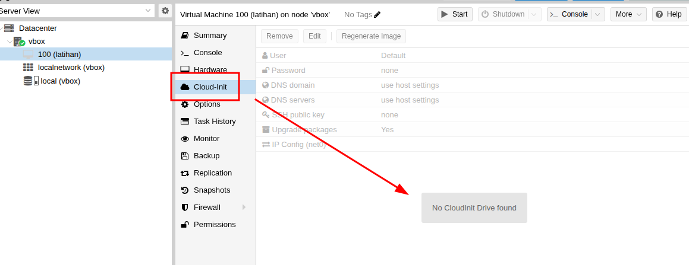
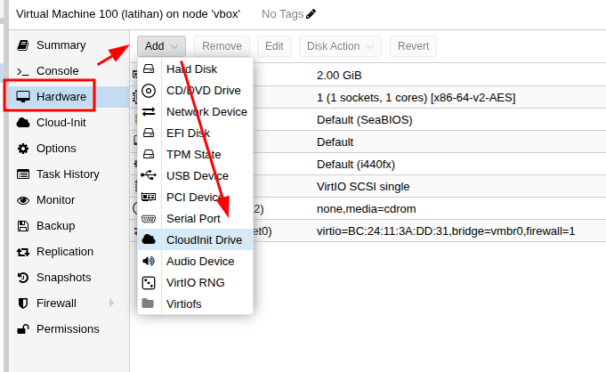
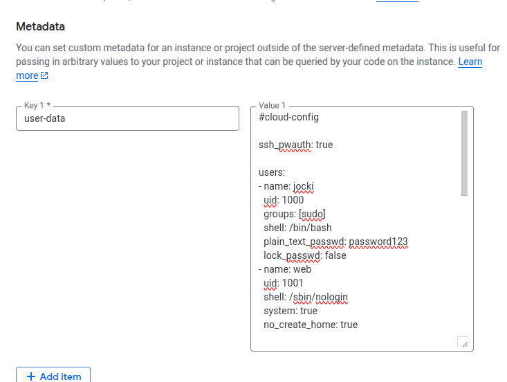
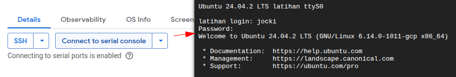

import { FileTree } from '@astrojs/starlight/components';

`cloud-init` adalah sebuah standar untuk melakukan operasi umum pada saat sebuah VM saat ia pertama kali dibuat seperti mengatur *hostname*, menambahkan SSH keys, menjalankan *startup script* dan sebagainya.  Dengan `cloud-init`, *system administrator* hanya perlu menambahkan konfigurasi di *platform* yang digunakan (yang disebut sebagai *data source*) dan saat dijalankan, VM sudah siap dipakai tanpa harus dikonfigurasi secara manual.  Untuk menggunakan `cloud-init`, sistem operasi yang dipakai oleh VM harus mendukungnya.  Sistem operasi populer yang dipakai di VM seperti Ubuntu, Debian, Container-Optimized OS sudah mendukung `cloud-init` seperti yang terlihat di https://cloudinit.readthedocs.io/en/latest/reference/availability.html.  Selain sistem operasi, *platform* yang dipakai juga harus mendukung `cloud-init` (sehingga *system administrator* dapat menuliskan konfigurasi di *platform* tersebut). Bukan hanya cloud populer seperti AWS, Azure dan GCP, *hypervisor* seperti VMWare dan Proxmox juga mendukung `cloud-init`.

Pada saat VM dijalankan dan `cloud-init` mulai bekerja, ia akan membaca konfigurasi dari *data source* yang dipakai di *platform* bersangkutan.  Daftar *data source* yang didukung dapat dilihat di https://cloudinit.readthedocs.io/en/latest/reference/datasources.html.  `cloud-init` akan membaca *data source* secara otomatis tanpa perlu konfigurasi dari *system administrator*.  Sebagai contoh, bila VM adalah sebuah *instance* Compute Engine di GCP, `cloud-init` akan membaca konfigurasi dari GCP metadata server yang ada di http://meta-data.google.internal (`169.254.169.254`).  Bila ini adalah pertama kali-nya VM dijalankan, `cloud-init` akan menjalankan konfigurasi yang hanya perlu dilakukan sekali saja saat VM dibuat.  Bila `cloud-init` mengenali VM ini sudah pernah dijalankan sebelumnya, ia hanya akan menjalankan konfigurasi untuk setiap kali VM di-*restart* bila ada.

Bagian dari konfigurasi `cloud-init` yang paling penting bagi *system administrator* adalah *cloud config*.

## Cloud Config

*Cloud config* adalah sebuah YAML yang berisi konfigurasi VM yang diinginkan.  Baris pertama dari *cloud config* harus berupa `#cloud-config`.  Sisanya adalah konfigurasi *module* yang contoh pengunaannya secara lengkap dapat dilihat di https://cloudinit.readthedocs.io/en/latest/reference/modules.html.

Sebagai latihan, pada artikel ini, saya akan membuat konfigurasi yang menjalankan `nginx` dalam *container* Docker. *Container* ini harus selalu tetap berjalan walaupun VM di-*restart*.  Agar lebih aman, saya juga akan menjalankan *container* ini sebagai user biasa (bukan `root`) sehingga saya perlu menggunakan image `nginxinc/nginx-unprivileged`.

Ini adalah isi *cloud config* yang akan saya pakai:

```yaml
#cloud-config

ssh_pwauth: true

users:
- name: jocki
  uid: 1000
  groups: [sudo]
  shell: /bin/bash
  plain_text_passwd: password123
  lock_passwd: false
- name: web
  uid: 1001
  shell: /sbin/nologin
  system: true
  no_create_home: true

snap:
  commands:
    0: snap install docker


write_files:
- path: /etc/systemd/system/web.service
  permissions: '0644'
  owner: root
  content: |
    [Unit]
    Description=My Web Server

    [Service]
    ExecStartPre=-/snap/bin/docker stop web
    ExecStartPre=-/snap/bin/docker rm web
    ExecStart=/snap/bin/docker run --rm -u 1001 -p 8080:8080 --name=web nginxinc/nginx-unprivileged
    Restart=always

    [Install]
    WantedBy=multi-user.target

runcmd:
- systemctl daemon-reload
- systemctl enable web.service
- systemctl start web.service
```

Pada konfigurasi di atas, saya menggunakan nilai `true` di `ssh_pwauth` supaya pengguna VM dapat login dengan menggunakan password.  Saya kemudian mendefinisikan pengguna di sistem operasi dengan menggunakan `users`:
* `jocki` adalah user yang memiliki password berupa `password123`.  Untuk membolehkan user ini login secara interaktif dengan menggunakan password, saya perlu mengubah nilai `lock_passwd` menjadi `false`.  Selain itu, saya juga menambahkan user ini ke group `sudo` sehingga ia boleh memberikan perintah `sudo`.
* `web` adalah *daemon user* yang akan saya pakai untuk menjalankan *container* Docker.  Tujuannya adalah meningkatkan keamanan karena *container* tidak jalan sebagai `root`.  Karena berupa *daemon user*, pengguna ini tidak akan bisa login ke sistem operasi dan juga tidak memiliki penyimpanan di `/home`.

:::caution
Menggunakan `plain_text_passwd` sangat tidak dianjurkan karena akan mempermudah *lateral movement* bila terdapat celah keamanan pada VM.  Penyerang yang berhasil mengambil alih aplikasi  di VM dapat mengakses URL *metadata server* untuk melihat *cloud config* dimana password pengguna terlihat secara jelas.  Cara yang lebih aman adalah dengan menggunakan `ssh` untuk mendefinisikan SSH keys dan mensyaratkan pengguna untuk login dengan menggunakan SSH key.
:::

Penggunaan `users` di atas juga akan menghilangkan user *default* di VM.  Sebagai contoh, *cloud image* Ubuntu secara *default* memiliki user `ubuntu` yang dapat dipakai untuk *login*.  Karena saya tidak menambahkan `ubuntu` pada definisi `users` di atas, pada saat VM dibuat, tidak akan ada lagi user `ubuntu`.  Bila saya menginginkan user *default* tetap ada, saya bisa menambahkan `default` pada daftar pengguna di atas.

Sebelum bisa menggunakan perintah `docker`, saya perlu melakukan instalasi Docker terlebih dahulu.  Hal ini karena sistem operasi Ubuntu yang saya tidak memiliki Docker secara bawaan. Cara yang paling mudah untuk menambahkan Docker di Ubuntu adalah dengan menggunakan `snap` untuk menjalankan perintah `snap install docker`.  Setelah itu, saya akan menggunakan `systemd` untuk menjalankan *container* `nginx`.  Untuk itu, saya membuat sebuah *service* dengan nama `web.service` yang menjalankan perintah `docker run`.  *Service* ini memiliki `Restart=always` sehingga `systemd` akan selalu berusaha menjalankan ulang *service* ini bila ia berhenti.

## QEMU

Cara paling mudah untuk menguji `cloud-init` adalah dengan menggunakan QEMU dengan *data source* [NoCloud](https://cloudinit.readthedocs.io/en/latest/reference/datasources/nocloud.html).  Untuk menggunakan NoCloud, saya perlu membuat sebuah *web server* yang memiliki informasi `user-data` dan `meta-data`.

Untuk itu, saya akan membuat sebuah file baru dengan nama `user-data` yang berisi *cloud config* yang saya buat [di atas](#cloud-config).

Selain itu, saya juga akan membuat sebuah file baru dengan nama `meta-data` yang isinya seperti berikut ini:

```yaml title='meta-data'
instance-id: my-testing-vm
```

Struktur direktori yang saya pakai sekarang akan terlihat seperti berikut ini:

<FileTree>
    - cloud-init
    - user-data
    - meta-data
</FileTree>

`cloud-init` akan mengakses kedua file ini melalui HTTP.  Agar bisa diakses, saya membuat *web server* yang menyediakan kedua file di atas dengan menggunakan modul `http.server` dari Python dengan perintah seperti berikut ini:

```shell
$ cd cloud-init
$ python3 -m http.server
```

Selanjutnya, saya perlu memilih sistem operasi yang akan dijalankan di VM.  Karena akan menggunakan Ubuntu, saya akan menggunakan *cloud image* Noble di https://cloud-images.ubuntu.com/noble/current/noble-server-cloudimg-amd64.img.  *Cloud image* ini dapat langsung dipakai sebagai harddisk utama di VM (tanpa perlu  instalasi seperti di ISO).

Sekarang, saya siap untuk membuat VM di QEMU dengan menggunakan perintah berikut ini:

```shell "ds='nocloud;s=http://10.0.2.2:8000/'"
$ qemu-system-x86_64 -accel kvm -net nic -net user -m 512 -nographic \
    -hda noble-server-cloudimg-amd64.img \
    -smbios type=1,serial=ds='nocloud;s=http://10.0.2.2:8000/'
```


Bagian paling penting dari perintah di atas adalah `-smbios`.  Perintah ini menambahkan informasi yang kemudian akan dibaca oleh `cloud-init` sehingga ia tahu bahwa *data source* yang dipakai adalah NoCloud dan terletak di http://10.0.2.2:8000.  IP `10.0.2.2` adalah IP yang dipakai dari dalam VM QEMU untuk mengakses *host* yang menjalankan *web server* (yang berisi *cloud config*).

Setelah VM selesai dibuat, saya dapat login ke VM dengan menggunakan user `jocki` dan password `password123`.  Saya juga dapat memberikan perintah berikut ini untuk memastikan bahwa *container* `nginx` sudah berjalan secara otomatis:

```shell
$ curl http://localhost:8080

### Output:
### <!DOCTYPE html>
### <html>
### <head>
### <title>Welcome to nginx!</title>
### ...
```

Biarpun VM di-*restart* (dengan dimatikan lewat <kbd>Ctrl</kbd>+<kbd>A</kbd> diikuti dengan <kbd>X</kbd> dan dijalankan kembali dengan perintah `qemu`), saya dapat memastikan bahwa `nginx` tetap dapat diakses.  Namun kali ini, proses *boot* akan lebih cepat karena `cloud-init` tidak lagi melakukan instalasi Docker dan mempersiapkan pengguna.  Semua itu hanya dilakukan sekali saja pada saat VM pertama kali dijalankan.

:::note
Salah satu bagian yang paling membingungkan saat pertama kali menulis *cloud config* adalah perubahan pada *cloud config* yang tidak diterapkan.  Sebagai contoh, bila saya mengubah nilai `plain_text_passwd` menjadi `password_baru`, setelah men-*restart* VM , **TIDAK** akan ada yang berubah.  Saya tetap harus login dengan password `password123`.

Hal ini karena VM sudah pernah dijalankan sebelumnya dan sudah melewati konfigurasi pertama kali sehingga `cloud-init` tidak akan melakukan perubahan lagi.  Saya perlu menggunakan *image* `noble-server-cloudimg-amd64.img` yang masih baru sama seperti pertama kali di-*download*.

Cara lain yang lebih sederhana adalah menambahkan `-snapshot` pada saat menjalankan VM sehingga perubahan pada *disk* akan diabaikan sehingga setiap kali VM dijalankan, status-nya akan selalu pertama kali dijalankan:

```shell "-snapshot"
$ qemu-system-x86_64 -accel kvm -net nic -net user -m 512 -nographic \
    -hda noble-server-cloudimg-amd64.img \
    -smbios type=1,serial=ds='nocloud;s=http://10.0.2.2:8000/'
    -snapshot
```
:::

## Proxmox VE

Proxmox VE mendukung `cloud-init` dengan menyediakan sebuah halaman di web UI-nya khusus untuk melakukan pengaturan lewat `cloud-init` pada VM.  Untuk saat ini, pengaturan tersebut masih terbatas ke pengaturan seperti nama user dan password-nya, SSH keys, DNS dan sejenisnya.   Tidak semua *module* yang tersedia di `cloud-init` dapat dipakai secara langsung pada halaman ini.

Selain itu, halaman ini pada awalnya tidak dapat dipergunakan seperti yang terlihat pada gambar berikut ini:



Hal ini karena Proxmox VE menggunakan *disk* yang berisi *cloud config* sebagai sarana komunikasi antara sistem operasi dan *data source* (berbeda dengan implementasi QEMU sebelumnya yang menggunakan web HTTP sebagai media komunikasi).  *Disk* ini kemudian akan ditempelkan ke VM yang akan menggunakan konfigurasi di *disk* tersebut.

Oleh sebab itu, sebelum bisa melakukan pengaturan pada halaman `cloud-init`, saya perlu terlebih dahulu memilih menu **Hardware**, **Add**, **CloudInit Drive** seperti yang terlihat pada gambar berikut ini:



Sampai disini, halaman `cloud-init` sudah bisa dipakai.  Namun, bagaimana caranya supaya saya bisa menggunakan *cloud config* yang sudah saya buat dalam bentuk YAML?

Langkah pertama yang harus saya lakukan adalah membuat sebuah *storage* baru dengan memilih **Datacenter**, **Storage**, **Add**.  Sebagai latihan, saya akan memilih **Directory** dan menggunakan lokasi `/var/lib/jocki_storage` untuk membuat *storage* yang saya sebut sebagai `jocki_storage`.   Pada bagian Content, saya wajib memilih **Snippets**.

Saya kemudian menyalin isi *cloud config* yang ada di [di atas](#cloud-config) ke dalam file baru dengan nama `/var/lib/jocki_storage/snippets/my_cloud_config.yaml`.

Pada langkah berikutnya, saya akan mengasosiasikan `my_cloud_config.yaml` tersebut ke VM yang sudah saya buat sebelumnya.   Saya tidak dapat melakukan ini dari halaman web sehingga saya perlu masuk ke dalam node Proxmox dan memberikan perintah `qm` seperti berikut ini:

```shell
$ qm set 100 --ipconfig0 ip=dhcp
$ qm set 100 --cicustom "user=jocki_storage:snippets/my_cloud_config.yaml"
```

Pada perintah di atas, `100` adalah ID VM yang akan menggunakan *cloud config* tersebut.  Saya menambahkan konfigurasi `--ipconfig0 ip=dhcp` supaya perangkat jaringan VM dapat memiliki koneksi Internet saat dinyalakan (untuk men-*download* Docker dan image nginx yang akan dijalankan).  Proxmox VE akan memastikan bahwa konfigurasi ini tidak akan ditimpa oleh konfigurasi yang ada di `my_cloud_config.yaml`.

Sebagai langkah terakhir, sebelum menjalankan VM, saya perlu menggunakan *cloud image* Ubuntu sebagai *disk* utama pada VM tersebut.  Karena format *raw disk* `img` tidak seperti qcow2 yang didukung secara langsung, saya kembali harus menggunakan CLI untuk menyelesaikan langkah ini.  Saya segera memberikan perintah seperti berikut ini:

```shell "local"
$ cd /tmp
$ wget https://cloud-images.ubuntu.com/noble/current/noble-server-cloudimg-amd64.img
$ qm set 100 --scsi0 local:0,import-from=/tmp/noble-server-cloudimg-amd64.img
$ qm set 100 --boot order=scsi0
```

Pada perintah di atas, saya membuat sebuah *disk* SCSI di *storage* bawaan dengan nama `local`.  Saya juga menambahkan `--boot order=scsi0` sehingga saat VM dijalankan, sistem operasi Ubuntu yang ada di *disk* ini akan dijalankan.

Sekarang, saya siap untuk menjalankan VM.  Tidak lama setelah mengaktifkan VM, saat muncul *prompt* login, saya bisa login dengan menggunakan user `jocki` dan password `password123` sesuai dengan yang ada di *cloud config*.  Selain itu, bila saya memberikan perintah `curl http://localhost:8080`, saya akan menemukan respon yang menunjukkan bahwa Docker dan *container* sudah dipersiapkan oleh `cloud-init` secara otomatis.  Terlihat bahwa kondisi ini persis sesuai dengan VM saya di QEMU walaupun kali ini saya menggunakan Proxmox VE.

## Google Compute Engine (GCE)

Penggunaan `cloud-init` di *platform cloud* seperti Google Compute Engine (GCE) jauh lebih gampang dibandingkan dengan *self-hosted platform* sebelumnya.  Sebagai contoh, di GCE, pada saat membuat VM baru, saya hanya perlu menambahkan sebuah *metadata* dengan key `user-data` yang berisi *cloud config* seperti yang saya buat [di atas](#cloud-config) seperti yang terlihat pada gambar berikut ini:



Setelah menunggu sejenak hingga VM selesai dibuat dan `cloud-init` sudah selesai bekerja, saya bisa login ke VM dan memberikan perintah `curl http://localhost:8080` untuk memastikan bahwa `cloud-init` meng-install Docker dan menjalankan *container* `nginx` sesuai dengan *cloud config* yang ada.

:::note
Secara default, proses login ke instance GCE dilakukan lewat SSH (yang lebih aman) tanpa menggunakan user dan password yang dibuat oleh `cloud-init`.  Namun, bila saya ingin mencoba menggunakan user `jocki` untuk login, saya dapat memberikan tanda centang di *Enable connecting to serial ports*.

Setelah itu, saya dapat login dengan memilih **Connect to serial console** seperti yang terlihat pada gambar berikut ini:


:::

Terlihat bahwa berkat `cloud-init` dengan *cloud config* yang sama, saya mendapatkan isi VM yang konsisten tanpa harus melakukan *setup* secara manual walaupun berada di platform yang berbeda.
