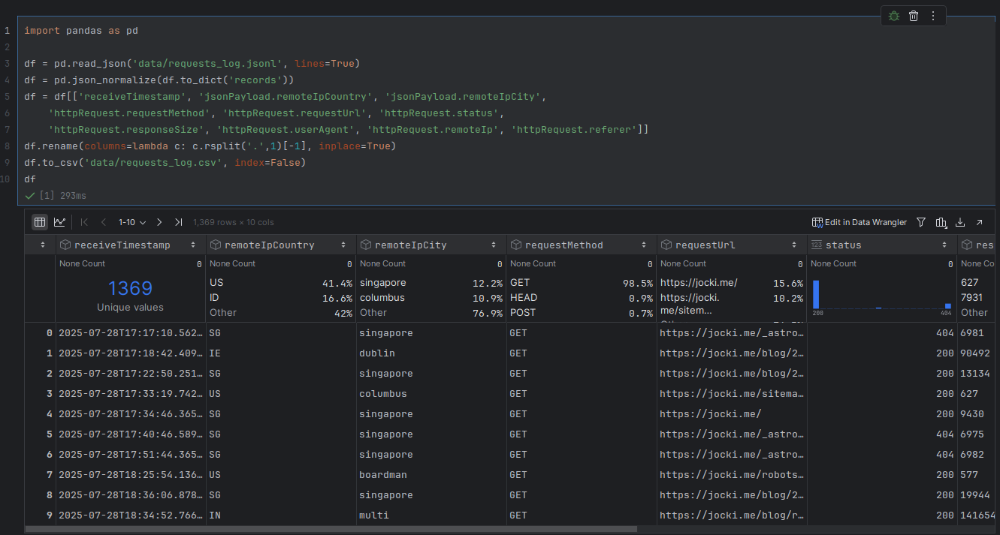

Salah satu bagian yang paling membosankan di cybersecurity adalah membuat laporan bagi *stakeholder* secara periodik.  Namun, berkat teknologi LLM, hal ini bukan lagi sebuah halangan.  LLM memiliki kemampuan luar biasa dalam merangkai kata yang indah.  Apalagi *stakeholder* pada umumnya bukan tipe pembaca *paper* penelitian yang mementingkan akurasi dan kronologi, banyak dari mereka akan menghargai laporan berdasarkan seberapa keren rangkaian kalimatnya (dan berapa banyak kata kunci yang dianggap penting) 🙂  Tipe pembaca seperti ini sangat tepat untuk dipasangkan dengan laporan yang dihasilkan oleh LLM.  Pada tulisan ini, saya akan mencoba menggunakan LLM untuk menghasilkan laporan cybersecurity berdasarkan *request logs* web blog ini selama seminggu.

## Sumber Data

Saya sudah men-*export* log ke file dengan nama `requests_log.jsonl` dalam format JSON Lines (dimana setiap baris berisi JSON) dengan isi seperti berikut ini:

```json lines title="requests_log.jsonl"
{"insertId":"2025-07-28T18:59:2312578","jsonPayload":{"acceptEncoding":"br, gzip","customDomain":true,"@type":"type.googleapis.com\/google.firebase.hosting.v1beta1.logging.v1.Payload","contentType":"application\/xml","remoteIpCountry":"US","billable":true,"hostname":"jocki.me","remoteIpCity":"columbus","contentEncoding":"br"},"httpRequest":{"requestMethod":"GET","requestUrl":"https:\/\/jocki.me\/sitemap-index.xml","status":200,"responseSize":"627","userAgent":"Mozilla\/5.0 AppleWebKit\/537.36 (KHTML, like Gecko; compatible; ClaudeBot\/1.0; +claudebot@anthropic.com)","remoteIp":"216.73.216.68","cacheHit":true,"latency":"0.000001s","protocol":"https"},"resource":{"type":"firebase_domain"},"timestamp":1753729157000,"logName":"firebasehosting.googleapis.com%2Fwebrequests","receiveTimestamp":"2025-07-28T19:08:00.320650558Z"}
{"insertId":"2025-07-28T19:14:2472870","jsonPayload":{"contentType":"application\/xml","remoteIpCity":"phoenix","billable":true,"contentEncoding":"br","customDomain":true,"hostname":"jocki.me","remoteIpCountry":"US","acceptEncoding":"br, gzip","@type":"type.googleapis.com\/google.firebase.hosting.v1beta1.logging.v1.Payload"},"httpRequest":{"requestMethod":"GET","requestUrl":"https:\/\/jocki.me\/sitemap-index.xml","status":200,"responseSize":"632","userAgent":"Mozilla\/5.0 AppleWebKit\/537.36 (KHTML, like Gecko; compatible; GPTBot\/1.2; +https:\/\/openai.com\/gptbot)","remoteIp":"20.171.207.158","cacheHit":true,"latency":"0.000001s","protocol":"https"},"resource":{"type":"firebase_domain"},"timestamp":1753730089000,"logName":"firebasehosting.googleapis.com%2Fwebrequests","receiveTimestamp":"2025-07-28T19:22:44.508272213Z"}
...
```

Salah satu langkah awal yang perlu saya lakukan adalah hanya menyertakan *property* yang diperlukan saja.  Selain karena setiap LLM memiliki batas *input context*, dengan menyertakan input yang relevan, hasil akhir yang diperoleh akan semakin akurat.  Untuk mengurangi jumlah token yang dipakai, saya juga akan mengubah format JSON (dengan *nested properties*-nya) menjadi kolom dalam bentuk CSV.  Untuk itu, saya akan menggunakan kode program Python yang menggunakan Pandas di notebook seperti berikut ini:

```python
import pandas as pd

df = pd.read_json('data/requests_log.jsonl', lines=True)
df = pd.json_normalize(df.to_dict('records'))
df = df[['receiveTimestamp', 'jsonPayload.remoteIpCountry',
    'jsonPayload.remoteIpCity', 'httpRequest.requestMethod',
    'httpRequest.requestUrl', 'httpRequest.status',
    'httpRequest.responseSize', 'httpRequest.userAgent',
    'httpRequest.remoteIp', 'httpRequest.referer']]
df.rename(columns=lambda c: c.rsplit('.',1)[-1], inplace=True)
df.to_csv('data/requests_log.csv', index=False)
df
```



Pada kode program di atas, saya menggunakan fitur `pd.json_normalize()` dari Pandas yang sangat bermanfaat untuk mengubah *nested properties* di JSON menjadi sebuah kolom tersendiri.  Sebagai contoh, `jsonPayload` adalah sebuah objek dengan *property* seperti `{"remoteIpCountry": "...", "remoteIpCity": "..."}`.  `json_normalize()` akan mengubah objek `jsonPayload` menjadi beberapa kolom berbeda seperti `jsonPayload.remoteIpCountry`, `jsonPayload.remoteIpCity` dan sebagainya.  Ini memungkinkan data JSON tersebut untuk di-*export* ke dalam bentuk CSV.

Setelah memilih beberapa kolom yang dibutuhkan, saya menggunakan `df.rename()` dengan menyertakan lambda untuk menghapus prefix seperti `jsonPayload` dan `httpRequest` sehingga nama kolom menjadi lebih singkat.  Setelah itu, saya menggunakan `df.to_csv()` untuk menghasilkan sebuah file CSV yang akan saya pakai di proses selanjutnya.

## Single Agent

Cara yang paling cepat untuk menghasilkan laporan *cybersecurity* adalah bertanya langsung pada LLM dalam satu *prompt* tunggal.  Sebagai contoh, saya akan meng-*upload* file `requests_logs.csv` yang diperoleh pada langkah sebelumnya ke Gemini dan menggunakan prompt berikut ini pada Gemini 2.5 Pro:

```text
You are a Cybersecurity Analyst. Your task is to analyze the attached GCP (Google Cloud Platform) HTTP request log file which contains data for the past week.

Based on your analysis, generate a comprehensive Weekly Cybersecurity Report.

The report should identify and summarize potential security threats and anomalous activities. Pay close attention to the following areas:

1. OWASP Top 10 Analysis: scan for request patterns that indicate common web application attacks.
2. Traffic & IP Analysis: analyze incoming traffic to identify suspicious sources and behaviors:
   * Malicious IP Addresses: Identify source IPs with a high volume of requests generating 4xx or 5xx error codes. Flag any IPs known for scanning or malicious activity.
   * Potential DDoS/Brute-Force Activity: Detect unusual spikes in traffic volume from a single IP or a distributed set of IPs over a short time frame. Note the peak requests per second/minute.
   * Geographic Hotspots: List the top 5 countries originating the most suspicious or denied requests.
3. Request & URL Analysis

Examine the requested URLs and user agents for anomalies:
* Suspicious URLs: Identify requests containing directory traversal patterns (../, ..%2F), enumeration attempts, or unusually long/obfuscated query strings.
* Anomalous User-Agents: Flag requests from outdated browsers or known malicious/bot user-agents (e.g., sqlmap, nmap).
* HTTP Status Code Summary: Provide a summary of significant response codes, focusing on the count and meaning of 400, 401, 403, 404, and 5xx errors.

Your final report must be written in clear, simple language suitable for a non-technical audience, such as business executives and managers.

The goal of the report is to answer three main questions for leadership:
* Are we safe? (What was our overall security posture?)
* What happened? (What kinds of threats did we see?)
* What should we do? (What are the recommended next steps to reduce risk?)
```

Ini adalah hasil yang saya peroleh:

```text
Subject: Weekly Cybersecurity Report: July 24 - July 30, 2025

To: Executive Leadership & Management
From: Cybersecurity Analysis Team
Date: July 31, 2025

Hello Team,

This email provides a summary of our web security posture for the week of July 24
- July 30, 2025, based on an analysis of our server logs.

EXECUTIVE SUMMARY

Are we safe? (Overall Security Posture)
Yes. Our systems remained secure and operational. We successfully deflected a high
volume of automated scanning and probing. No breaches or successful attacks were
identified.

What happened? (Threat Summary)
Our web server was the target of continuous, automated "door-knocking" by malicious
bots. These scanners searched for common vulnerabilities in software like WordPress
and for exposed configuration files. All attempts failed.

What should we do? (Key Recommendations)
We recommend implementing a Web Application Firewall (WAF) to block malicious
traffic and an automated IP blocking system to shut down scanners proactively.

DETAILED FINDINGS

1. Types of Attacks We Saw (OWASP Top 10 Analysis)

* Attackers used automated tools to scan for common weaknesses. All attempts
  were unsuccessful.
* Security Misconfiguration: Scans for files associated with WordPress and
  Joomla (e.g., /xmlrpc.php, /wp-admin/).
* Broken Access Control: Attempts to access sensitive files like /.git/config,
  /.env, and system user files (../../etc/passwd).

2. Threat Origins (Traffic & IP Analysis)

The malicious traffic was automated and globally distributed.
* Malicious IP Addresses: We identified several IPs from France (185.177.72.205)
  and Japan (74.176.198.35) conducting aggressive scanning.
* Geographic Hotspots: The top 5 countries originating suspicious requests were:
  - France
  - Japan
  - United States
  - Ireland
  - Ukraine

3. Attack Methods (Request & URL Analysis)

The requests confirm the automated nature of the attacks.
* Suspicious URLs: We logged over 150 requests with clear attack patterns, like
  directory traversal (../).
* Anomalous User-Agents: Some requests came from scanning tools, not normal browsers.
* Server Response Codes: The high number of "404 (Not Found)" errors (79 instances)
  for these malicious requests confirms they were unsuccessful. We saw no other
  significant server or access errors.

RECOMMENDATIONS & NEXT STEPS

To enhance our security posture, we recommend the following actions:
1. Implement a Web Application Firewall (WAF): A WAF would act as a filter to block
   most of these scans before they reach our server, improving security and
   performance.
2. Deploy an Intrusion Prevention System (e.g., Fail2Ban): This software can
   automatically block IP addresses that show malicious intent, shutting down
   persistent scanners.
3. Continue Vigilant Monitoring: We will continue our weekly monitoring to detect
   new threats and ensure our defenses remain effective.

Please let us know if you have any questions.

Best regards,

The Cybersecurity Analysis Team
```

Terlihat bahwa hasil di atas cukup masuk akal.  Berkat pengetahuan umum cybersecurity-nya, Gemini berhasil mendeteksi akses URL yang mencurigakan seperti `/xmlrpc.php`, `/wp-admin/`, `../` dan sebagainya.  Selain itu, Gemini juga melakukan agregasi IP dengan baik, bahkan ia menggunakan nama negara seperti France dan Japan di laporan padahal data saya hanya berisi kode negara seperti FR dan JP.  Bukan hanya itu, Gemini juga memberikan rekomendasi yang masuk akal (walaupun tidak relevan untuk teknologi yang saya pakai).  Saya yakin stakeholder akan cukup senang membaca laporan ini.

## Multi Agent

Pada kasus yang lebih realistis, laporan cybersecurity tidak hanya berdasarkan WAF (*perimeter security*) dan HTTP request (*application security*), namun juga harus mempertimbangkan log dari IDS (*network security*), audit log dari Google Workspace dan security posture di cloud platform (*cloud security*), dan sebagainya.  Ada kemungkinan besar seluruh data ini tidak muat di sebuah *prompt* tunggal.  Selain itu, bila seluruh log dari berbagai sumber yang berbeda ini dipakai bersamaan, LLM bisa saja kehilangan fokus.  Secara teori, menggunakan beberapa agent berbeda seperti *application security agent*, *network security agent*, *cloud security agent* dan sebagainya yang saling berkolaborasi (*agentic*) akan menghasilkan sebuah laporan yang lebih berkualitas dan akurat.

Sebagai latihan, saya akan membuat kode program Python yang menggunakan CrewAI untuk membuat laporan cybersecurity dengan menggunakan multi-agent.  Setelah membuat sebuah proyek CrewAI baru, saya akan mulai dengan membuat agent seperti berikut ini:
* `appsec_enginer` adalah agent yang mewakili *security engineer* dengan spesialisasi di web.  Agent ini akan mendeteksi pola yang mencurigakan di *requests log* yang saya berikan.
* `threat_intel_analyst` adalah *analyst* dengan spesialisasi di *network security* yang berpengalaman mendeteksi pola serangan dari IP mencurigakan seperti DDoS, scanner bots, dan sebagainya.
* `manager` adalah agent yang akan menulis laporan cybersecurity.

Selain itu, untuk melakukan pengaturan *temperature* di CrewAI, saya perlu membuat definisi LLM baru.  Sebagai contoh, saya membuat sebuah LLM dengan nama `gemini_pro` yang menggunakan model `gemini/gemini-2.5-pro` dengan nilai `temperature` berupa `0.3`:

```python title="crew.py"
@CrewBase
class CybersecurityReport:

    agents: List[BaseAgent]
    tasks: List[Task]

    @llm
    def gemini_pro(self):
        return LLM(
            model="gemini/gemini-2.5-pro",
            temperature=0.3,
        )
    ...
```

### appsec_engineer

Pada agent `appsec_engineer`, saya menggunakan definisi seperti berikut ini:

```yaml title="config/agents.yaml"
appsec_engineer:
  role: Application security engineer specialized in web security
  goal: >
    Analyze Google Cloud logs to detect potential application-level and
    infrastructure-level security threats in accordance with industry standards
    such as OWASP Top 10 and cloud security best practices.
  backstory: >
    A seasoned application security expert with deep expertise in Google Cloud
    operations, threat detection, and log analysis.  Specializes in identifying
    advanced attack patterns, anomalies, and behaviors indicative of security
    incidents or malicious activity.
  llm: gemini_pro
  allow_delegation: True
```

Pada kode program, saya akan menggunakan konfigurasi di atas seperti pada contoh kode program berikut ini:

```python title="crew.py"
@agent
def appsec_engineer(self) -> Agent:
    csv_source = CSVKnowledgeSource(file_paths='requests_log.csv')
    return Agent(
        config=self.agents_config['appsec_engineer'],
        knowledge_sources=[csv_source],
        respect_context_window=True,
        verbose=True,
    )
```

CrewAI memiliki cara mudah untuk memberikan *knowledge* kepada agent dalam bentuk file.  Saya hanya perlu meletakkan file tersebut ke sebuah folder dengan nama `knowledge`.  Sebagai contoh, saya sudah meletakkan file `requests_log.csv` yang saya buat sebagai sumber data ke folder ini.  Saya hanya perlu mendefinisikan `CSVKnowledgeSource(file_paths='requests_logs.csv')` di kode program dan mengasosiasikannya ke agent lewat konfigurasi `knowledge_sources`.

### threat_intel_analyst

Khusus untuk agent ini, saya akan mencari setiap IP unik yang ada di `requests_log.csv` dan menambahkan informasi dari *threat intelligence platform* untuk setiap IP yang ada.  Idealnya, saya dapat membuat sebuah *tool* di CrewAI sehingga agent dapat memanggil *threat intelligence platform* seperti CriminalIP, VirusTotal, AbuseIPDB, dan sebagainya setiap kali akan menganalisa alamat IP.  Namun, cara ini tidak praktis tanpa budget besar karena versi gratis dari platform tersebut memiliki batasan jumlah pemanggilan setiap menit dan setiap hari.

Sebagai alternatif dari membuat *tool*, saya dapat melakukan *preprocessing* yang memanggil *threat intelligence platform* yang bisa dilakukan dalam batasan limit yang tersedia.  Sebagai contoh, saya akan menggunakan AbuseIPDB seperti pada kode program di *notebook* berikut ini:

```python
import pandas as pd
import requests


def get_abuseipdb_info(ip):
    response = requests.request(method='GET', url='https://api.abuseipdb.com/api/v2/check', headers={
        'Accept': 'application/json',
        'Key': ABUSEIPDB_API_KEY,
    }, params={
        'ipAddress': ip,
    })
    return response.text


df = pd.read_csv('data/requests_log.csv')
df = df.groupby('remoteIp', as_index=False).size()
df['abuse_ipdb_result'] = df['remoteIp'].apply(get_abuseipdb_info)
df.to_csv('data/ip_with_threat_intel.csv', index=False)
df
```

Pada kode program di atas, saya menggunakan `df.groupby()` dari Pandas untuk melakukan agregasi berdasarkan kolom `remoteIp` dan membuat kolom baru `size` yang berisi jumlah baris yang mengandung IP tersebut.  Selain itu, saya menambahkan kolom baru dengan nama `abuse_ipdb_result` yang berisi hasil pemanggilan `/check` di AbuseIPDB untuk setiap IP di baris tersebut.  Saya kemudian menyimpan hasilnya sebagai file CSV baru dengan nama `ip_with_threat_intel.csv`.  File ini perlu saya pindahkan ke folder `knowledge` di proyek CrewAI.

Saya kemudian memberikan definisi untuk agents `threat_intel_analyst` seperti berikut ini:

```yaml title="config/agents.yaml"
threat_intel_analyst:
  role: Threat Intelligence Analyst specialized in network security
  goal: >
    Analyze IP address data enriched with threat intelligence information
    to identify suspicious or malicious behavior, and provide recommendations
    for response actions such as blocking or monitoring.
  backstory: >
    A cyber threat analyst with deep experience in threat intelligence platforms,
    abuse detection, and IP reputation scoring. Skilled in correlating behavior
    patterns across logs and public threat intelligence databases to identify
    potential attack infrastructure and advise on mitigation strategies.
  llm: gemini_pro
  allow_delegation: False
```

Untuk menggunakan konfigurasi di atas, saya membuat kode program seperti berikut ini:

```python title="crew.py"
@agent
def threat_intel_analyst(self) -> Agent:
    csv_source = CSVKnowledgeSource(file_paths='ip_with_threat_intel.csv')
    return Agent(
        config=self.agents_config['threat_intel_analyst'],
        knowledge_sources=[csv_source],
        respect_context_window=True,
        verbose=True,
    )
```

### manager

Pada agent `manager`, saya menggunakan definisi seperti berikut ini:

```yaml title="config/agents.yaml"
manager:
  role: Cybersecurity manager that reports to stakeholder
  goal: >
    Create a clear, concise, and stakeholder-friendly weekly security report
    summarizing security incidents and threats identified by internal
    security analysts.
  backstory: >
    An experienced cybersecurity communicator and technical writer who specializes
    in translating complex threat data and cloud security incidents into actionable,
    plain-language summaries for executives, compliance teams, and business
    stakeholders. Skilled in prioritizing clarity, impact, and actionable insight.
  llm: gemini_pro
  allow_delegation: True
  inject_date: True
  reasoning: True
  max_reasoning_attempts: 5
```

Pada konfigurasi di atas, saya menggunakan `inject_date` sehingga agent memiliki informasi periode laporan yang hendak dibuat.  Selain itu, saya memberikan nilai `True` pada `reasoning` sehingga agent `manager` akan membuat rencana eksekusi dan melakukan evaluasi untuk setiap eksekusi yang direncanakan.  Saya menggunakan `max_reasoning_attempts` untuk membatasi `reasoning` sehingga LLM tidak terus menerus melakukan evaluasi bila tidak menemukan rencana eksekusi yang ideal.

Saya kemudian menggunakan konfigurasi ini pada kode program seperti berikut ini:

```python title="crew.py"
@agent
def manager(self) -> Agent:
    return Agent(
        config=self.agents_config['manager'],
        verbose=True,
    )
```

Berikutnya, saya akan membuat satu-satunya *task* yang akan diberikan pada agent `manager` dengan konfigurasi seperti berikut ini:

```yaml title="config/tasks.yaml"
cybersecurity_report_task:
  description: >
    Generate a comprehensive but non-technical cybersecurity report based on findings
    from two other agents:
    * Application Security Engineer - Focused on security incidents based on request
      logs (from GCP) like suspicious request URLs, suspicious user agents,
      web scanning, etc.
    * Threat Intelligence Analyst - Provides threat intel based on AbuseIPDB on all
      IP addresses found in request logs.

    The goal of the report is to answer three main questions for leadership:
    * Are we safe? (What was our overall security posture?)
    * What happened? (What kinds of threats did we see?)
    * What should we do? (What are the recommended next steps to reduce risk?)
  expected_output: >
    A complete, well-formatted markdown document for a cybersecurity report.  The report
    must be written in clear, simple language suitable for a non-technical audience,
    such as business executives and managers.
  agent: manager
  markdown: True
  output_file: reports/cybersecurity_report.md
```

Pada konfigurasi *task* di atas, saya menambahkan `output_file` yang berisi laporan cybersecurity yang saya inginkan.  Nilai `True` pada `markdown` menunjukkan bahwa laporan ini akan menggunakan format *markdown*.

Perhatikan bahwa saya hanya mendefinisikan satu *task* saja padahal ada 3 agent yang berbeda.  Hal ini karena saya akan menggunakan modus kolaborasi.  Saya sudah menambahkan `allow_delegation` dengan nilai `True` pada definisi agent sehingga agent bisa mendelegasikan tugas ke agent lainnya bila dirasa perlu.  Saya tidak mendefinikasikan `context` untuk mengatur pola komunikasi tetapi saya membiarkan LLM untuk menentukan sendiri bagaimana mereka mendelegasikan tugasnya.

### Eksekusi

Sebagai langkah terakhir, saya mendefinikan *crew* seperti berikut ini:

```python title="crew.py"
@crew
def crew(self) -> Crew:
    return Crew(
        agents=self.agents,
        tasks=self.tasks,
        process=Process.sequential,
        memory=True,
        embedder={
            'provider': 'google',
            'config': {
                'model': 'gemini-embedding-001',
                'api_key': os.getenv('GEMINI_API_KEY')
            }
        },
        verbose=True,
    )
```

Pada kode program di atas, saya menambahkan seluruh agent dan task yang sudah saya buat ke sebuah `Crew`.  Selain itu, dengan menambahkan `memory=True`, `Crew` ini juga akan memiliki *memory* (*short-term*, *long-term* dan *entity*) yang disimpan dalam bentuk file ChromaDB (database *vector* berbasis file sama seperti SQLite di database relasional).

:::note
Agar file *knowledge* dalam bentuk CSV yang saya buat bisa disimpan ke penyimpanan *vector*, teks yang ada perlu diterjemahkan menjadi angka dalam bentuk *vector*.  Proses ini dilakukan oleh model yang disebut *embedder*.

Salah satu *embedder* yang paling matang adalah *embedder* bawaan OpenAI yang juga secara default akan dipakai oleh CrewAI.  Dengan demikian, pada konfigurasi default, walaupun LLM yang saya pakai adalah Gemini, CrewAI tetap akan menggunakan OpenAI sebagai *embedder* dan meminta saya untuk menyertakan API key OpenAI.

Untuk mempermudah pengawasan *billing*, pada konfigurasi di atas, saya menambahkan definisi `embedder` untuk menggunakan *embedder* dari Gemini sehingga saya tidak perlu menyertakan OpenAI di proyek latihan ini.
:::

Sekarang, saya siap untuk menjalankan program dengan memberikan perintah seperti berikut ini:

```shell
$ crewai run
```

Setelah proses selesai, saya akan menemukan file `cybersecurity_report.md` dengan isi seperti berikut ini:

```text title="reports/cybersecurity_report.md"
# Weekly Cybersecurity Report
**For Period:** July 26, 2025 – August 1, 2025
**Status:** Green | All threats mitigated. No incidents or breaches.

---

### **Executive Summary**

This report summarizes the key security events of the past week.

*   **Are we safe?**
    Yes. Our security systems performed as expected, automatically identifying
    and blocking all threats this week. We did not experience any security breaches,
    data loss, or service interruptions. The activity we observed was low-sophistication
    and was effectively neutralized by our existing defenses.

*   **What happened?**
    Our applications faced a steady stream of automated scanning from across the globe.
    Think of this as automated tools "jiggling the handles" on our digital doors and windows.
    These scans were not targeted specifically at us but were part of broad internet-wide
    campaigns searching for common, easy-to-exploit vulnerabilities (like outdated WordPress
    plugins) which our systems do not have.

*   **What should we do?**
    The primary recommendation is to continue strengthening our proactive defenses.
    We will immediately block the malicious IP addresses identified this week to
    prevent future attempts from the same sources. This action will further reduce
    our exposure to this common "background noise" of the internet.

---

### **This Week's Threat Landscape**

We categorize this week's activity into two main themes:

**1. Automated Vulnerability Scanning**
The vast majority of threats were from automated "bots" scanning for well-known software weaknesses.

*   **What it is:** These bots rapidly check thousands of websites for specific
    vulnerabilities, like outdated plugins or misconfigured servers. We saw numerous
    scans for WordPress and PHP vulnerabilities.
*   **Business Impact:** Since our applications are not built with this vulnerable
    software, these scans failed harmlessly. This activity is common and confirms
    our technology choices help reduce our risk profile. The most aggressive scanner
    was an IP from Japan (`130.33.61.3`) with a known history of malicious activity,
    which our systems successfully blocked.

**2. Pre-Attack Reconnaissance**
A small number of actors performed reconnaissance, which is the first step an attacker takes
to gather information before a more focused attack.

*   **What it is:** This is like a burglar "casing a building" before a break-in.
    We detected one actor (`34.134.233.195`) using a tool to identify our systems,
    and another (`103.177.224.46`) that attempted to access a configuration file
    where sensitive information is commonly stored.
*   **Business Impact:** All reconnaissance attempts were blocked. Importantly,
    our systems identified the actor from India (`103.177.224.46`) as malicious
    *before* it was publicly reported, demonstrating that our threat detection
    is proactive and effective at identifying emerging threats.

---

### **Actionable Recommendations**

To continue improving our security posture, we recommend the following actions:

| Recommendation | Reason | Expected Outcome |
| :--- | :--- | :--- |
| **1. Block Malicious Actors** | The IP addresses identified this week have proven to be malicious. Blocking them is a simple and effective hygiene measure. | **Reduced Risk.** Prevents these specific actors from conducting further scans or launching attacks against our systems. |
| **2. Continue Proactive Monitoring** | Our current security tools and logging were highly effective at detecting and stopping these threats. | **Validated Defenses.** Ensures our security controls are working as intended and provides valuable intelligence on the threats we face. |
| **3. Share Threat Intelligence** | We will report the newly identified malicious actor (`103.177.224.46`) to global threat intelligence platforms. | **Strengthened Collective Security.** Contributes to the broader security community, helping others protect themselves and improving the data we receive in return. |
```

Bagaimana hasil laporan ini dibandingkan dengan versi Single Agent?  Secara garis besar, tujuan yang hendak disampaikan tidak berbeda jauh.  Terlihat bahwa versi Multi Agent ini membutuhkan biaya yang lebih besar namun tidak memberikan perbedaan yang signifikan pada kasus yang sederhana.  Namun, versi Multi Agent memiliki *scalability* yang lebih tinggi karena saya bisa menambahkan beberbagai agent lain secara mudah untuk meningkatkan kualitas laporan.  Sebagai contoh, dengan adanya penambahkan informasi *threat intel*, laporan baru ini men-*highlight* IP `34.134.233.195` yang `abuseConfidenceScore`-nya masih `0` (belum pernah ada indikasi *malicious* sebelumnya).

Salah satu karakteristik LLM adalah setiap kali saya menjalankan laporan, saya bisa saja menjumpai IP lain di-*highlight* (biar adil, kadang laporan dari manusia juga sama acaknya tergantung pada mood penulisnya!).  Walaupun demikian, laporan ini sepertinya sudah lebih dari cukup untuk mencapai tujuan utamanya: sesuatu yang indah untuk dibaca oleh *stakeholder* 🙂
